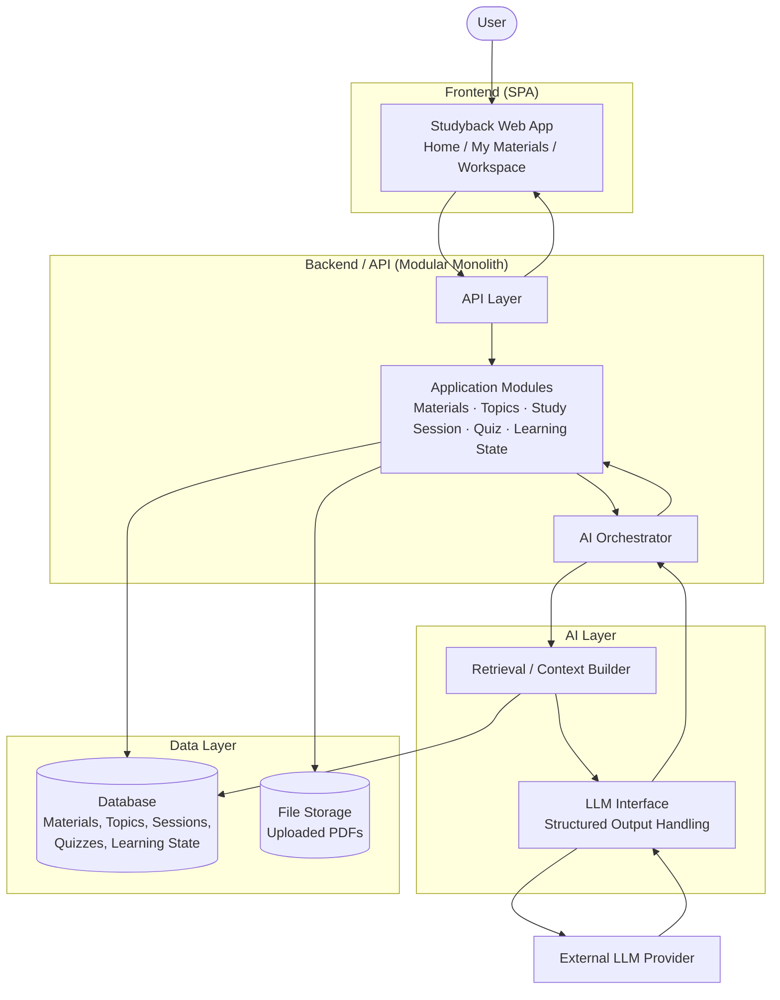
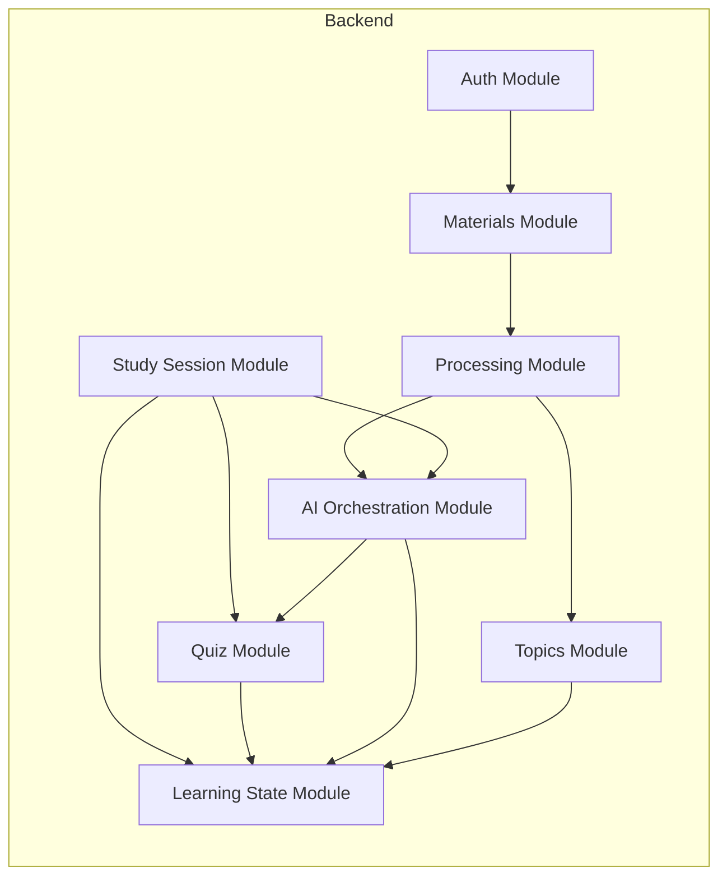
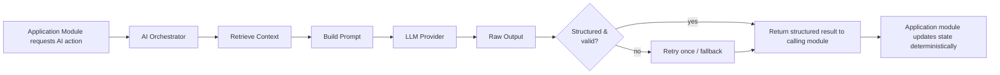
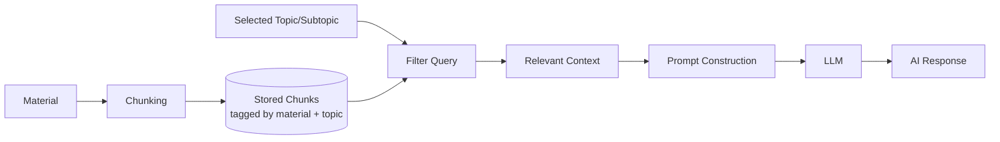
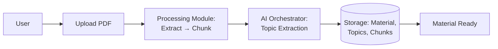
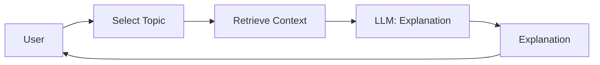
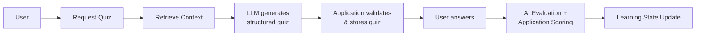
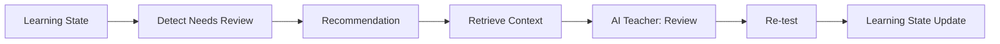

> **Implementation Language Directive**
>
> This document is written in Indonesian for documentation and planning purposes. However, all implementation based on this document must use **English** as the project's primary language.
>
> When implementing the requirements described in this document:
>
> * All user-facing UI text, labels, buttons, messages, notifications, and content must be written in **English**.
> * All source code, variable names, function names, class names, component names, and comments should use **English**.
> * All database names, table names, column names, enum values, and database-related identifiers must use **English**.
> * All API endpoints, request/response fields, validation messages, and API-related identifiers must use **English**.
> * All routes, URLs, configuration keys, and other technical identifiers must use **English**.
> * Do not directly copy Indonesian wording from this document into the application.
> * When this document contains Indonesian descriptions, interpret them as **functional and design requirements**, not as the literal language to be used in the implementation.
>
> **Important:** The language of this document does not determine the language of the application. The application must remain fully English unless another language requirement is explicitly specified.


# Studyback — System Architecture Blueprint

**Status:** Pre-hackathon architecture design (no implementation)
**Source of truth:** Studyback Product Specification
**Purpose:** Blueprint to guide 48-hour hackathon implementation

---

## 1. Architecture Goals

Based on the Product Specification, the architecture must:

1. Support the full learning loop **Learn → Test → Evaluate → Review** and the product flow **Material → Study Session → Learning State → Personalized Review**.
2. Keep **Learning State** (mastery, status, needs-review) as deterministic, application-owned data — never as AI memory.
3. Let AI perform reasoning tasks (explain, generate quiz, evaluate, extract topics) while the **application** performs all state mutation, scoring, and persistence.
4. Ground all AI responses in the **user's own uploaded material**, using a simple retrieval flow rather than open-domain knowledge.
5. Be implementable end-to-end by a small team in **48 hours**, without speculative infrastructure.
6. Cleanly separate **Frontend / Backend / AI Layer / Data Layer** so responsibilities never blur.
7. Support every MVP capability listed in the spec's "48-Hour MVP Scope" — nothing more, nothing less.

---

## 2. Recommended Architecture Style

**Chosen style: Modular Monolith**

### Why it fits Studyback
- The product is a single cohesive application (one user, one workspace, one learning loop) — there is no natural seam that demands independently deployed services.
- The spec explicitly separates *concerns* (Materials, Processing, Topics, Study Sessions, AI, Quiz, Learning State, Review) but these concerns are tightly coupled through one shared object: **Learning State**. Splitting them into separate services would require constant network calls just to keep mastery consistent.
- A modular monolith gives clean internal module boundaries (matching section 5) while keeping deployment, debugging, and data consistency simple.

### Why it fits a 48-hour hackathon
- One codebase, one deployment target, one database connection — no service discovery, no inter-service auth, no distributed transactions.
- Team members can work in parallel on different modules (Materials, AI, Quiz, Learning State) inside the same repo without waiting on service contracts or deployment pipelines.
- Debugging a single process is dramatically faster than debugging distributed calls under time pressure.

### Why alternatives are less appropriate
| Style | Why not for this hackathon |
|---|---|
| Microservices | Introduces network boundaries, service-to-service auth, and deployment overhead for a system with one primary read/write model (Learning State). Massive overkill for 48 hours. |
| Serverless (pure FaaS) | PDF processing and multi-step AI orchestration involve longer-running, stateful flows that are awkward to coordinate across cold-starting functions within a tight timeline. |
| Pure Monolith (no internal modularity) | Would work for 48 hours but risks becoming tangled fast, especially around the AI/Application boundary (Principle 8–11). Modular boundaries prevent AI logic from leaking into state logic even under time pressure. |
| Hybrid (monolith + separate AI microservice) | Reasonable *future* evolution (see Section 15) but unnecessary now — an in-process AI Orchestrator module achieves the same separation of concerns without deployment complexity. |

---

## 3. High-Level System Architecture



**Reading the diagram:** the AI Layer never writes to the Data Layer directly, and the AI Orchestrator never bypasses the Application Modules. All state changes flow back through application logic (Principle 8, 9, 10).

---

## 4. Major System Components

| Component | Responsibility | Main Input | Main Output | Dependencies |
|---|---|---|---|---|
| **Frontend** | Renders Home, My Materials, Material Detail, Study Session Config, Studyback Workspace (sidebar + main area) | User interaction | API requests | Backend API |
| **API / Application Backend** | Single entry point for all frontend requests; routes to modules | HTTP requests | JSON responses | Application Modules |
| **Authentication** | Identify user, protect materials & learning state per user | Login credentials/session | Authenticated user context | Data Layer |
| **Material Management** | CRUD for materials, Material Library, Material Detail data | Material metadata queries | Material list/detail | Data Layer, File Storage |
| **Material Processing** | Coordinates PDF extraction → chunking → topic identification pipeline | Uploaded PDF | Structured material (topics/subtopics + chunks) | File Storage, AI Orchestrator, Data Layer |
| **AI Orchestrator** | Central point that prepares prompts, calls the LLM Interface, validates structured output, and hands results back to the correct application module | Application requests (explain, quiz, evaluate, extract topics) | Structured AI results | Retrieval, LLM Provider |
| **Retrieval / RAG** | Selects relevant material chunks for a given topic/question | Topic/subtopic + query | Relevant context chunks | Data Layer |
| **Quiz Engine** | Requests quiz generation from AI, validates structure, stores quiz, scores submitted answers deterministically | Topic, difficulty, user answers | Stored quiz, score | AI Orchestrator, Data Layer |
| **Learning State Engine** | Deterministically computes/updates subtopic mastery and status; detects Needs Review | Quiz scores, evaluation results | Updated mastery/status records | Data Layer |
| **Database** | Persistent store for materials, topics, subtopics, sessions, quizzes, learning state | Read/write from all modules | Query results | — |
| **File Storage** | Stores uploaded PDF files | Uploaded file | File reference/URL | — |
| **LLM Provider** | External AI model that performs reasoning tasks | Structured prompt | Structured/text output | AI Orchestrator |

---

## 5. Backend Module Architecture

Modules chosen to mirror the actual product concerns in the spec, avoiding a 1:1 mapping to database tables:



| Module | Responsibility |
|---|---|
| **Auth** | User identity, session/token validation. Gatekeeper for all other modules. |
| **Materials** | Material Library CRUD, Material Detail assembly (metadata + topics + progress), Download Material. |
| **Processing** | Orchestrates the pipeline: extract text → chunk → call AI for topic/subtopic identification → persist structured material. Owns the "Material Ready" state transition. |
| **Topics** | Stores and serves topic/subtopic structure and their current mastery/status for the sidebar Learning Map. |
| **Study Session** | Manages Study Session Configuration (topics selected, mode, difficulty) and coordinates which learning mode is active in the Workspace (Teach Me / Quiz Me / Review / Guided). |
| **AI Orchestration** | The only module allowed to talk to the LLM Interface. Builds prompts using retrieved context, requests structured output, validates it, and returns clean data to the calling module (Processing, Study Session, Quiz, Learning State). Never mutates state itself. |
| **Quiz** | Requests quiz generation via AI Orchestration, validates/stores quiz structure, scores answers deterministically (using AI evaluation output as input, not as final authority on state), hands score to Learning State. |
| **Learning State** | Applies the deterministic mastery formula, updates status (Needs Review / In Progress / Mastered), stores history, and answers "what needs review" queries. |

**Communication pattern:** modules communicate through direct in-process function/service calls (not HTTP), since this is a modular monolith. Each module exposes a narrow internal interface; only Study Session and Processing call AI Orchestration — no module calls the LLM Interface directly except AI Orchestration.

---

## 6. AI Architecture

### AI reasoning vs. Application business logic

| AI Responsibility | Application Responsibility |
|---|---|
| Explain a concept (Teach Me) | Decide *which* topic/subtopic is being taught |
| Simplify explanation / give example | Track that an explanation occurred (for session history) |
| Generate quiz questions (structured) | Validate quiz structure, persist quiz, present to user |
| Evaluate a submitted answer (correct/incorrect + feedback) | Calculate score, aggregate into subtopic mastery |
| Identify topics/subtopics from material | Persist topic/subtopic records, link to material |
| Suggest what to review next (phrasing/tone) | **Determine** Needs Review using the deterministic threshold; decide navigation/recommendation logic |

**Core boundary rule:** the LLM never writes directly to Learning State. It returns structured judgments (e.g., "this answer is correct," "this maps to Subtopic X"), and the **Learning State Engine** is the only component authorized to compute and persist mastery/status, per Principle 8 and 10.

### Where structured output is required
- Topic/subtopic extraction → JSON list of topics/subtopics with names and short descriptions
- Quiz generation → JSON array of questions (type, options, correct answer reference)
- Answer evaluation → JSON verdict (correct/incorrect, confidence/feedback text, targeted subtopic)

These are the same four areas the spec calls out in Section 9.1, and no others — the architecture does not expand structured-output usage beyond what's specified.

### How context is retrieved
Retrieval is scoped to **one material** and, where applicable, **one topic/subtopic** at a time — matching the workspace's single-material session model. See Section 8 for details.

### How prompts are organized conceptually
Each AI capability (explain, generate quiz, evaluate answer, extract topics) has its own conceptual prompt template with three logical parts:
1. **Role/instruction** — what the AI is being asked to do and the output contract (structured or conversational).
2. **Retrieved context** — the material chunks relevant to the current topic/subtopic.
3. **Task-specific input** — e.g., the user's question, submitted answer, or difficulty setting.

This keeps every AI call anchored to real material content rather than open-ended knowledge.

### How AI output flows back into application logic



---

## 7. Material Processing Architecture

```
PDF Upload            → Application logic (Materials module) + File Storage
Text Extraction        → Application logic (library-based extraction, not AI reasoning)
Text Processing         → Application logic (cleanup, normalization)
Chunking                → Application logic (deterministic splitting rules)
Topic/Subtopic ID        → AI processing (AI Orchestrator + LLM, structured output)
Storage                  → Data storage (Database: topics, subtopics, chunks, material metadata)
Ready for Study           → Application logic (state transition, triggers "Material Ready ✓")
```

| Stage | Layer |
|---|---|
| PDF Upload | Application logic + File Storage |
| Text Extraction | Application logic (deterministic library) |
| Text Processing / Cleanup | Application logic |
| Chunking | Application logic (deterministic rules — fixed size or heading-based) |
| Topic/Subtopic Identification | **AI processing** (only AI step in this pipeline) |
| Persisting structured material | Data storage |
| "Material Ready" state | Application logic |

Only one step in this entire pipeline uses the LLM — topic/subtopic identification. Extraction and chunking are deterministic, which keeps the pipeline fast, debuggable, and cheap during the hackathon.

---

## 8. RAG Architecture

A deliberately simple, hackathon-appropriate RAG — no vector database.

**What is stored:** the extracted text of each material, split into chunks, each chunk tagged with its source material and (once identified) its associated topic/subtopic.

**What gets chunked:** the raw extracted text from the PDF, split by a simple deterministic rule (e.g., by heading/section if detectable, otherwise fixed-length chunks with slight overlap).

**How retrieval works conceptually:**
- Every AI interaction in the Workspace happens in the context of a **selected material** and usually a **selected topic/subtopic** (from the sidebar or session configuration).
- Retrieval is therefore a straightforward **filter**, not a similarity search: fetch the chunks belonging to the selected material + topic/subtopic directly from the database.
- This is sufficient because the product scope is single-material, topic-scoped interaction — not cross-document semantic search.

**How relevant context reaches the LLM:** the AI Orchestrator pulls the filtered chunks and inserts them into the prompt's context section before calling the LLM.

**How drift is prevented:** the prompt instruction explicitly constrains the LLM to answer only using the provided context chunks, and the context passed in is always scoped to the material/topic the user is actively working on — the LLM is never given free rein over the full material or outside knowledge.



---

## 9. Learning State Architecture

**Component responsible for calculating mastery:** the **Learning State Engine** (Section 5), using the fixed deterministic formula from the spec:

- `< 60%` → Needs Review
- `60–79%` → In Progress
- `≥ 80%` → Mastered

**What data is stored** (conceptually, no schema detail):
- Per subtopic: current mastery score, current status, last updated timestamp, history of quiz attempts/scores contributing to the score.
- Per material: aggregated overall mastery (derived from subtopic mastery, not separately AI-generated).

**When learning state is updated:**
- After a quiz is submitted and evaluated (Quiz flow).
- After a Review Weak Topics re-test.
- After any Guided Study Session step that includes evaluation.

Learning State is **never** updated directly by the AI Orchestrator or LLM output — only by the Learning State Engine after it receives an evaluation result.

**How Review Weak Topics uses this state:**
- Review Weak Topics queries the Learning State Engine for subtopics with status `Needs Review`.
- The sidebar Learning Map (Section 7.4) reads the same state to render status symbols (✓ ◐ ⚠ ○).
- Clicking a `⚠` subtopic triggers Study Session to focus AI Teacher on that subtopic, using the same retrieval scoping from Section 8.

No knowledge tracing or ML model is introduced — mastery is a pure function of quiz results, as specified.

---

## 10. Core Data Flow

### Flow A — Upload Material



### Flow B — Teach Me



### Flow C — Quiz



### Flow D — Review Weak Topic



---

## 11. Component Interaction

| Component | Communicates With | Purpose |
|---|---|---|
| Frontend | API / Backend | Send user actions, receive rendered data |
| API | Auth | Validate user session before routing |
| API | Materials, Study Session, Quiz, Learning State modules | Route requests to correct module |
| Processing | File Storage | Retrieve uploaded PDF for extraction |
| Processing | AI Orchestrator | Request topic/subtopic identification |
| Processing | Database | Persist material, topics, chunks |
| Study Session | AI Orchestrator | Request explanation (Teach Me), review content |
| Quiz | AI Orchestrator | Request quiz generation, answer evaluation |
| Quiz | Learning State | Send score to update mastery |
| AI Orchestrator | Retrieval | Get relevant material context |
| AI Orchestrator | LLM Provider | Send prompt, receive structured/text output |
| Retrieval | Database | Fetch chunks scoped to material/topic |
| Learning State | Database | Read/write mastery & status |
| Topics (sidebar data) | Learning State | Read current status for Learning Map display |
| Materials | File Storage | Serve Download Material |

No component skips a layer (e.g., Frontend never talks to the LLM Provider directly; AI Orchestrator never writes to the Database directly).

---

## 12. Architecture Boundaries

- **Frontend responsibility:** render Home, My Materials, Material Detail, Study Session Configuration, and Studyback Workspace (sidebar + dual interaction main area); send user actions to the API; display AI/quiz/state results. No business logic, no direct AI calls, no direct database access.
- **Backend responsibility:** own all business logic — routing, material processing coordination, quiz validation/storage, deterministic mastery calculation, review detection, and orchestrating AI calls. The backend is the only component allowed to decide what gets persisted.
- **AI responsibility:** reasoning tasks only — explain, simplify, generate quiz questions, evaluate answers, identify topics. AI returns data/text to the backend; it never persists anything and never determines final application state.
- **Database responsibility:** durable storage of materials, topics/subtopics, chunks, sessions, quizzes, and learning state. No logic lives in the database beyond standard constraints.
- **File storage responsibility:** store and serve raw uploaded PDFs (and support Download Material). No processing logic.

---

## 13. Failure Handling

| Failure | Handling Approach |
|---|---|
| PDF extraction fails | Mark material processing as failed; show a clear error state to the user (e.g., "couldn't read this file"); allow re-upload. No partial material is marked "Ready." |
| AI topic extraction fails | Retry once with the same context; if it still fails, mark material as failed at that stage (not silently "Ready" with zero topics) and prompt user to retry. |
| LLM request fails (network/timeout) | Retry once with backoff; if it still fails, surface a friendly in-workspace error ("AI Teacher is unavailable, try again") without crashing the session. |
| Quiz generation produces invalid structured output | Application validates the JSON shape before accepting it; on validation failure, retry the generation call once; if still invalid, fall back to a simplified quiz template or show an error and let the user retry. |
| Retrieval finds insufficient context | If no chunks match the selected topic/subtopic, inform the AI Orchestrator to instruct the LLM to say it cannot find enough material on this topic, rather than answering from general knowledge. |
| Answer evaluation fails | Treat as a transient error; retry once; if it still fails, do not update Learning State (avoid corrupting mastery with a guess) and inform the user to resubmit. |

Guiding principle: **never let an AI failure silently corrupt Learning State.** When in doubt, the system fails visibly and leaves prior state untouched.

---

## 14. Security Considerations (MVP-relevant only)

- **Authentication:** basic session/token-based auth sufficient to identify a user across requests (exact provider TBD in Tech Stack phase).
- **Authorization:** every material, topic, quiz, and learning-state record is scoped to its owning user; backend enforces ownership checks on every read/write — a user can never access another user's materials or state.
- **Uploaded file access:** PDFs stored in file storage are not publicly accessible by guessable URL; access goes through the authenticated backend (e.g., signed/short-lived URLs or backend-proxied download).
- **API security:** all endpoints require a valid authenticated session except public/marketing pages; no unauthenticated write operations.
- **LLM data boundary:** only the material content relevant to the current user/topic is sent to the LLM provider — no cross-user data ever enters a single prompt.
- **Input validation:** validate file type/size on upload (PDF only, reasonable size cap); validate quiz answer payloads before scoring.
- **File validation:** confirm uploaded file is actually a parseable PDF before beginning processing, to avoid wasted processing cycles or crashes.

No enterprise-grade measures (e.g., SSO, audit logging, encryption-at-rest key management, WAF) are in scope for MVP.

---

## 15. Scalability Considerations

| Concern | CURRENT MVP | FUTURE EVOLUTION |
|---|---|---|
| More users | Single backend instance, direct DB connection | Horizontal scaling of backend behind a load balancer |
| More materials per user | Synchronous processing, simple DB queries | Indexed search, pagination, archiving |
| Processing time | Synchronous upload → processing pipeline (acceptable for hackathon file sizes) | Asynchronous background workers/queue for extraction & topic identification |
| Retrieval | Simple filter-based retrieval scoped to material/topic | Vector database + embedding-based semantic retrieval for larger/multi-document contexts |
| AI Layer | In-process AI Orchestrator module inside the monolith | Extracted as a separate AI service if load or team structure demands it |
| Background processing | None — all steps run inline during the request | Dedicated background worker/queue system (e.g., job queue) for long-running AI tasks |
| Data layer | Single relational database | Read replicas, caching layer, or separate analytics store |

The current MVP intentionally defers all of the right-hand column — the modular monolith's clean boundaries (Section 5, 12) make each of these an additive change later, not a rewrite.

---

## 16. 48-Hour Implementation Mapping

**Phase 1 — Foundation**
Frontend shell (routing for Home / My Materials / Workspace) + backend skeleton (API layer, Auth, module scaffolding) + database schema setup + file storage wiring.

**Phase 2 — Material Upload & Processing**
Upload endpoint, PDF text extraction, chunking logic, Material Ready state transition, Material Library + Material Detail screens.

**Phase 3 — AI Material Understanding**
AI Orchestrator skeleton, LLM Interface integration, topic/subtopic identification with structured output validation, persisting topics/subtopics.

**Phase 4 — Study Workspace Shell**
Sidebar Learning Map (static data first), Study Session Configuration modal, dual interaction layout (conversational + structured areas) without full AI wiring.

**Phase 5 — Teach Me + Quiz + Evaluation**
Retrieval (filter-based), Teach Me conversational flow, Quiz generation (structured output), quiz UI, answer submission, AI evaluation.

**Phase 6 — Learning State**
Deterministic mastery calculation, status thresholds, Needs Review detection, sidebar status symbols wired to real data, Review Weak Topics flow, Guided Study Session loop tying Learn → Test → Evaluate → Review together.

**Phase 7 — Integration & Testing**
End-to-end walkthrough of both New Material Flow and Existing Material Flow, failure-path testing (Section 13), polish loading states, final demo rehearsal.

No code is specified — this is a sequencing plan only.

---

## 17. Architecture Decision Summary

| Decision | Recommendation | Reason |
|---|---|---|
| Architecture Style | Modular Monolith | Simple deployment, fast iteration, clean internal boundaries suited to 48 hours |
| Frontend | Single-Page Application | To be determined during Tech Stack phase. |
| Backend | Single backend service with internal modules | To be determined during Tech Stack phase. |
| AI | In-process AI Orchestrator calling an external LLM Provider | Keeps AI reasoning isolated from state logic without service overhead |
| RAG | Simple filter-based retrieval scoped to material/topic (no vector DB) | Matches single-material, topic-scoped product scope; avoids unnecessary complexity |
| Database | Single relational database | To be determined during Tech Stack phase. |
| File Storage | Dedicated file storage for uploaded PDFs | To be determined during Tech Stack phase. |
| Background Processing | None (synchronous pipeline) for MVP | Keeps hackathon scope simple; deferred to future evolution |
| Deployment | Single deployable unit | To be determined during Tech Stack phase. |

---

## Final Question: What remains to be built during the 48 hours?

### PRE-HACKATHON BLUEPRINT (this document)
- Architecture style and rationale
- Component boundaries and responsibilities
- Module breakdown and communication patterns
- AI vs. application logic boundary
- Material processing pipeline design
- Simple RAG design
- Learning State rules and update triggers
- Data flow diagrams for all four core flows
- Failure handling strategy
- Security scope
- Implementation phase sequencing

### HACKATHON IMPLEMENTATION (remaining work)
1. **Tech stack selection** — concrete frontend framework, backend framework/language, database engine, file storage provider, LLM provider/SDK, hosting/deployment target.
2. **Database schema design** — actual tables/collections for materials, topics, subtopics, chunks, sessions, quizzes, learning state.
3. **API endpoint design** — concrete routes/contracts for each module.
4. **UI/UX detailed design and implementation** — actual screens, components, and styling for Home, My Materials, Material Detail, Study Session Configuration, and Studyback Workspace (sidebar + dual interaction area).
5. **All actual code**: extraction logic, chunking logic, prompt templates, structured-output schemas and parsers, quiz scoring logic, mastery calculation logic, API handlers, frontend components and state management.
6. **Integration** of every module into one working system, plus testing of the four core flows and the failure-handling paths defined in Section 13.
7. **Demo preparation** — seeding a sample material, rehearsing the New Material Flow and Existing Material Flow end-to-end.

In short: the blueprint defines **what the system is and how its parts must relate**; the hackathon builds **the actual working system inside those boundaries**.


