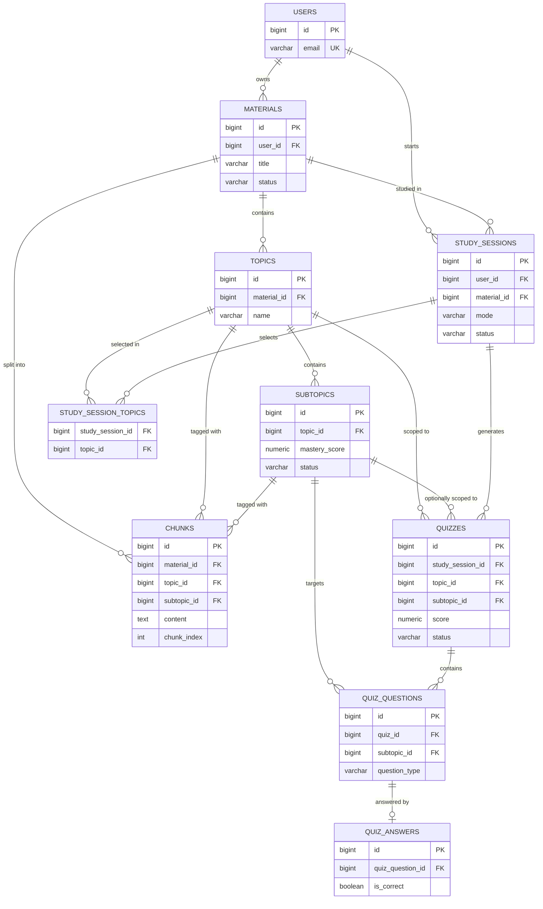

> **Implementation Language Directive**
>
> This document is written in Indonesian for documentation and planning purposes. However, all implementation based on this document must use **English** as the project's primary language.
>
> When implementing the requirements described in this document:
>
> * All user-facing UI text, labels, buttons, messages, notifications, and content must be written in **English**.
> * All source code, variable names, function names, class names, component names, and comments should use **English**.
> * All database names, table names, column names, enum values, and database-related identifiers must use **English**.
> * All API endpoints, request/response fields, validation messages, and API-related identifiers must use **English**.
> * All routes, URLs, configuration keys, and other technical identifiers must use **English**.
> * Do not directly copy Indonesian wording from this document into the application.
> * When this document contains Indonesian descriptions, interpret them as **functional and design requirements**, not as the literal language to be used in the implementation.
>
> **Important:** The language of this document does not determine the language of the application. The application must remain fully English unless another language requirement is explicitly specified.


# Studyback — Database Design Document (Final)

**Status:** Final, implementation-ready
**Source of truth:** Studyback Product Specification · Studyback System Architecture Blueprint · Studyback Tech Stack Specification
**Database Engine:** PostgreSQL (single application database)
**Framework:** Laravel (modular monolith, single owner of database state)
**Scope:** 48-hour hackathon MVP

---

## 1. Database Design Overview

### Tujuan

Dokumen ini adalah **Database Design Document (DDD) final** untuk Studyback. DDD ini menerjemahkan Product Specification, System Architecture Blueprint, dan Tech Stack Specification menjadi schema PostgreSQL yang konkret dan siap diimplementasikan langsung sebagai Laravel migrations, Eloquent models, relationships, constraints, dan indexes.

### Scope

Schema mencakup seluruh entity yang dibutuhkan untuk mendukung empat core flow (New Material Flow, Existing Material Flow, Teach Me, Quiz Me, Review Weak Topics, Guided Study Session) serta Adaptive Learning Loop (Learn → Test → Evaluate → Review). Schema **tidak** mencakup entity yang tidak didukung oleh ketiga source document — termasuk vector storage, embedding, cache layer, queue/job table, atau tabel percakapan (chat log) yang tidak dipersyaratkan secara eksplisit di MVP scope manapun.

### Prinsip Database

1. **PostgreSQL sebagai single application database** — tidak ada database sekunder, tidak ada vector database.
2. **Laravel adalah satu-satunya pemilik state** — AI (`ai_service`) tidak pernah menulis langsung ke database; seluruh write dilakukan oleh Application Modules setelah menerima structured output dari AI.
3. **Learning State bersifat deterministic** — mastery/status dihitung oleh Learning State logic di Laravel menggunakan formula tetap, bukan oleh LLM.
4. **Retrieval berbasis filter, bukan similarity search** — chunk diambil melalui `WHERE material_id = ? AND topic_id = ?` (atau `subtopic_id`), didukung index reguler, bukan vector index.
5. **Skema sederhana untuk 48 jam** — setiap tabel harus punya alasan langsung dari salah satu dari tiga source document; tidak ada tabel spekulatif.
6. **Ownership eksplisit** — setiap baris data yang bersifat personal (material dan seluruh data turunannya) dapat ditelusuri ke `users.id` pemiliknya melalui foreign key chain, mendukung authorization di level Laravel.

---

## 2. Architecture → Database Mapping

| Module (Architecture Blueprint §5) | Tables | Responsibility |
|---|---|---|
| **Auth** | `users` | Identitas user; dasar dari seluruh ownership scoping. |
| **Materials** | `materials` | Material Library CRUD, Material Detail assembly, Download Material metadata. |
| **Processing** | `materials` (status columns), `topics`, `subtopics`, `chunks` | Persist hasil pipeline: extract → chunk → topic/subtopic identification. |
| **Topics** | `topics`, `subtopics` | Struktur topic/subtopic dan status/mastery untuk sidebar Learning Map. |
| **Study Session** | `study_sessions`, `study_session_topics` | Konfigurasi sesi (topics dipilih, mode, difficulty) dan koneksi ke mode belajar aktif. |
| **AI Orchestration (`ai_service`)** | *(tidak ada tabel)* | `ai_service` bersifat thin & stateless — tidak pernah mempersist apa pun; hanya mengembalikan data terstruktur ke module pemanggil. |
| **Quiz** | `quizzes`, `quiz_questions`, `quiz_answers` | Simpan quiz yang dihasilkan AI (setelah divalidasi), jawaban user, dan hasil evaluasi. |
| **Learning State** | `subtopics` (mastery/status columns), dibaca bersama `quiz_answers` sebagai historical log | Mastery & status disimpan sebagai current-state pada `subtopics`; histori attempt secara alami tersimpan di `quiz_answers`/`quiz_questions` tanpa tabel terpisah. |

> **Design Decision:** Tidak ada tabel `learning_state_events` terpisah. Architecture Blueprint §9 mensyaratkan "history of quiz attempts/scores contributing to the score" — kebutuhan ini sudah terpenuhi oleh `quiz_answers` (join ke `quiz_questions.subtopic_id`), sehingga menambahkan tabel log terpisah hanya akan menduplikasi data yang sudah immutable di `quiz_answers`. Ini konsisten dengan Quality Rule #10 (skema sederhana untuk hackathon 48 jam).

---

## 3. Entity Inventory

| Entity | Purpose | Module | Owner |
|---|---|---|---|
| `users` | Identitas & autentikasi; root ownership seluruh data | Auth | Laravel (Sanctum) |
| `materials` | Metadata materi upload (judul, file, status processing) | Materials / Processing | Laravel |
| `topics` | Konsep tingkat atas hasil identifikasi AI dalam satu material | Topics / Processing | AI (identify) → Laravel (persist) |
| `subtopics` | Unit pembelajaran granular; menyimpan mastery & status saat ini | Topics / Learning State | AI (identify) → Laravel (persist & update) |
| `chunks` | Potongan teks material (fixed-length) untuk retrieval/RAG | Processing / Retrieval | Laravel (deterministic) + AI (tagging topic/subtopic) |
| `study_sessions` | Satu sesi belajar (mode, difficulty, waktu mulai/selesai) | Study Session | Laravel |
| `study_session_topics` | Pivot topic mana saja yang dipilih dalam satu study session | Study Session | Laravel |
| `quizzes` | Satu instance quiz (scope topic/subtopic, hasil agregat) | Quiz | AI (generate) → Laravel (validate, store, score) |
| `quiz_questions` | Pertanyaan quiz individual + jawaban benar & target subtopic | Quiz | AI (generate) → Laravel (validate & persist) |
| `quiz_answers` | Jawaban user per pertanyaan + hasil evaluasi AI | Quiz / Learning State | AI (evaluate) → Laravel (persist & score) |

Tidak ada tabel terpisah untuk "Material Processing" (dipersist sebagai kolom status pada `materials`, lihat §7 dan §10) dan tidak ada tabel percakapan/chat log (Teach Me bersifat request/response yang di-generate langsung dari retrieval setiap kali, tidak dipersyaratkan untuk disimpan oleh source manapun).

---

## 4. Database Schema

Seluruh tabel menggunakan `id BIGSERIAL PRIMARY KEY` kecuali dinyatakan lain, dan menggunakan `created_at` / `updated_at` (`TIMESTAMP`) mengikuti konvensi Laravel `timestamps()`, kecuali dinyatakan sebagai immutable log (hanya `created_at`).

### `users`

> **Design Decision:** Tabel standar Laravel + Sanctum. Ketiga source document menyatakan autentikasi/otorisasi "tetap dikontrol oleh Laravel" tanpa merinci provider di luar Sanctum (Tech Stack §3), sehingga schema mengikuti struktur default Laravel `users` table. Tabel `personal_access_tokens` disediakan otomatis oleh migration bawaan Sanctum dan tidak didesain ulang di sini.

| Column | PostgreSQL Type | Nullable | Default | Constraints | Description |
|---|---|---|---|---|---|
| id | BIGSERIAL | No | auto | PRIMARY KEY | Identitas user |
| name | VARCHAR(255) | No | — | — | Nama user |
| email | VARCHAR(255) | No | — | UNIQUE | Email login |
| email_verified_at | TIMESTAMP | Yes | NULL | — | Timestamp verifikasi email |
| password | VARCHAR(255) | No | — | — | Password ter-hash |
| remember_token | VARCHAR(100) | Yes | NULL | — | Token "remember me" |
| created_at | TIMESTAMP | No | now() | — | — |
| updated_at | TIMESTAMP | No | now() | — | — |

---

### `materials`

| Column | PostgreSQL Type | Nullable | Default | Constraints | Description |
|---|---|---|---|---|---|
| id | BIGSERIAL | No | auto | PRIMARY KEY | Identitas material |
| user_id | BIGINT | No | — | FK → `users.id`, ON DELETE CASCADE | Pemilik material |
| title | VARCHAR(255) | No | — | — | Nama material (Material Information) |
| description | TEXT | Yes | NULL | — | Deskripsi singkat material |
| original_filename | VARCHAR(255) | No | — | — | Nama file asli untuk Download Material |
| file_path | VARCHAR(500) | No | — | UNIQUE | Path internal di Laravel Filesystem (`storage/app/private`), tidak mudah ditebak |
| file_size_bytes | INTEGER | No | — | CHECK (file_size_bytes > 0) | Ukuran file PDF |
| status | VARCHAR(20) | No | `'processing'` | CHECK (status IN ('processing','ready','failed')) | Status pipeline pemrosesan material |
| failed_reason | TEXT | Yes | NULL | — | Pesan error saat status = 'failed' |
| created_at | TIMESTAMP | No | now() | — | Upload date |
| updated_at | TIMESTAMP | No | now() | — | — |

> **Design Decision:** Product Spec §3 menampilkan tahapan UI granular ("Uploading… → Extracting Content… → Understanding Material… → Identifying Topics…"), tetapi karena Tech Stack §8 menetapkan **synchronous processing** (seluruh pipeline berjalan inline dalam satu request), tahapan tersebut adalah *ephemeral frontend state*, bukan state yang perlu dipersist di database. Database hanya menyimpan state final yang relevan untuk query & failure handling: `processing` (sedang berjalan / baru mulai), `ready` (berhasil, Architecture §13: "No partial material is marked Ready"), `failed` (gagal di titik manapun dalam pipeline).

---

### `topics`

| Column | PostgreSQL Type | Nullable | Default | Constraints | Description |
|---|---|---|---|---|---|
| id | BIGSERIAL | No | auto | PRIMARY KEY | Identitas topic |
| material_id | BIGINT | No | — | FK → `materials.id`, ON DELETE CASCADE | Material pemilik topic |
| name | VARCHAR(255) | No | — | — | Nama topic (hasil AI topic extraction) |
| description | TEXT | Yes | NULL | — | Deskripsi singkat topic |
| order_index | SMALLINT | No | 0 | — | Urutan tampil di sidebar |
| created_at | TIMESTAMP | No | now() | — | — |
| updated_at | TIMESTAMP | No | now() | — | — |

Constraint tambahan: `UNIQUE (material_id, name)` — mencegah duplikasi nama topic dalam satu material.

---

### `subtopics`

| Column | PostgreSQL Type | Nullable | Default | Constraints | Description |
|---|---|---|---|---|---|
| id | BIGSERIAL | No | auto | PRIMARY KEY | Identitas subtopic |
| topic_id | BIGINT | No | — | FK → `topics.id`, ON DELETE CASCADE | Topic pemilik subtopic |
| name | VARCHAR(255) | No | — | — | Nama subtopic |
| description | TEXT | Yes | NULL | — | Deskripsi singkat subtopic |
| order_index | SMALLINT | No | 0 | — | Urutan tampil di sidebar |
| mastery_score | NUMERIC(5,2) | No | 0 | CHECK (mastery_score BETWEEN 0 AND 100) | Skor mastery saat ini (Learning State) |
| status | VARCHAR(20) | No | `'not_started'` | CHECK (status IN ('not_started','in_progress','needs_review','mastered')) | Status belajar saat ini |
| created_at | TIMESTAMP | No | now() | — | — |
| updated_at | TIMESTAMP | No | now() | Diperbarui setiap kali Learning State Engine menghitung ulang mastery | Timestamp update mastery terakhir |

Constraint tambahan: `UNIQUE (topic_id, name)`.

> **Design Decision:** Product Spec §8.2 menyatakan mastery disimpan **terutama pada level Subtopic** — inilah tabel yang menjadi pusat Learning State. `mastery_score` dan `status` disimpan langsung sebagai kolom current-state (bukan tabel terpisah) agar sidebar Learning Map bisa dibaca dengan query sederhana tanpa agregasi berat pada setiap render.

---

### `chunks`

| Column | PostgreSQL Type | Nullable | Default | Constraints | Description |
|---|---|---|---|---|---|
| id | BIGSERIAL | No | auto | PRIMARY KEY | Identitas chunk |
| material_id | BIGINT | No | — | FK → `materials.id`, ON DELETE CASCADE | Material asal chunk |
| topic_id | BIGINT | No | — | FK → `topics.id`, ON DELETE CASCADE | Topic hasil AI tagging |
| subtopic_id | BIGINT | Yes | NULL | FK → `subtopics.id`, ON DELETE SET NULL | Subtopic hasil AI tagging (jika teridentifikasi) |
| content | TEXT | No | — | — | Isi teks chunk (~1.000 karakter + ~200 overlap) |
| chunk_index | INTEGER | No | — | — | Urutan chunk di dalam material (0-based) |
| created_at | TIMESTAMP | No | now() | — | Chunk bersifat immutable, tidak ada `updated_at` |

Constraint tambahan: `UNIQUE (material_id, chunk_index)`.

> **Design Decision:** `chunks` hanya dipersist **setelah** pipeline processing berhasil sepenuhnya (extraction → cleaning → chunking → topic identification) dalam satu transaction (lihat §15), sehingga `topic_id` selalu terisi (NOT NULL) pada saat commit — konsisten dengan Architecture §13: "No partial material is marked Ready." `subtopic_id` tetap nullable karena AI topic identification (Tech Stack §3, Architecture §6) hanya wajib menghasilkan struktur topic/subtopic secara umum; tidak setiap chunk pasti bisa dipetakan setepat level subtopic, sehingga fallback ke level topic tetap valid untuk retrieval.

---

### `study_sessions`

| Column | PostgreSQL Type | Nullable | Default | Constraints | Description |
|---|---|---|---|---|---|
| id | BIGSERIAL | No | auto | PRIMARY KEY | Identitas study session |
| user_id | BIGINT | No | — | FK → `users.id`, ON DELETE CASCADE | Pemilik sesi |
| material_id | BIGINT | No | — | FK → `materials.id`, ON DELETE CASCADE | Material yang dipelajari |
| mode | VARCHAR(30) | No | — | CHECK (mode IN ('teach_me','quiz_me','review_weak_topics','guided_study_session')) | Learning Mode yang dipilih |
| difficulty | VARCHAR(10) | Yes | NULL | CHECK (difficulty IN ('easy','medium','hard')) | Difficulty (relevan untuk mode yang melibatkan quiz) |
| status | VARCHAR(20) | No | `'active'` | CHECK (status IN ('active','completed')) | Status sesi |
| started_at | TIMESTAMP | No | now() | — | Waktu mulai sesi |
| ended_at | TIMESTAMP | Yes | NULL | — | Waktu sesi berakhir |
| created_at | TIMESTAMP | No | now() | — | — |
| updated_at | TIMESTAMP | No | now() | — | — |

> **Design Decision:** Product Spec §7 menegaskan seluruh Learning Mode (Teach Me, Quiz Me, Review Weak Topics, Guided Study Session) berada di **satu Workspace yang sama** — tidak ada halaman terpisah. `study_sessions.mode` merepresentasikan hal ini sebagai satu baris per sesi, bukan sebagai tabel terpisah per mode.

---

### `study_session_topics`

| Column | PostgreSQL Type | Nullable | Default | Constraints | Description |
|---|---|---|---|---|---|
| study_session_id | BIGINT | No | — | FK → `study_sessions.id`, ON DELETE CASCADE | Sesi terkait |
| topic_id | BIGINT | No | — | FK → `topics.id`, ON DELETE CASCADE | Topic yang dipilih untuk sesi ini |
| created_at | TIMESTAMP | No | now() | — | — |

Primary Key: **composite** `(study_session_id, topic_id)`.

> **Design Decision:** Study Session Configuration (Product Spec §6) memungkinkan user memilih beberapa topic sekaligus ("Topics — topic/concept mana yang ingin dipelajari"). Dimodelkan sebagai pivot table (bukan kolom JSON array) agar tetap dapat di-enforce dengan foreign key dan diindeks — sesuai kebutuhan relational integrity untuk implementation reference yang konkret.

---

### `quizzes`

| Column | PostgreSQL Type | Nullable | Default | Constraints | Description |
|---|---|---|---|---|---|
| id | BIGSERIAL | No | auto | PRIMARY KEY | Identitas quiz |
| study_session_id | BIGINT | No | — | FK → `study_sessions.id`, ON DELETE CASCADE | Sesi yang menghasilkan quiz ini |
| topic_id | BIGINT | No | — | FK → `topics.id`, ON DELETE CASCADE | Scope topic quiz |
| subtopic_id | BIGINT | Yes | NULL | FK → `subtopics.id`, ON DELETE CASCADE | Scope subtopic spesifik (dipakai Review Weak Topics) |
| difficulty | VARCHAR(10) | Yes | NULL | CHECK (difficulty IN ('easy','medium','hard')) | Difficulty quiz ini |
| status | VARCHAR(20) | No | `'in_progress'` | CHECK (status IN ('in_progress','completed')) | Status quiz |
| total_questions | SMALLINT | No | 0 | CHECK (total_questions >= 0) | Jumlah pertanyaan |
| correct_count | SMALLINT | Yes | NULL | CHECK (correct_count >= 0) | Jumlah jawaban benar (setelah completed) |
| score | NUMERIC(5,2) | Yes | NULL | CHECK (score BETWEEN 0 AND 100) | Skor akhir quiz (%) |
| completed_at | TIMESTAMP | Yes | NULL | — | Waktu quiz diselesaikan |
| created_at | TIMESTAMP | No | now() | — | — |
| updated_at | TIMESTAMP | No | now() | — | — |

> **Design Decision:** Review Weak Topics (Product Spec §7.2: "AI memberikan mini-question atau re-test") **menggunakan struktur `quizzes` yang sama** dengan Quiz Me — bedanya hanya `study_sessions.mode = 'review_weak_topics'` dan `quizzes.subtopic_id` diisi untuk mempersempit scope ke satu subtopic yang lemah. Ini menghindari duplikasi tabel "review attempt" yang secara struktural identik dengan quiz biasa (pertanyaan → jawaban → evaluasi → update mastery).

---

### `quiz_questions`

| Column | PostgreSQL Type | Nullable | Default | Constraints | Description |
|---|---|---|---|---|---|
| id | BIGSERIAL | No | auto | PRIMARY KEY | Identitas pertanyaan |
| quiz_id | BIGINT | No | — | FK → `quizzes.id`, ON DELETE CASCADE | Quiz pemilik pertanyaan |
| subtopic_id | BIGINT | No | — | FK → `subtopics.id`, ON DELETE CASCADE | Subtopic target evaluasi (untuk update mastery) |
| question_type | VARCHAR(20) | No | — | CHECK (question_type IN ('multiple_choice','true_false','short_answer')) | Tipe pertanyaan (Product Spec §7.1) |
| question_text | TEXT | No | — | — | Teks pertanyaan |
| options | JSONB | Yes | NULL | — | Array opsi jawaban (untuk `multiple_choice`) |
| correct_answer | TEXT | No | — | — | Jawaban benar / referensi kunci jawaban |
| order_index | SMALLINT | No | 0 | — | Urutan pertanyaan dalam quiz |
| created_at | TIMESTAMP | No | now() | — | Immutable setelah dibuat, tidak ada `updated_at` |

> **Design Decision:** `subtopic_id` di level pertanyaan (bukan hanya di level quiz) diperlukan karena satu quiz bisa mencakup beberapa subtopic di bawah satu topic (mis. quiz untuk topic "Inheritance" bisa berisi pertanyaan dari beberapa subtopic-nya), sementara Learning State Engine perlu tahu **subtopic mana** yang harus diperbarui mastery-nya per pertanyaan — sesuai Architecture §6: AI mengembalikan "this maps to Subtopic X".

---

### `quiz_answers`

| Column | PostgreSQL Type | Nullable | Default | Constraints | Description |
|---|---|---|---|---|---|
| id | BIGSERIAL | No | auto | PRIMARY KEY | Identitas jawaban |
| quiz_question_id | BIGINT | No | — | FK → `quiz_questions.id`, ON DELETE CASCADE, UNIQUE | Pertanyaan yang dijawab (1 jawaban per pertanyaan) |
| submitted_answer | TEXT | No | — | — | Jawaban yang dikirim user |
| is_correct | BOOLEAN | No | — | — | Hasil evaluasi (AI verdict, divalidasi Laravel) |
| ai_feedback | TEXT | Yes | NULL | — | Feedback dari AI evaluation |
| answered_at | TIMESTAMP | No | now() | — | Waktu jawaban dikirim |

> **Design Decision:** `UNIQUE (quiz_question_id)` menegakkan relasi 1:1 antara pertanyaan dan jawaban — setiap percobaan quiz baru ("Try Quiz Again") menghasilkan baris `quiz_questions` baru (bukan menimpa jawaban lama), sehingga tabel ini sekaligus berfungsi sebagai **historical log** dari seluruh attempt yang pernah dilakukan user, tanpa perlu tabel log tambahan (lihat §2).

---

## 5. Relationships

| Parent | Child | Cardinality | FK | Explanation |
|---|---|---|---|---|
| `users` | `materials` | 1 : N | `materials.user_id` | Satu user memiliki banyak material. |
| `materials` | `topics` | 1 : N | `topics.material_id` | Satu material memiliki banyak topic hasil AI extraction. |
| `topics` | `subtopics` | 1 : N | `subtopics.topic_id` | Satu topic memiliki banyak subtopic. |
| `materials` | `chunks` | 1 : N | `chunks.material_id` | Satu material dipecah menjadi banyak chunk. |
| `topics` | `chunks` | 1 : N | `chunks.topic_id` | Chunk ditandai dengan topic hasil identifikasi AI. |
| `subtopics` | `chunks` | 1 : N (optional) | `chunks.subtopic_id` | Chunk dapat ditandai lebih spesifik ke subtopic. |
| `users` | `study_sessions` | 1 : N | `study_sessions.user_id` | Satu user memulai banyak study session. |
| `materials` | `study_sessions` | 1 : N | `study_sessions.material_id` | Satu material dapat dipelajari dalam banyak sesi berbeda. |
| `study_sessions` | `study_session_topics` | 1 : N | `study_session_topics.study_session_id` | Satu sesi memilih banyak topic. |
| `topics` | `study_session_topics` | 1 : N | `study_session_topics.topic_id` | Satu topic dapat dipilih di banyak sesi. |
| `study_sessions` | `quizzes` | 1 : N | `quizzes.study_session_id` | Satu sesi dapat menghasilkan lebih dari satu quiz (mis. "Try Quiz Again"). |
| `topics` | `quizzes` | 1 : N | `quizzes.topic_id` | Quiz selalu berada dalam scope satu topic. |
| `subtopics` | `quizzes` | 1 : N (optional) | `quizzes.subtopic_id` | Quiz review dapat dipersempit ke satu subtopic. |
| `quizzes` | `quiz_questions` | 1 : N | `quiz_questions.quiz_id` | Satu quiz memiliki banyak pertanyaan. |
| `subtopics` | `quiz_questions` | 1 : N | `quiz_questions.subtopic_id` | Setiap pertanyaan menargetkan satu subtopic untuk update mastery. |
| `quiz_questions` | `quiz_answers` | 1 : 1 | `quiz_answers.quiz_question_id` (UNIQUE) | Satu pertanyaan dijawab tepat satu kali per attempt quiz. |

---

## 6. Indexing Strategy

Index difokuskan pada dua kebutuhan utama: **ownership scoping** (query "punya user ini") dan **retrieval filter** (Architecture §8: `Material + Topic/Subtopic → PostgreSQL Filter → Relevant Chunks`).

```sql
-- Retrieval query utama yang harus didukung index:
-- SELECT * FROM chunks WHERE material_id = ? AND topic_id = ?;
-- SELECT * FROM chunks WHERE material_id = ? AND subtopic_id = ?;

CREATE INDEX idx_chunks_material_topic    ON chunks (material_id, topic_id);
CREATE INDEX idx_chunks_material_subtopic ON chunks (material_id, subtopic_id);
-- unique(material_id, chunk_index) sudah otomatis membuat index tambahan untuk ordering

CREATE INDEX idx_materials_user           ON materials (user_id);
CREATE INDEX idx_materials_user_status    ON materials (user_id, status);

CREATE INDEX idx_topics_material          ON topics (material_id);
CREATE INDEX idx_subtopics_topic          ON subtopics (topic_id);
CREATE INDEX idx_subtopics_status         ON subtopics (status);

CREATE INDEX idx_study_sessions_user_material ON study_sessions (user_id, material_id);

CREATE INDEX idx_quizzes_session          ON quizzes (study_session_id);
CREATE INDEX idx_quiz_questions_quiz      ON quiz_questions (quiz_id);
CREATE INDEX idx_quiz_questions_subtopic  ON quiz_questions (subtopic_id);
-- unique(quiz_question_id) pada quiz_answers sudah otomatis terindeks
```

Tidak ada index tambahan di luar daftar ini — sesuai instruksi untuk tidak membuat index secara berlebihan. Full-text index (`tsvector`) disebut Tech Stack §10 sebagai *SHOULD LEARN/opsional*, bukan kebutuhan MVP, sehingga tidak dimasukkan sebagai baseline.

---

## 7. State & Enum Design

| Entity.Column | Values | Meaning |
|---|---|---|
| `materials.status` | `processing`, `ready`, `failed` | Status pipeline Material Processing (Product Spec §3, Architecture §7 & §13). |
| `subtopics.status` | `not_started`, `in_progress`, `needs_review`, `mastered` | Learning status per subtopic; dipetakan ke simbol sidebar `○ ◐ ⚠ ✓` (Product Spec §7.4). |
| `study_sessions.mode` | `teach_me`, `quiz_me`, `review_weak_topics`, `guided_study_session` | Learning Mode aktif dalam Studyback Workspace (Product Spec §7.2). |
| `study_sessions.difficulty` | `easy`, `medium`, `hard` | Difficulty konfigurasi sesi (Product Spec §6). |
| `study_sessions.status` | `active`, `completed` | Lifecycle sesi. |
| `quizzes.status` | `in_progress`, `completed` | Lifecycle quiz. |
| `quizzes.difficulty` | `easy`, `medium`, `hard` | Diwariskan dari konfigurasi sesi. |
| `quiz_questions.question_type` | `multiple_choice`, `true_false`, `short_answer` | Tipe pertanyaan (Product Spec §7.1, Quiz — struktured interface). |

Mapping status → threshold mastery (Product Spec §8.2, fixed & deterministic):

| Skor | Status |
|---|---|
| < 60% | `needs_review` |
| 60% – 79% | `in_progress` |
| ≥ 80% | `mastered` |

`not_started` khusus untuk subtopic yang belum pernah memiliki `quiz_answers` sama sekali (belum pernah diuji).

---

## 8. Learning State Model

**Current state** disimpan langsung sebagai kolom pada `subtopics`: `mastery_score` (NUMERIC 0–100) dan `status` (enum). Kolom ini adalah satu-satunya sumber kebenaran yang dibaca oleh sidebar Learning Map, Material Detail ("Overall mastery"), dan Review Weak Topics.

**History of attempts** tidak memerlukan tabel terpisah — seluruh jawaban historis tersedia di `quiz_answers` (join `quiz_questions.subtopic_id`), yang bersifat immutable (tidak pernah di-update, hanya di-insert).

**Formula update mastery (Design Decision, deterministic sesuai Product Spec §8.2):**

Setiap kali sebuah quiz diselesaikan (`quizzes.status → 'completed'`), untuk setiap `subtopic_id` unik yang muncul di antara `quiz_questions` pada quiz tersebut, Learning State Engine (Laravel) menghitung ulang:

```sql
mastery_score = (
  SELECT AVG(CASE WHEN qa.is_correct THEN 100 ELSE 0 END)
  FROM quiz_answers qa
  JOIN quiz_questions qq ON qq.id = qa.quiz_question_id
  WHERE qq.subtopic_id = :subtopic_id
);
```

yaitu **rata-rata kumulatif seluruh jawaban yang pernah diberikan** untuk subtopic tersebut (di seluruh quiz/attempt), lalu `status` ditentukan dari threshold di §7. Nilai hasil perhitungan ditulis kembali ke `subtopics.mastery_score` dan `subtopics.status` (`updated_at` otomatis terisi ulang).

**Overall mastery per material** (Product Spec §5, "Overall mastery") **tidak disimpan sebagai kolom** — dihitung on-the-fly sebagai `AVG(subtopics.mastery_score)` untuk seluruh subtopic milik material tersebut, agar tidak ada risiko nilai agregat menjadi stale terhadap sumber aslinya.

**AI tidak pernah menjadi pemilik Learning State:** `ai_service` hanya mengembalikan verdict per jawaban (`is_correct`, `ai_feedback`) yang kemudian **divalidasi dan ditulis oleh Laravel** ke `quiz_answers`; perhitungan `mastery_score`/`status` sepenuhnya dilakukan oleh Laravel (Learning State Engine), bukan oleh LLM — sesuai Architecture §6 & §9.

---

## 9. Quiz & Study Session Model

- **Study Session** (`study_sessions`) dibuat saat user menekan *Start Learning* atau *Start Study Session*, menyimpan `mode`, `difficulty`, dan topic yang dipilih (`study_session_topics`).
- **Quiz** (`quizzes`) dibuat oleh Quiz Module setiap kali AI Orchestrator menghasilkan quiz baru (dipicu dari Quiz Me, Guided Study Session tahap Test, atau Review Weak Topics re-test) — selalu terhubung ke `study_session_id` yang sedang berjalan.
- **Questions** (`quiz_questions`) di-generate oleh AI (structured JSON), divalidasi bentuknya oleh Laravel sebelum di-insert (Architecture §13: validasi shape, retry-once bila invalid).
- **Answers/Attempts** (`quiz_answers`) di-insert satu per pertanyaan setelah user submit, hasil evaluasi AI (`is_correct`, `ai_feedback`) disimpan sebagai referensi tetapi **skor final dihitung ulang oleh Laravel** (bukan sekadar disalin dari AI), sesuai Architecture §5: "scores answers deterministically (using AI evaluation output as input, not as final authority on state)".
- **Score/Evaluation**: setelah seluruh `quiz_questions` terjawab, Laravel menghitung `quizzes.correct_count`, `quizzes.score = correct_count / total_questions * 100`, set `quizzes.status = 'completed'` dan `completed_at`, lalu memicu update `subtopics.mastery_score`/`status` (§8) dalam satu transaction (§15).

Hanya data yang benar-benar diperlukan yang dipersist — tidak ada penyimpanan percakapan bebas (free-form chat) dari Teach Me, karena hanya empat area structured output yang didukung (Product Spec §9.1): topic extraction, quiz generation, answer evaluation, dan output terkait learning state.

---

## 10. Material Processing Model

Pipeline (Architecture §7, Tech Stack §4):

```text
PDF
 ↓ (File Storage)                         materials.file_path, materials.status = 'processing'
Text Extraction (spatie/pdf-to-text)
 ↓
Cleaning (PHP native, tidak dipersist)
 ↓
Fixed-Length Chunking (~1.000 char, ~200 char overlap)
 ↓ (di memory, belum di-insert)
Topic/Subtopic Identification (ai_service → Featherless, structured JSON)
 ↓
PostgreSQL — dalam SATU transaction:
   INSERT topics
   INSERT subtopics
   INSERT chunks (dengan topic_id/subtopic_id hasil AI)
   UPDATE materials SET status = 'ready'
```

Jika pipeline gagal di titik manapun (extraction gagal, AI gagal setelah retry-once, validasi structured output gagal), transaction di atas di-rollback sepenuhnya dan `materials.status` di-set `'failed'` dengan `failed_reason` terisi di luar transaction utama (update tunggal), sehingga tidak pernah ada material dengan `topics`/`subtopics`/`chunks` sebagian (partial) — sesuai Architecture §13.

---

## 11. File Storage Metadata

PDF binary **tidak** disimpan di PostgreSQL — hanya metadata-nya, sesuai Tech Stack §5 (Laravel Filesystem, disk `local`, `storage/app/private`):

| Column (di `materials`) | Purpose |
|---|---|
| `original_filename` | Nama file yang ditampilkan ke user saat Download Material. |
| `file_path` | Nama/path file internal di disk `local` (tidak mudah ditebak, tidak diekspos ke client). |
| `file_size_bytes` | Validasi ukuran upload & tampilan info file. |

Download Material selalu melalui backend-proxied route (`Storage::download()`) setelah ownership check (`materials.user_id === auth()->id()`) — tidak ada URL publik langsung ke file.

---

## 12. Retrieval Design

Implementasi flow (Architecture §8, Tech Stack §6):

```text
Study Session (material_id, topic_id/subtopic_id terpilih)
        ↓
SELECT content FROM chunks
WHERE material_id = :material_id
  AND (topic_id = :topic_id OR subtopic_id = :subtopic_id)
ORDER BY chunk_index ASC
        ↓
Relevant Chunks → dirangkai jadi Relevant Context
        ↓
ai_service membangun prompt (Retrieved Context + Task Input)
```

Query ini didukung langsung oleh relationship `chunks.material_id` + `chunks.topic_id` (dan `chunks.subtopic_id` untuk scope lebih sempit) beserta composite index `idx_chunks_material_topic` / `idx_chunks_material_subtopic` (§6). Tidak ada similarity search, embedding, atau vector index — murni `WHERE` filter relational sesuai keputusan arsitektur final.

---

## 13. Laravel Eloquent Mapping

| Table | Model | Relationships |
|---|---|---|
| `users` | `User` | `hasMany(Material::class)`, `hasMany(StudySession::class)` |
| `materials` | `Material` | `belongsTo(User::class)`, `hasMany(Topic::class)`, `hasMany(Chunk::class)`, `hasMany(StudySession::class)` |
| `topics` | `Topic` | `belongsTo(Material::class)`, `hasMany(Subtopic::class)`, `hasMany(Chunk::class)`, `belongsToMany(StudySession::class, 'study_session_topics')`, `hasMany(Quiz::class)` |
| `subtopics` | `Subtopic` | `belongsTo(Topic::class)`, `hasMany(Chunk::class)`, `hasMany(QuizQuestion::class)`, `hasMany(Quiz::class)` |
| `chunks` | `Chunk` | `belongsTo(Material::class)`, `belongsTo(Topic::class)`, `belongsTo(Subtopic::class)` |
| `study_sessions` | `StudySession` | `belongsTo(User::class)`, `belongsTo(Material::class)`, `belongsToMany(Topic::class, 'study_session_topics')`, `hasMany(Quiz::class)` |
| `study_session_topics` | *(pivot, no model required)* | Diakses via `belongsToMany` |
| `quizzes` | `Quiz` | `belongsTo(StudySession::class)`, `belongsTo(Topic::class)`, `belongsTo(Subtopic::class)`, `hasMany(QuizQuestion::class)` |
| `quiz_questions` | `QuizQuestion` | `belongsTo(Quiz::class)`, `belongsTo(Subtopic::class)`, `hasOne(QuizAnswer::class)` |
| `quiz_answers` | `QuizAnswer` | `belongsTo(QuizQuestion::class)` |

Ownership scoping diterapkan melalui Laravel Policy pada `Material` (root entity); seluruh query ke `Topic`, `Subtopic`, `Chunk`, `StudySession`, `Quiz`, dst. dilakukan melalui relationship yang di-scope dari `Material` milik `auth()->user()`.

---

## 14. Migration Order

Urutan berdasarkan foreign-key dependency (harus dieksekusi berurutan):

1. `users` *(bawaan Laravel/Sanctum)*
2. `materials` — depends on `users`
3. `topics` — depends on `materials`
4. `subtopics` — depends on `topics`
5. `chunks` — depends on `materials`, `topics`, `subtopics`
6. `study_sessions` — depends on `users`, `materials`
7. `study_session_topics` — depends on `study_sessions`, `topics`
8. `quizzes` — depends on `study_sessions`, `topics`, `subtopics`
9. `quiz_questions` — depends on `quizzes`, `subtopics`
10. `quiz_answers` — depends on `quiz_questions`

---

## 15. Transaction Boundaries

| Operation | Transaction Scope | Reason |
|---|---|---|
| **Material processing persistence** | `INSERT topics` + `INSERT subtopics` + `INSERT chunks` + `UPDATE materials.status = 'ready'` dalam satu `DB::transaction()` | Mencegah material "Ready" dengan data topic/subtopic/chunk yang tidak lengkap (Architecture §13). Kegagalan → rollback penuh, lalu `UPDATE materials.status = 'failed'` sebagai operasi terpisah. |
| **Quiz submission** | `INSERT quiz_answers` untuk seluruh pertanyaan yang di-submit + `UPDATE quizzes` (correct_count, score, status, completed_at) dalam satu `DB::transaction()` | Menjamin hasil quiz konsisten (skor selalu sinkron dengan jawaban yang tersimpan). |
| **Score calculation & Learning State update** | Berjalan **di dalam transaction yang sama** dengan Quiz submission: setelah `quiz_answers` di-insert dan `quizzes` diperbarui, `UPDATE subtopics.mastery_score, subtopics.status` untuk setiap subtopic yang terdampak | Architecture §13 (guiding principle): "never let an AI failure silently corrupt Learning State" — jika evaluasi AI gagal sebelum commit, seluruh transaction (termasuk mastery update) di-rollback dan state lama tetap utuh. |

---

## 16. Deletion & Lifecycle Rules

- **Hard delete** digunakan di seluruh schema — tidak ada `deleted_at`/soft delete, karena tidak ada requirement soft-delete/recovery di ketiga source document, dan menambahkannya hanya menambah kompleksitas yang tidak dibutuhkan untuk MVP 48 jam.
- **`users` → `materials`**: `ON DELETE CASCADE`. Menghapus user menghapus seluruh material miliknya beserta seluruh data turunan.
- **`materials` → `topics`, `chunks`, `study_sessions`**: `ON DELETE CASCADE`. Material adalah root entity personal; menghapusnya membersihkan seluruh struktur topic/subtopic/chunk serta sesi belajar yang terkait.
- **`topics` → `subtopics`, `chunks`, `study_session_topics`, `quizzes`**: `ON DELETE CASCADE`.
- **`subtopics` → `quiz_questions`, `quizzes` (scope)**: `ON DELETE CASCADE`. **`chunks.subtopic_id`**: `ON DELETE SET NULL` — chunk tetap berguna untuk retrieval di level topic meski tagging subtopic-nya hilang.
- **`study_sessions` → `quizzes`, `study_session_topics`**: `ON DELETE CASCADE`.
- **`quizzes` → `quiz_questions`**: `ON DELETE CASCADE`. **`quiz_questions` → `quiz_answers`**: `ON DELETE CASCADE`.
- Tidak ada lifecycle "archive"/"expire" — sesuai MVP scope, materials dan learning state bersifat persisten selama tidak dihapus user.

---

## 17. Security & Ownership

- Setiap `materials` memiliki `user_id` sebagai satu-satunya sumber ownership; seluruh entity turunan (`topics`, `subtopics`, `chunks`, `study_sessions`, `quizzes`, `quiz_questions`, `quiz_answers`) hanya dapat ditelusuri melalui rantai foreign key yang berakhir di `materials.user_id`.
- Laravel Policy/Middleware memvalidasi `materials.user_id === auth()->id()` pada **setiap** request read/write terhadap material atau turunannya — tidak ada endpoint yang mengizinkan akses lintas user (Architecture §14).
- `chunks.content` (isi materi) hanya boleh dikirim ke LLM Provider dalam scope material/topic milik user yang sedang login — tidak pernah lintas user dalam satu prompt (Architecture §14, LLM data boundary).
- `materials.file_path` tidak pernah diekspos sebagai URL publik; akses hanya melalui route backend terautentikasi dengan ownership check (§11).
- Tidak ada mekanisme sharing/public material di schema ini — seluruh data material bersifat privat per user, sesuai MVP scope.

---

## 18. Final ERD



---

## 19. Final Schema Summary

| Table | Purpose | Primary Key | Important Foreign Keys |
|---|---|---|---|
| `users` | Identitas & autentikasi | `id` | — |
| `materials` | Metadata material upload & status processing | `id` | `user_id → users.id` |
| `topics` | Konsep tingkat atas dalam material | `id` | `material_id → materials.id` |
| `subtopics` | Unit mastery/status granular | `id` | `topic_id → topics.id` |
| `chunks` | Potongan teks untuk retrieval | `id` | `material_id → materials.id`, `topic_id → topics.id`, `subtopic_id → subtopics.id` |
| `study_sessions` | Sesi belajar (mode, difficulty) | `id` | `user_id → users.id`, `material_id → materials.id` |
| `study_session_topics` | Topic terpilih per sesi | `(study_session_id, topic_id)` | `study_session_id → study_sessions.id`, `topic_id → topics.id` |
| `quizzes` | Instance quiz & hasil agregat | `id` | `study_session_id → study_sessions.id`, `topic_id → topics.id`, `subtopic_id → subtopics.id` |
| `quiz_questions` | Pertanyaan quiz individual | `id` | `quiz_id → quizzes.id`, `subtopic_id → subtopics.id` |
| `quiz_answers` | Jawaban user & hasil evaluasi | `id` | `quiz_question_id → quiz_questions.id` (UNIQUE) |

---

## 20. Implementation Checklist

- [ ] **Migrations** dibuat sesuai urutan §14, satu file migration per tabel, menggunakan tipe kolom PostgreSQL di §4.
- [ ] **Models** dibuat sesuai §13 (`User`, `Material`, `Topic`, `Subtopic`, `Chunk`, `StudySession`, `Quiz`, `QuizQuestion`, `QuizAnswer`); `study_session_topics` cukup sebagai pivot table tanpa model.
- [ ] **Relationships** Eloquent (`belongsTo`, `hasMany`, `belongsToMany`) diimplementasikan persis sesuai §5 dan §13.
- [ ] **Foreign keys** dan `ON DELETE` behavior diterapkan persis sesuai §16 (`CASCADE` untuk seluruh child kecuali `chunks.subtopic_id` → `SET NULL`).
- [ ] **Indexes** dibuat persis sesuai daftar di §6 — tidak menambah index lain di luar daftar.
- [ ] **Constraints**: seluruh `CHECK` constraint enum (§7) dan constraint numerik (`mastery_score`, `score` 0–100; `file_size_bytes > 0`) diterapkan di level migration, bukan hanya validasi aplikasi.
- [ ] **Seeders**: seeder minimal untuk satu user demo + satu material contoh dengan topics/subtopics/chunks (untuk keperluan demo rehearsal, Architecture §16 Phase 7) — opsional, tidak wajib untuk schema itu sendiri.
- [ ] **Transactions**: `DB::transaction()` diterapkan pada Material Processing persistence dan Quiz submission + Learning State update sesuai §15.
- [ ] **Ownership scoping**: Policy/middleware memvalidasi `materials.user_id` pada setiap endpoint yang menyentuh material atau turunannya, sesuai §17.
- [ ] **Retrieval support**: query filter chunk (`material_id` + `topic_id`/`subtopic_id`, `ORDER BY chunk_index`) diimplementasikan di Retrieval module sesuai §12, menggunakan index yang sudah didefinisikan di §6.
