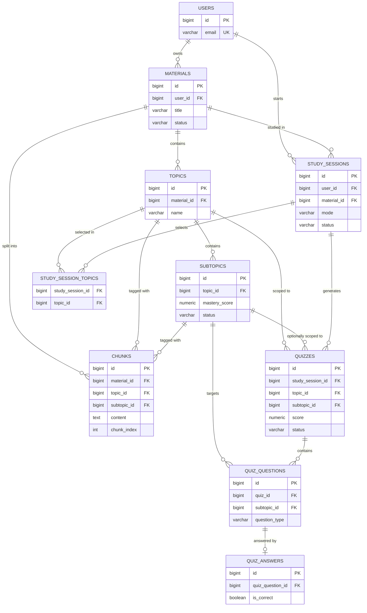

> **Implementation Language Directive**
>
> This document is written in Indonesian for documentation and planning purposes. However, all implementation based on this document must use **English** as the project's primary language.
>
> When implementing the requirements described in this document:
>
> * All user-facing UI text, labels, buttons, messages, notifications, and content must be written in **English**.
> * All source code, variable names, function names, class names, component names, and comments should use **English**.
> * All database names, table names, column names, enum values, and database-related identifiers must use **English**.
> * All API endpoints, request/response fields, validation messages, and API-related identifiers must use **English**.
> * All routes, URLs, configuration keys, and other technical identifiers must use **English**.
> * Do not directly copy Indonesian wording from this document into the application.
> * When this document contains Indonesian descriptions, interpret them as **functional and design requirements**, not as the literal language to be used in the implementation.
>
> **Important:** The language of this document does not determine the language of the application. The application must remain fully English unless another language requirement is explicitly specified.


# Studyback — Database Design Document (Final)

**Status:** Final, implementation-ready
**Source of truth:** Studyback Product Specification · Studyback System Architecture Blueprint · Studyback Tech Stack Specification
**Database Engine:** PostgreSQL (single application database)
**Framework:** Laravel (modular monolith, single owner of database state)
**Scope:** 48-hour hackathon MVP

---

## 1. Database Design Overview

### Purpose

This document is the **final Database Design Document (DDD)** for Studyback. This DDD translates the Product Specification, System Architecture Blueprint, and Tech Stack Specification into a concrete PostgreSQL schema that is ready to be implemented directly as Laravel migrations, Eloquent models, relationships, constraints, and indexes.

### Scope

The schema covers all entities needed to support the four core flows (New Material Flow, Existing Material Flow, Teach Me, Quiz Me, Review Weak Topics, Guided Study Session) as well as the Adaptive Learning Loop (Learn → Test → Evaluate → Review). The schema does **not** include entities not supported by the three source documents — including vector storage, embeddings, cache layers, queue/job tables, or conversation (chat log) tables that are not explicitly required in any MVP scope.

### Database Principles

1. **PostgreSQL as the single application database** — no secondary database, no vector database.
2. **Laravel is the sole owner of state** — AI (`ai_service`) never writes directly to the database; all writes are performed by the Application Modules after receiving structured output from the AI.
3. **Learning State is deterministic** — mastery/status is calculated by the Learning State logic in Laravel using a fixed formula, not by the LLM.
4. **Filter-based retrieval, not similarity search** — chunks are fetched via `WHERE material_id = ? AND topic_id = ?` (or `subtopic_id`), backed by regular indexes, not vector indexes.
5. **Simple schema for 48 hours** — every table must have a direct justification from one of the three source documents; no speculative tables.
6. **Explicit ownership** — every row of personal data (material and all of its derived data) can be traced back to its owner's `users.id` through the foreign key chain, supporting authorization at the Laravel level.

---

## 2. Architecture → Database Mapping

| Module (Architecture Blueprint §5) | Tables | Responsibility |
|---|---|---|
| **Auth** | `users` | User identity; the basis for all ownership scoping. |
| **Materials** | `materials` | Material Library CRUD, Material Detail assembly, Download Material metadata. |
| **Processing** | `materials` (status columns), `topics`, `subtopics`, `chunks` | Persists pipeline results: extract → chunk → topic/subtopic identification. |
| **Topics** | `topics`, `subtopics` | Topic/subtopic structure and status/mastery for the sidebar Learning Map. |
| **Study Session** | `study_sessions`, `study_session_topics` | Session configuration (selected topics, mode, difficulty) and connection to the active learning mode. |
| **AI Orchestration (`ai_service`)** | *(no tables)* | `ai_service` is thin & stateless — it never persists anything; it only returns structured data to the calling module. |
| **Quiz** | `quizzes`, `quiz_questions`, `quiz_answers` | Stores AI-generated quizzes (after validation), user answers, and evaluation results. |
| **Learning State** | `subtopics` (mastery/status columns), read together with `quiz_answers` as a historical log | Mastery & status are stored as current state on `subtopics`; attempt history is naturally stored in `quiz_answers`/`quiz_questions` without a separate table. |

> **Design Decision:** There is no separate `learning_state_events` table. Architecture Blueprint §9 requires "history of quiz attempts/scores contributing to the score" — this requirement is already satisfied by `quiz_answers` (joined to `quiz_questions.subtopic_id`), so adding a separate log table would only duplicate data that is already immutable in `quiz_answers`. This is consistent with Quality Rule #10 (simple schema for a 48-hour hackathon).

---

## 3. Entity Inventory

| Entity | Purpose | Module | Owner |
|---|---|---|---|
| `users` | Identity & authentication; root ownership of all data | Auth | Laravel (Sanctum) |
| `materials` | Metadata of uploaded material (title, file, processing status) | Materials / Processing | Laravel |
| `topics` | Top-level concepts from AI identification within one material | Topics / Processing | AI (identify) → Laravel (persist) |
| `subtopics` | Granular learning units; stores current mastery & status | Topics / Learning State | AI (identify) → Laravel (persist & update) |
| `chunks` | Fixed-length text segments of the material for retrieval/RAG | Processing / Retrieval | Laravel (deterministic) + AI (topic/subtopic tagging) |
| `study_sessions` | One study session (mode, difficulty, start/end time) | Study Session | Laravel |
| `study_session_topics` | Pivot of which topics are selected in one study session | Study Session | Laravel |
| `quizzes` | One quiz instance (topic/subtopic scope, aggregate result) | Quiz | AI (generate) → Laravel (validate, store, score) |
| `quiz_questions` | Individual quiz question + correct answer & target subtopic | Quiz | AI (generate) → Laravel (validate & persist) |
| `quiz_answers` | User's answer per question + AI evaluation result | Quiz / Learning State | AI (evaluate) → Laravel (persist & score) |

There is no separate table for "Material Processing" (persisted as status columns on `materials`, see §7 and §10) and no conversation/chat log table (Teach Me is a request/response generated directly from retrieval each time and is not required to be stored by any source).

---

## 4. Database Schema

All tables use `id BIGSERIAL PRIMARY KEY` unless stated otherwise, and use `created_at` / `updated_at` (`TIMESTAMP`) following the Laravel `timestamps()` convention, except where stated as immutable logs (only `created_at`).

### `users`

> **Design Decision:** Standard Laravel + Sanctum table. All three source documents state that authentication/authorization "remains controlled by Laravel" without specifying a provider beyond Sanctum (Tech Stack §3), so the schema follows the default Laravel `users` table structure. The `personal_access_tokens` table is provided automatically by the built-in Sanctum migration and is not redesigned here.

| Column | PostgreSQL Type | Nullable | Default | Constraints | Description |
|---|---|---|---|---|---|
| id | BIGSERIAL | No | auto | PRIMARY KEY | User identity |
| name | VARCHAR(255) | No | — | — | User name |
| email | VARCHAR(255) | No | — | UNIQUE | Login email |
| email_verified_at | TIMESTAMP | Yes | NULL | — | Email verification timestamp |
| password | VARCHAR(255) | No | — | — | Hashed password |
| remember_token | VARCHAR(100) | Yes | NULL | — | "Remember me" token |
| created_at | TIMESTAMP | No | now() | — | — |
| updated_at | TIMESTAMP | No | now() | — | — |

---

### `materials`

| Column | PostgreSQL Type | Nullable | Default | Constraints | Description |
|---|---|---|---|---|---|
| id | BIGSERIAL | No | auto | PRIMARY KEY | Material identity |
| user_id | BIGINT | No | — | FK → `users.id`, ON DELETE CASCADE | Material owner |
| title | VARCHAR(255) | No | — | — | Material name (Material Information) |
| description | TEXT | Yes | NULL | — | Short material description |
| original_filename | VARCHAR(255) | No | — | — | Original file name for Download Material |
| file_path | VARCHAR(500) | No | — | UNIQUE | Internal path in Laravel Filesystem (`storage/app/private`), hard to guess |
| file_size_bytes | INTEGER | No | — | CHECK (file_size_bytes > 0) | PDF file size |
| status | VARCHAR(20) | No | `'processing'` | CHECK (status IN ('processing','ready','failed')) | Material processing pipeline status |
| failed_reason | TEXT | Yes | NULL | — | Error message when status = 'failed' |
| created_at | TIMESTAMP | No | now() | — | Upload date |
| updated_at | TIMESTAMP | No | now() | — | — |

> **Design Decision:** Product Spec §3 displays granular UI stages ("Uploading… → Extracting Content… → Understanding Material… → Identifying Topics…"), but because Tech Stack §8 establishes **synchronous processing** (the entire pipeline runs inline within a single request), those stages are *ephemeral frontend state*, not state that needs to be persisted in the database. The database only stores the final states relevant for querying and failure handling: `processing` (running / just started), `ready` (successful, Architecture §13: "No partial material is marked Ready"), `failed` (failed at any point in the pipeline).

---

### `topics`

| Column | PostgreSQL Type | Nullable | Default | Constraints | Description |
|---|---|---|---|---|---|
| id | BIGSERIAL | No | auto | PRIMARY KEY | Topic identity |
| material_id | BIGINT | No | — | FK → `materials.id`, ON DELETE CASCADE | Material owning the topic |
| name | VARCHAR(255) | No | — | — | Topic name (result of AI topic extraction) |
| description | TEXT | Yes | NULL | — | Short topic description |
| order_index | SMALLINT | No | 0 | — | Display order in the sidebar |
| created_at | TIMESTAMP | No | now() | — | — |
| updated_at | TIMESTAMP | No | now() | — | — |

Additional constraint: `UNIQUE (material_id, name)` — prevents duplicate topic names within one material.

---

### `subtopics`

| Column | PostgreSQL Type | Nullable | Default | Constraints | Description |
|---|---|---|---|---|---|
| id | BIGSERIAL | No | auto | PRIMARY KEY | Subtopic identity |
| topic_id | BIGINT | No | — | FK → `topics.id`, ON DELETE CASCADE | Topic owning the subtopic |
| name | VARCHAR(255) | No | — | — | Subtopic name |
| description | TEXT | Yes | NULL | — | Short subtopic description |
| order_index | SMALLINT | No | 0 | — | Display order in the sidebar |
| mastery_score | NUMERIC(5,2) | No | 0 | CHECK (mastery_score BETWEEN 0 AND 100) | Current mastery score (Learning State) |
| status | VARCHAR(20) | No | `'not_started'` | CHECK (status IN ('not_started','in_progress','needs_review','mastered')) | Current learning status |
| created_at | TIMESTAMP | No | now() | — | — |
| updated_at | TIMESTAMP | No | now() | Updated every time the Learning State Engine recalculates mastery | Timestamp of the last mastery update |

Additional constraint: `UNIQUE (topic_id, name)`.

> **Design Decision:** Product Spec §8.2 states that mastery is stored **primarily at the Subtopic level** — this table is the center of the Learning State. `mastery_score` and `status` are stored directly as current-state columns (not a separate table) so the sidebar Learning Map can be read with a simple query without heavy aggregation on every render.

---

### `chunks`

| Column | PostgreSQL Type | Nullable | Default | Constraints | Description |
|---|---|---|---|---|---|
| id | BIGSERIAL | No | auto | PRIMARY KEY | Chunk identity |
| material_id | BIGINT | No | — | FK → `materials.id`, ON DELETE CASCADE | Material the chunk belongs to |
| topic_id | BIGINT | No | — | FK → `topics.id`, ON DELETE CASCADE | Topic from AI tagging |
| subtopic_id | BIGINT | Yes | NULL | FK → `subtopics.id`, ON DELETE SET NULL | Subtopic from AI tagging (if identified) |
| content | TEXT | No | — | — | Chunk text content (~1,000 characters + ~200 overlap) |
| chunk_index | INTEGER | No | — | — | Chunk order within the material (0-based) |
| created_at | TIMESTAMP | No | now() | — | Chunks are immutable; no `updated_at` |

Additional constraint: `UNIQUE (material_id, chunk_index)`.

> **Design Decision:** `chunks` are only persisted **after** the processing pipeline has fully succeeded (extraction → cleaning → chunking → topic identification) within a single transaction (see §15), so `topic_id` is always populated (NOT NULL) at commit time — consistent with Architecture §13: "No partial material is marked Ready." `subtopic_id` remains nullable because AI topic identification (Tech Stack §3, Architecture §6) is only required to produce a topic/subtopic structure in general; not every chunk can necessarily be mapped at the subtopic level of precision, so falling back to the topic level remains valid for retrieval.

---

### `study_sessions`

| Column | PostgreSQL Type | Nullable | Default | Constraints | Description |
|---|---|---|---|---|---|
| id | BIGSERIAL | No | auto | PRIMARY KEY | Study session identity |
| user_id | BIGINT | No | — | FK → `users.id`, ON DELETE CASCADE | Session owner |
| material_id | BIGINT | No | — | FK → `materials.id`, ON DELETE CASCADE | Material being studied |
| mode | VARCHAR(30) | No | — | CHECK (mode IN ('teach_me','quiz_me','review_weak_topics','guided_study_session')) | Selected Learning Mode |
| difficulty | VARCHAR(10) | Yes | NULL | CHECK (difficulty IN ('easy','medium','hard')) | Difficulty (relevant for modes that involve quizzes) |
| status | VARCHAR(20) | No | `'active'` | CHECK (status IN ('active','completed')) | Session status |
| started_at | TIMESTAMP | No | now() | — | Session start time |
| ended_at | TIMESTAMP | Yes | NULL | — | Session end time |
| created_at | TIMESTAMP | No | now() | — | — |
| updated_at | TIMESTAMP | No | now() | — | — |

> **Design Decision:** Product Spec §7 asserts that all Learning Modes (Teach Me, Quiz Me, Review Weak Topics, Guided Study Session) exist in the **same Workspace** — there are no separate pages. `study_sessions.mode` represents this as one row per session, not as a separate table per mode.

---

### `study_session_topics`

| Column | PostgreSQL Type | Nullable | Default | Constraints | Description |
|---|---|---|---|---|---|
| study_session_id | BIGINT | No | — | FK → `study_sessions.id`, ON DELETE CASCADE | Related session |
| topic_id | BIGINT | No | — | FK → `topics.id`, ON DELETE CASCADE | Topic selected for this session |
| created_at | TIMESTAMP | No | now() | — | — |

Primary Key: **composite** `(study_session_id, topic_id)`.

> **Design Decision:** Study Session Configuration (Product Spec §6) allows the user to select multiple topics at once ("Topics — which topic/concept to study"). Modeled as a pivot table (not a JSON array column) so it can still be enforced with foreign keys and indexed — meeting the relational integrity requirements for a concrete implementation reference.

---

### `quizzes`

| Column | PostgreSQL Type | Nullable | Default | Constraints | Description |
|---|---|---|---|---|---|
| id | BIGSERIAL | No | auto | PRIMARY KEY | Quiz identity |
| study_session_id | BIGINT | No | — | FK → `study_sessions.id`, ON DELETE CASCADE | Session that produced this quiz |
| topic_id | BIGINT | No | — | FK → `topics.id`, ON DELETE CASCADE | Quiz topic scope |
| subtopic_id | BIGINT | Yes | NULL | FK → `subtopics.id`, ON DELETE CASCADE | Specific subtopic scope (used by Review Weak Topics) |
| difficulty | VARCHAR(10) | Yes | NULL | CHECK (difficulty IN ('easy','medium','hard')) | Difficulty of this quiz |
| status | VARCHAR(20) | No | `'in_progress'` | CHECK (status IN ('in_progress','completed')) | Quiz status |
| total_questions | SMALLINT | No | 0 | CHECK (total_questions >= 0) | Number of questions |
| correct_count | SMALLINT | Yes | NULL | CHECK (correct_count >= 0) | Number of correct answers (after completed) |
| score | NUMERIC(5,2) | Yes | NULL | CHECK (score BETWEEN 0 AND 100) | Final quiz score (%) |
| completed_at | TIMESTAMP | Yes | NULL | — | Time the quiz was completed |
| created_at | TIMESTAMP | No | now() | — | — |
| updated_at | TIMESTAMP | No | now() | — | — |

> **Design Decision:** Review Weak Topics (Product Spec §7.2: "The AI gives a mini-question or re-test") **uses the same `quizzes` structure** as Quiz Me — the only difference is `study_sessions.mode = 'review_weak_topics'` and `quizzes.subtopic_id` being populated to narrow the scope to a single weak subtopic. This avoids duplicating a "review attempt" table that is structurally identical to a regular quiz (question → answer → evaluation → mastery update).

---

### `quiz_questions`

| Column | PostgreSQL Type | Nullable | Default | Constraints | Description |
|---|---|---|---|---|---|
| id | BIGSERIAL | No | auto | PRIMARY KEY | Question identity |
| quiz_id | BIGINT | No | — | FK → `quizzes.id`, ON DELETE CASCADE | Quiz owning the question |
| subtopic_id | BIGINT | No | — | FK → `subtopics.id`, ON DELETE CASCADE | Target subtopic for evaluation (for mastery updates) |
| question_type | VARCHAR(20) | No | — | CHECK (question_type IN ('multiple_choice','true_false','short_answer')) | Question type (Product Spec §7.1) |
| question_text | TEXT | No | — | — | Question text |
| options | JSONB | Yes | NULL | — | Answer options array (for `multiple_choice`) |
| correct_answer | TEXT | No | — | — | Correct answer / answer key reference |
| order_index | SMALLINT | No | 0 | — | Question order within the quiz |
| created_at | TIMESTAMP | No | now() | — | Immutable after creation; no `updated_at` |

> **Design Decision:** `subtopic_id` at the question level (not just at the quiz level) is required because one quiz can span multiple subtopics under one topic (e.g., a quiz for the topic "Inheritance" can contain questions from several of its subtopics), while the Learning State Engine needs to know **which subtopic** must have its mastery updated per question — consistent with Architecture §6: the AI returns "this maps to Subtopic X".

---

### `quiz_answers`

| Column | PostgreSQL Type | Nullable | Default | Constraints | Description |
|---|---|---|---|---|---|
| id | BIGSERIAL | No | auto | PRIMARY KEY | Answer identity |
| quiz_question_id | BIGINT | No | — | FK → `quiz_questions.id`, ON DELETE CASCADE, UNIQUE | Question answered (1 answer per question) |
| submitted_answer | TEXT | No | — | — | Answer submitted by the user |
| is_correct | BOOLEAN | No | — | — | Evaluation result (AI verdict, validated by Laravel) |
| ai_feedback | TEXT | Yes | NULL | — | Feedback from AI evaluation |
| answered_at | TIMESTAMP | No | now() | — | Time the answer was submitted |

> **Design Decision:** `UNIQUE (quiz_question_id)` enforces a 1:1 relationship between a question and an answer — each new quiz attempt ("Try Quiz Again") produces a new `quiz_questions` row (rather than overwriting the old answer), so this table also serves as the **historical log** of every attempt the user has made, without needing an additional log table (see §2).

---

## 5. Relationships

| Parent | Child | Cardinality | FK | Explanation |
|---|---|---|---|---|
| `users` | `materials` | 1 : N | `materials.user_id` | One user owns many materials. |
| `materials` | `topics` | 1 : N | `topics.material_id` | One material has many topics from AI extraction. |
| `topics` | `subtopics` | 1 : N | `subtopics.topic_id` | One topic has many subtopics. |
| `materials` | `chunks` | 1 : N | `chunks.material_id` | One material is split into many chunks. |
| `topics` | `chunks` | 1 : N | `chunks.topic_id` | Chunks are tagged with the topic from AI identification. |
| `subtopics` | `chunks` | 1 : N (optional) | `chunks.subtopic_id` | Chunks can be tagged more specifically to a subtopic. |
| `users` | `study_sessions` | 1 : N | `study_sessions.user_id` | One user starts many study sessions. |
| `materials` | `study_sessions` | 1 : N | `study_sessions.material_id` | One material can be studied across many different sessions. |
| `study_sessions` | `study_session_topics` | 1 : N | `study_session_topics.study_session_id` | One session selects many topics. |
| `topics` | `study_session_topics` | 1 : N | `study_session_topics.topic_id` | One topic can be selected in many sessions. |
| `study_sessions` | `quizzes` | 1 : N | `quizzes.study_session_id` | One session can produce more than one quiz (e.g., "Try Quiz Again"). |
| `topics` | `quizzes` | 1 : N | `quizzes.topic_id` | A quiz is always scoped to one topic. |
| `subtopics` | `quizzes` | 1 : N (optional) | `quizzes.subtopic_id` | A review quiz can be narrowed to one subtopic. |
| `quizzes` | `quiz_questions` | 1 : N | `quiz_questions.quiz_id` | One quiz has many questions. |
| `subtopics` | `quiz_questions` | 1 : N | `quiz_questions.subtopic_id` | Each question targets one subtopic for mastery updates. |
| `quiz_questions` | `quiz_answers` | 1 : 1 | `quiz_answers.quiz_question_id` (UNIQUE) | One question is answered exactly once per quiz attempt. |

---

## 6. Indexing Strategy

Indexes focus on two main needs: **ownership scoping** (queries for "belongs to this user") and **retrieval filtering** (Architecture §8: `Material + Topic/Subtopic → PostgreSQL Filter → Relevant Chunks`).

```sql
-- Main retrieval query the indexes must support:
-- SELECT * FROM chunks WHERE material_id = ? AND topic_id = ?;
-- SELECT * FROM chunks WHERE material_id = ? AND subtopic_id = ?;

CREATE INDEX idx_chunks_material_topic    ON chunks (material_id, topic_id);
CREATE INDEX idx_chunks_material_subtopic ON chunks (material_id, subtopic_id);
-- unique(material_id, chunk_index) automatically provides an additional index for ordering

CREATE INDEX idx_materials_user           ON materials (user_id);
CREATE INDEX idx_materials_user_status    ON materials (user_id, status);

CREATE INDEX idx_topics_material          ON topics (material_id);
CREATE INDEX idx_subtopics_topic          ON subtopics (topic_id);
CREATE INDEX idx_subtopics_status         ON subtopics (status);

CREATE INDEX idx_study_sessions_user_material ON study_sessions (user_id, material_id);

CREATE INDEX idx_quizzes_session          ON quizzes (study_session_id);
CREATE INDEX idx_quiz_questions_quiz      ON quiz_questions (quiz_id);
CREATE INDEX idx_quiz_questions_subtopic  ON quiz_questions (subtopic_id);
-- unique(quiz_question_id) on quiz_answers is automatically indexed
```

There are no additional indexes beyond this list — consistent with the instruction not to over-index. A full-text index (`tsvector`) is mentioned in Tech Stack §10 as *SHOULD LEARN/optional*, not an MVP requirement, so it is not included in the baseline.

---

## 7. State & Enum Design

| Entity.Column | Values | Meaning |
|---|---|---|
| `materials.status` | `processing`, `ready`, `failed` | Material Processing pipeline status (Product Spec §3, Architecture §7 & §13). |
| `subtopics.status` | `not_started`, `in_progress`, `needs_review`, `mastered` | Learning status per subtopic; mapped to sidebar symbols `○ ◐ ⚠ ✓` (Product Spec §7.4). |
| `study_sessions.mode` | `teach_me`, `quiz_me`, `review_weak_topics`, `guided_study_session` | Active Learning Mode in the Studyback Workspace (Product Spec §7.2). |
| `study_sessions.difficulty` | `easy`, `medium`, `hard` | Session configuration difficulty (Product Spec §6). |
| `study_sessions.status` | `active`, `completed` | Session lifecycle. |
| `quizzes.status` | `in_progress`, `completed` | Quiz lifecycle. |
| `quizzes.difficulty` | `easy`, `medium`, `hard` | Inherited from the session configuration. |
| `quiz_questions.question_type` | `multiple_choice`, `true_false`, `short_answer` | Question type (Product Spec §7.1, Quiz — structured interface). |

Status → mastery threshold mapping (Product Spec §8.2, fixed & deterministic):

| Score | Status |
|---|---|
| < 60% | `needs_review` |
| 60% – 79% | `in_progress` |
| ≥ 80% | `mastered` |

`not_started` is specifically for subtopics that have never had any `quiz_answers` at all (never tested).

---

## 8. Learning State Model

**Current state** is stored directly as columns on `subtopics`: `mastery_score` (NUMERIC 0–100) and `status` (enum). These columns are the single source of truth read by the sidebar Learning Map, Material Detail ("Overall mastery"), and Review Weak Topics.

**History of attempts** needs no separate table — all historical answers are available in `quiz_answers` (joined via `quiz_questions.subtopic_id`), which is immutable (never updated, only inserted).

**Mastery update formula (Design Decision, deterministic per Product Spec §8.2):**

Whenever a quiz is completed (`quizzes.status → 'completed'`), for every unique `subtopic_id` appearing among the `quiz_questions` of that quiz, the Learning State Engine (Laravel) recalculates:

```sql
mastery_score = (
  SELECT AVG(CASE WHEN qa.is_correct THEN 100 ELSE 0 END)
  FROM quiz_answers qa
  JOIN quiz_questions qq ON qq.id = qa.quiz_question_id
  WHERE qq.subtopic_id = :subtopic_id
);
```

that is, the **cumulative average of every answer ever given** for that subtopic (across all quizzes/attempts), and then `status` is determined from the thresholds in §7. The calculated value is written back to `subtopics.mastery_score` and `subtopics.status` (`updated_at` is automatically refreshed).

**Overall mastery per material** (Product Spec §5, "Overall mastery") is **not stored as a column** — it is calculated on the fly as `AVG(subtopics.mastery_score)` over all subtopics belonging to that material, so there is no risk of the aggregate value becoming stale relative to its source.

**AI is never the owner of the Learning State:** `ai_service` only returns a verdict per answer (`is_correct`, `ai_feedback`), which is then **validated and written by Laravel** into `quiz_answers`; the `mastery_score`/`status` calculation is done entirely by Laravel (Learning State Engine), not by the LLM — consistent with Architecture §6 & §9.

---

## 9. Quiz & Study Session Model

- **Study Session** (`study_sessions`) is created when the user presses *Start Learning* or *Start Study Session*, storing the `mode`, `difficulty`, and selected topics (`study_session_topics`).
- **Quiz** (`quizzes`) is created by the Quiz Module every time the AI Orchestrator produces a new quiz (triggered from Quiz Me, the Test stage of Guided Study Session, or a Review Weak Topics re-test) — always linked to the running `study_session_id`.
- **Questions** (`quiz_questions`) are generated by the AI (structured JSON), and their shape is validated by Laravel before insert (Architecture §13: validate shape, retry-once if invalid).
- **Answers/Attempts** (`quiz_answers`) are inserted one per question after the user submits; the AI evaluation result (`is_correct`, `ai_feedback`) is stored as a reference, but **the final score is recalculated by Laravel** (not merely copied from the AI), consistent with Architecture §5: "scores answers deterministically (using AI evaluation output as input, not as final authority on state)".
- **Score/Evaluation**: once all `quiz_questions` are answered, Laravel calculates `quizzes.correct_count`, `quizzes.score = correct_count / total_questions * 100`, sets `quizzes.status = 'completed'` and `completed_at`, then triggers the update of `subtopics.mastery_score`/`status` (§8) within a single transaction (§15).

Only the data that is truly needed is persisted — no storage of free-form conversation (chat) from Teach Me, because only the four structured output areas are supported (Product Spec §9.1): topic extraction, quiz generation, answer evaluation, and learning state-related output.

---

## 10. Material Processing Model

Pipeline (Architecture §7, Tech Stack §4):

```text
PDF
 ↓ (File Storage)                         materials.file_path, materials.status = 'processing'
Text Extraction (spatie/pdf-to-text)
 ↓
Cleaning (PHP native, not persisted)
 ↓
Fixed-Length Chunking (~1,000 char, ~200 char overlap)
 ↓ (in memory, not yet inserted)
Topic/Subtopic Identification (ai_service → Featherless, structured JSON)
 ↓
PostgreSQL — within ONE transaction:
   INSERT topics
   INSERT subtopics
   INSERT chunks (with topic_id/subtopic_id from AI)
   UPDATE materials SET status = 'ready'
```

If the pipeline fails at any point (extraction fails, AI fails after retry-once, structured output validation fails), the transaction above is fully rolled back and `materials.status` is set to `'failed'` with `failed_reason` populated outside the main transaction (a single update), so there is never a material with partial `topics`/`subtopics`/`chunks` — consistent with Architecture §13.

---

## 11. File Storage Metadata

PDF binaries are **not** stored in PostgreSQL — only their metadata, per Tech Stack §5 (Laravel Filesystem, `local` disk, `storage/app/private`):

| Column (in `materials`) | Purpose |
|---|---|
| `original_filename` | Filename shown to the user during Download Material. |
| `file_path` | Internal file name/path on the `local` disk (hard to guess, not exposed to the client). |
| `file_size_bytes` | Upload size validation & file info display. |

Download Material always goes through a backend-proxied route (`Storage::download()`) after an ownership check (`materials.user_id === auth()->id()`) — there is no direct public URL to the file.

---

## 12. Retrieval Design

Flow implementation (Architecture §8, Tech Stack §6):

```text
Study Session (material_id, selected topic_id/subtopic_id)
        ↓
SELECT content FROM chunks
WHERE material_id = :material_id
  AND (topic_id = :topic_id OR subtopic_id = :subtopic_id)
ORDER BY chunk_index ASC
        ↓
Relevant Chunks → assembled into Relevant Context
        ↓
ai_service builds the prompt (Retrieved Context + Task Input)
```

This query is directly supported by the `chunks.material_id` + `chunks.topic_id` relationships (and `chunks.subtopic_id` for a narrower scope) along with the composite indexes `idx_chunks_material_topic` / `idx_chunks_material_subtopic` (§6). There is no similarity search, embedding, or vector index — purely a relational `WHERE` filter, consistent with the final architecture decision.

---

## 13. Laravel Eloquent Mapping

| Table | Model | Relationships |
|---|---|---|
| `users` | `User` | `hasMany(Material::class)`, `hasMany(StudySession::class)` |
| `materials` | `Material` | `belongsTo(User::class)`, `hasMany(Topic::class)`, `hasMany(Chunk::class)`, `hasMany(StudySession::class)` |
| `topics` | `Topic` | `belongsTo(Material::class)`, `hasMany(Subtopic::class)`, `hasMany(Chunk::class)`, `belongsToMany(StudySession::class, 'study_session_topics')`, `hasMany(Quiz::class)` |
| `subtopics` | `Subtopic` | `belongsTo(Topic::class)`, `hasMany(Chunk::class)`, `hasMany(QuizQuestion::class)`, `hasMany(Quiz::class)` |
| `chunks` | `Chunk` | `belongsTo(Material::class)`, `belongsTo(Topic::class)`, `belongsTo(Subtopic::class)` |
| `study_sessions` | `StudySession` | `belongsTo(User::class)`, `belongsTo(Material::class)`, `belongsToMany(Topic::class, 'study_session_topics')`, `hasMany(Quiz::class)` |
| `study_session_topics` | *(pivot, no model required)* | Accessed via `belongsToMany` |
| `quizzes` | `Quiz` | `belongsTo(StudySession::class)`, `belongsTo(Topic::class)`, `belongsTo(Subtopic::class)`, `hasMany(QuizQuestion::class)` |
| `quiz_questions` | `QuizQuestion` | `belongsTo(Quiz::class)`, `belongsTo(Subtopic::class)`, `hasOne(QuizAnswer::class)` |
| `quiz_answers` | `QuizAnswer` | `belongsTo(QuizQuestion::class)` |

Ownership scoping is applied through Laravel Policies on `Material` (the root entity); all queries to `Topic`, `Subtopic`, `Chunk`, `StudySession`, `Quiz`, etc. are performed through relationships scoped from the `Material` owned by `auth()->user()`.

---

## 14. Migration Order

Order based on foreign-key dependencies (must be executed sequentially):

1. `users` *(default Laravel/Sanctum)*
2. `materials` — depends on `users`
3. `topics` — depends on `materials`
4. `subtopics` — depends on `topics`
5. `chunks` — depends on `materials`, `topics`, `subtopics`
6. `study_sessions` — depends on `users`, `materials`
7. `study_session_topics` — depends on `study_sessions`, `topics`
8. `quizzes` — depends on `study_sessions`, `topics`, `subtopics`
9. `quiz_questions` — depends on `quizzes`, `subtopics`
10. `quiz_answers` — depends on `quiz_questions`

---

## 15. Transaction Boundaries

| Operation | Transaction Scope | Reason |
|---|---|---|
| **Material processing persistence** | `INSERT topics` + `INSERT subtopics` + `INSERT chunks` + `UPDATE materials.status = 'ready'` within one `DB::transaction()` | Prevents a "Ready" material with incomplete topic/subtopic/chunk data (Architecture §13). Failure → full rollback, then `UPDATE materials.status = 'failed'` as a separate operation. |
| **Quiz submission** | `INSERT quiz_answers` for all submitted questions + `UPDATE quizzes` (correct_count, score, status, completed_at) within one `DB::transaction()` | Guarantees consistent quiz results (score is always in sync with the stored answers). |
| **Score calculation & Learning State update** | Runs **within the same transaction** as the Quiz submission: after `quiz_answers` are inserted and `quizzes` is updated, `UPDATE subtopics.mastery_score, subtopics.status` for every affected subtopic | Architecture §13 (guiding principle): "never let an AI failure silently corrupt Learning State" — if the AI evaluation fails before commit, the entire transaction (including the mastery update) is rolled back and the old state remains intact. |

---

## 16. Deletion & Lifecycle Rules

- **Hard delete** is used throughout the schema — no `deleted_at`/soft delete, because none of the three source documents requires soft-delete/recovery, and adding it would only add complexity that is not needed for the 48-hour MVP.
- **`users` → `materials`**: `ON DELETE CASCADE`. Deleting a user deletes all of their materials along with all derived data.
- **`materials` → `topics`, `chunks`, `study_sessions`**: `ON DELETE CASCADE`. A material is the personal root entity; deleting it cleans up the entire topic/subtopic/chunk structure as well as related study sessions.
- **`topics` → `subtopics`, `chunks`, `study_session_topics`, `quizzes`**: `ON DELETE CASCADE`.
- **`subtopics` → `quiz_questions`, `quizzes` (scope)**: `ON DELETE CASCADE`. **`chunks.subtopic_id`**: `ON DELETE SET NULL` — a chunk remains useful for topic-level retrieval even if its subtopic tagging is gone.
- **`study_sessions` → `quizzes`, `study_session_topics`**: `ON DELETE CASCADE`.
- **`quizzes` → `quiz_questions`**: `ON DELETE CASCADE`. **`quiz_questions` → `quiz_answers`**: `ON DELETE CASCADE`.
- There is no "archive"/"expire" lifecycle — consistent with the MVP scope, materials and learning state remain persistent as long as the user does not delete them.

---

## 17. Security & Ownership

- Every `materials` row has a `user_id` as the single source of ownership; all derived entities (`topics`, `subtopics`, `chunks`, `study_sessions`, `quizzes`, `quiz_questions`, `quiz_answers`) can only be traced through the foreign key chain that ends at `materials.user_id`.
- Laravel Policies/Middleware validate `materials.user_id === auth()->id()` on **every** read/write request to a material or its descendants — no endpoint allows cross-user access (Architecture §14).
- `chunks.content` (material content) may only be sent to the LLM Provider within the scope of the logged-in user's own material/topic — never cross-user within a single prompt (Architecture §14, LLM data boundary).
- `materials.file_path` is never exposed as a public URL; access is only through an authenticated backend route with an ownership check (§11).
- There is no sharing/public material mechanism in this schema — all material data is private per user, consistent with the MVP scope.

---

## 18. Final ERD



---

## 19. Final Schema Summary

| Table | Purpose | Primary Key | Important Foreign Keys |
|---|---|---|---|
| `users` | Identity & authentication | `id` | — |
| `materials` | Uploaded material metadata & processing status | `id` | `user_id → users.id` |
| `topics` | Top-level concepts within a material | `id` | `material_id → materials.id` |
| `subtopics` | Granular mastery/status units | `id` | `topic_id → topics.id` |
| `chunks` | Text segments for retrieval | `id` | `material_id → materials.id`, `topic_id → topics.id`, `subtopic_id → subtopics.id` |
| `study_sessions` | Study sessions (mode, difficulty) | `id` | `user_id → users.id`, `material_id → materials.id` |
| `study_session_topics` | Topics selected per session | `(study_session_id, topic_id)` | `study_session_id → study_sessions.id`, `topic_id → topics.id` |
| `quizzes` | Quiz instance & aggregate result | `id` | `study_session_id → study_sessions.id`, `topic_id → topics.id`, `subtopic_id → subtopics.id` |
| `quiz_questions` | Individual quiz questions | `id` | `quiz_id → quizzes.id`, `subtopic_id → subtopics.id` |
| `quiz_answers` | User answers & evaluation results | `id` | `quiz_question_id → quiz_questions.id` (UNIQUE) |

---

## 20. Implementation Checklist

- [ ] **Migrations** created in the §14 order, one migration file per table, using the PostgreSQL column types in §4.
- [ ] **Models** created per §13 (`User`, `Material`, `Topic`, `Subtopic`, `Chunk`, `StudySession`, `Quiz`, `QuizQuestion`, `QuizAnswer`); `study_session_topics` is sufficient as a pivot table without a model.
- [ ] **Eloquent relationships** (`belongsTo`, `hasMany`, `belongsToMany`) implemented exactly per §5 and §13.
- [ ] **Foreign keys** and `ON DELETE` behavior applied exactly per §16 (`CASCADE` for all children except `chunks.subtopic_id` → `SET NULL`).
- [ ] **Indexes** created exactly per the list in §6 — no indexes beyond that list.
- [ ] **Constraints**: all `CHECK` enum constraints (§7) and numeric constraints (`mastery_score`, `score` 0–100; `file_size_bytes > 0`) enforced at the migration level, not just application validation.
- [ ] **Seeders**: a minimal seeder for one demo user + one sample material with topics/subtopics/chunks (for demo rehearsal purposes, Architecture §16 Phase 7) — optional, not required for the schema itself.
- [ ] **Transactions**: `DB::transaction()` applied to Material Processing persistence and to Quiz submission + Learning State update per §15.
- [ ] **Ownership scoping**: Policies/middleware validate `materials.user_id` on every endpoint that touches a material or its descendants, per §17.
- [ ] **Retrieval support**: the chunk filter query (`material_id` + `topic_id`/`subtopic_id`, `ORDER BY chunk_index`) implemented in the Retrieval module per §12, using the indexes defined in §6.