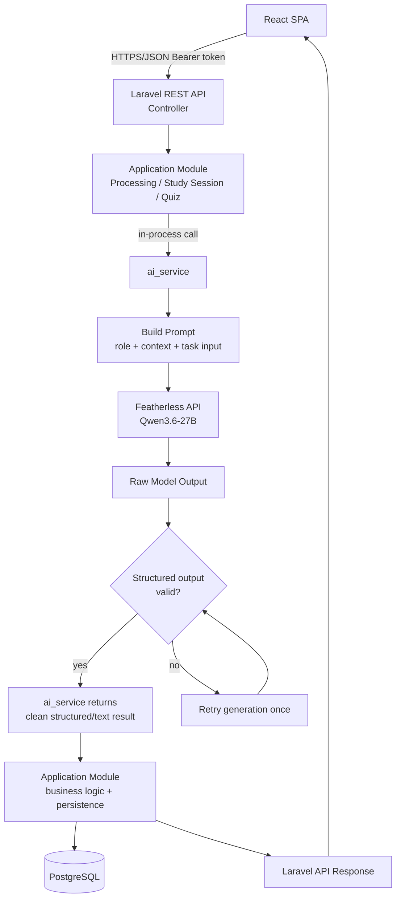
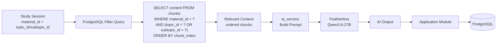
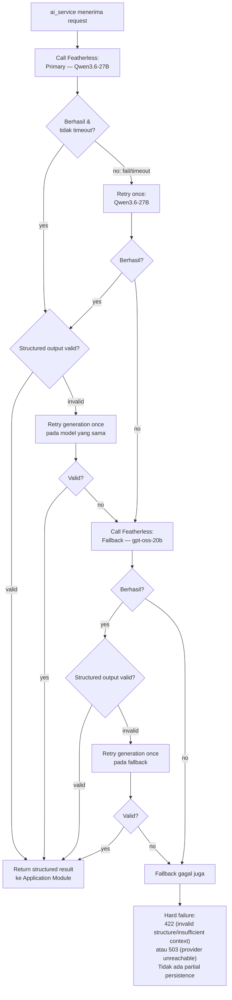

> **Implementation Language Directive**
>
> This document is written in Indonesian for documentation and planning purposes. However, all implementation based on this document must use **English** as the project's primary language.
>
> When implementing the requirements described in this document:
>
> * All user-facing UI text, labels, buttons, messages, notifications, and content must be written in **English**.
> * All source code, variable names, function names, class names, component names, and comments should use **English**.
> * All database names, table names, column names, enum values, and database-related identifiers must use **English**.
> * All API endpoints, request/response fields, validation messages, and API-related identifiers must use **English**.
> * All routes, URLs, configuration keys, and other technical identifiers must use **English**.
> * Do not directly copy Indonesian wording from this document into the application.
> * When this document contains Indonesian descriptions, interpret them as **functional and design requirements**, not as the literal language to be used in the implementation.
>
> **Important:** The language of this document does not determine the language of the application. The application must remain fully English unless another language requirement is explicitly specified.


# Studyback — AI Architecture Document (Final)

**Status:** Final, implementation-ready
**Source of truth:** Studyback System Architecture Blueprint · Studyback Database Design Document (Final) · Studyback API Design Document (Final)
**AI Service:** `ai_service` — in-process Laravel service (bukan microservice/container)
**Primary Model:** `Qwen3.6-27B`
**Fallback Model:** `gpt-oss-20b` (retry-once pada primary, lalu fallback jika masih gagal)
**LLM Provider:** Featherless API (external)
**Retrieval:** PostgreSQL filter-based (`material_id` + `topic_id`/`subtopic_id`), tanpa vector database/embedding
**Scope:** 48-hour hackathon MVP

---

## 1. AI Architecture Overview

### Role AI dalam Studyback

AI di Studyback hanya bertugas melakukan **reasoning tasks** — bukan menyimpan state, bukan mengambil keputusan final atas data aplikasi. Sesuai Architecture Blueprint §6 dan §12, AI ("AI Orchestrator" di level blueprint, diimplementasikan sebagai `ai_service` di level Laravel) melakukan empat hal saja:

1. Mengidentifikasi topic/subtopic dari material yang diupload.
2. Menjelaskan konsep (Teach Me / Review).
3. Menghasilkan pertanyaan quiz terstruktur.
4. Mengevaluasi jawaban user terhadap kunci jawaban.

Semua hasil AI di atas adalah **judgment terstruktur atau teks percakapan** yang dikembalikan ke Application Module pemanggil. AI tidak pernah menentukan apakah sebuah subtopic "dikuasai" (mastered), tidak pernah menulis ke PostgreSQL, dan tidak pernah menjadi pemilik Learning State (Architecture §6, §9; Database Design §8).

### Boundary antar Layer

| Layer | Boleh melakukan | Tidak boleh melakukan |
|---|---|---|
| **React (Frontend)** | Memanggil Laravel REST API | Memanggil Featherless langsung; memanggil `ai_service` langsung; membaca/menulis PostgreSQL langsung |
| **Laravel (Application Modules)** | Routing, validasi, ownership check, business logic, transaksi database, memanggil `ai_service` | Melewati validasi AI output; mempersist raw AI output tanpa validasi |
| **`ai_service` (in-process Laravel service)** | Membangun prompt, memilih model, memanggil Featherless, retry/fallback, memvalidasi bentuk structured output | Menulis ke PostgreSQL; memutuskan Learning State; dipanggil langsung dari HTTP route/frontend |
| **Featherless (External LLM Provider)** | Menjalankan inference (`Qwen3.6-27B` / `gpt-oss-20b`) atas prompt yang dikirim | Mengakses database; mengakses material milik user lain |
| **PostgreSQL (Data Layer)** | Menyimpan seluruh state aplikasi (materials, topics, subtopics, chunks, quizzes, learning state) | Menerima write langsung dari AI |

Ini konsisten dengan diagram arsitektur tingkat tinggi di Architecture Blueprint §3: *"the AI Layer never writes to the Data Layer directly, and the AI Orchestrator never bypasses the Application Modules."* Di level implementasi (API Design §2), diagram ini diterjemahkan menjadi:

```
React SPA → Laravel REST API → Application Module → ai_service → Featherless API
                                                          ↓
                                          ai_service memvalidasi structured output
                                                          ↓
                                     Application Module (business logic deterministik)
                                                          ↓
                                                     PostgreSQL
                                                          ↓
                                          Laravel API → React SPA (JSON response)
```

### Prinsip Final (tidak dapat dinegosiasikan)

1. `ai_service` adalah in-process Laravel service — dipanggil melalui function/service call biasa di dalam proses PHP yang sama, bukan HTTP call ke service terpisah (Architecture §5: *"Communication pattern: modules communicate through direct in-process function/service calls... only Study Session and Processing call AI Orchestration"*).
2. Laravel adalah satu-satunya owner application/database state (Database Design Prinsip #2).
3. AI tidak pernah menulis database secara langsung — seluruh write dilakukan Application Module setelah menerima & memvalidasi structured output.
4. `ai_service` bersifat thin & stateless — tidak menyimpan apa pun antar request, tidak punya tabel sendiri (Database Design §2: *"ai_service — tidak ada tabel"*).
5. Retrieval berbasis PostgreSQL filtering (`material_id` + `topic_id`/`subtopic_id`), tanpa vector database/embedding untuk MVP.
6. Frontend tidak pernah memanggil Featherless langsung, dan tidak pernah menerima raw AI output — hanya hasil yang sudah divalidasi & diproses Laravel (API Design §1).

---

## 2. AI Architecture Flow

### 2.1 General AI Request Flow



### 2.2 Retrieval + AI Flow



Jika filter query tidak menghasilkan chunk sama sekali untuk `material_id` + `topic_id`/`subtopic_id` yang diminta, Laravel **tidak memanggil LLM sama sekali** — ini adalah application-level failure (`422 Unprocessable Entity` untuk quiz generation), bukan sesuatu yang "ditutupi" dengan jawaban AI berbasis general knowledge (Architecture §13; API Design §12). Pengecualian: untuk Explanation, jika konteks kosong, `ai_service` tetap dipanggil namun diinstruksikan secara eksplisit untuk menyatakan materi tidak mencakup topik tersebut (API Design §14.2) — lihat §6.

### 2.3 Fallback Flow



**Design Decision:** Source documents (API Design §14, §7 `POST /api/materials`) mendefinisikan urutan *"retry once dengan primary → jika masih gagal, fallback ke `gpt-oss-20b`"* untuk kegagalan panggilan (network/timeout/provider error). Untuk kegagalan **validasi bentuk structured output** (JSON valid tapi shape salah), Architecture §13 menyebutkan *"retry generation once; if still invalid, treat as pipeline failure"* tanpa merinci apakah retry ini terjadi di model yang sama atau berpindah model. Karena kedua sumber tidak bertentangan dan retry-once adalah pola yang konsisten di seluruh dokumen, `ai_service` menerapkan retry structural-validation pada model yang sedang aktif (primary atau fallback, sesuai tahap saat itu terjadi) sebelum pindah tahap berikutnya — ini adalah solusi paling sederhana yang tidak menambah percabangan baru di luar yang sudah dispesifikasikan.

---

## 3. `ai_service` Design

### Responsibility

`ai_service` adalah **thin, stateless abstraction layer** di dalam Laravel yang menjadi satu-satunya komponen yang boleh berbicara dengan Featherless API (Architecture §5: *"AI Orchestration — The only module allowed to talk to the LLM Interface"*). Hanya dua module yang boleh memanggil `ai_service`: **Processing** (topic/subtopic identification) dan **Study Session** (yang selanjutnya mencakup Quiz — lihat §4).

### Boundary

- `ai_service` **tidak** memiliki tabel database sendiri (Database Design §2).
- `ai_service` **tidak** mempertahankan state antar request — setiap pemanggilan menerima seluruh context yang dibutuhkan sebagai parameter (retrieved chunks, task input) dan mengembalikan hasil tanpa efek samping.
- `ai_service` **tidak** pernah dipanggil langsung dari route/controller HTTP sebagai endpoint terpisah — ia dipanggil secara in-process dari dalam Application Module (Processing Module, atau Quiz/Explanation Controller di bawah Study Session), persis sebagaimana didefinisikan di API Design §3: *"no dedicated endpoint — invoked internally by Study Session and Quiz modules."*

### Internal Responsibilities

| Tanggung Jawab | Deskripsi |
|---|---|
| **Prompt construction** | Merangkai tiga bagian logis: role/instruction, retrieved context (chunks), task-specific input (lihat §9). |
| **Model selection** | Menentukan model aktif: `Qwen3.6-27B` (default/primary) atau `gpt-oss-20b` (setelah primary gagal, lihat §11). |
| **Featherless communication** | Mengirim request ke Featherless API dengan model & prompt yang sudah dibangun; menangani timeout. |
| **Retry/fallback** | Retry-once pada primary sebelum pindah ke fallback (lihat §2.3, §11). |
| **Structured-output validation** | Memvalidasi bentuk (shape) JSON terhadap schema tiap capability (lihat §10) sebelum mengembalikan hasil ke Application Module. |
| **Error handling** | Mengklasifikasikan kegagalan (timeout, provider error, invalid JSON, empty response) dan mengembalikan sinyal kegagalan yang jelas ke pemanggil (lihat §13) — bukan exception yang tidak tertangani. |

### Public Interface (conceptual — internal Laravel methods, bukan HTTP routes)

```
ai_service->identifyTopics(string $chunkedText): TopicIdentificationResult|AiFailure
ai_service->explain(array $contextChunks, string $intent, ?string $message): string|AiFailure
ai_service->generateQuiz(array $contextChunks, string $difficulty, int $questionCount): QuizGenerationResult|AiFailure
ai_service->evaluateAnswer(string $questionText, string $correctAnswer, string $submittedAnswer): AnswerEvaluationResult|AiFailure
```

Empat method ini persis memetakan ke empat AI capability di §4. Tidak ada method tambahan di luar yang dibutuhkan source documents (Design Rule: *"Jangan membuat AI feature baru yang tidak ada di source documents"*).

---

## 4. AI Capability Mapping

| Capability | Trigger | Input | Retrieval | Output | Persistence |
|---|---|---|---|---|---|
| **Topic/Subtopic Identification** | `POST /api/materials` (upload PDF) | Seluruh chunked text hasil extraction (material baru) | Tidak ada (material belum punya chunk tersimpan; input berasal langsung dari hasil chunking in-memory) | JSON: array topics `{name, description, subtopics:[{name, description}]}` | `topics`, `subtopics`, `chunks` (dengan `topic_id`/`subtopic_id`), `materials.status = 'ready'` — satu transaction |
| **Teach Me / Explanation** | `POST /api/study-sessions/{studySession}/explanations` | `subtopic_id`, `intent` (`explain`/`simplify`/`example`/`review`), `message` (opsional) | `SELECT content FROM chunks WHERE material_id = ? AND (topic_id = ? OR subtopic_id = ?) ORDER BY chunk_index` | Teks percakapan bebas (tidak terstruktur) | Tidak ada — tidak ada chat-log table (Database Design §3) |
| **Quiz Generation** | `POST /api/study-sessions/{studySession}/quizzes` | `topic_id`, `subtopic_id` (opsional), `difficulty`, `question_count` (3–10, default 5) | Sama seperti Explanation, discoped ke `topic_id`/`subtopic_id` yang diminta | JSON: array questions `{question_type, question_text, options?, correct_answer, subtopic_id, order_index}` | `quizzes`, `quiz_questions` — satu transaction |
| **Answer Evaluation** | `POST /api/quizzes/{quiz}/questions/{quizQuestion}/answer` | `question_text`, `correct_answer` (internal), `submitted_answer` | Tidak ada retrieval baru — konteks sudah melekat pada `quiz_question` yang tersimpan | JSON: `{is_correct: boolean, feedback: string}` | `quiz_answers` (insert), `subtopics.mastery_score`/`status` (update), `quizzes` (conditional update jika quiz selesai) — satu transaction |

Empat capability ini persis sama dengan yang didefinisikan di Architecture §6 (*"Where structured output is required"*) dan API Design §14 — tidak ada capability tambahan.

---

## 5. Topic/Subtopic Identification

### Flow

```
PDF (multipart upload, POST /api/materials)
  ↓ Laravel Filesystem — storage/app/private
Extraction (spatie/pdf-to-text) — deterministic library, bukan AI
  ↓
Cleaning (PHP native, in-memory, tidak dipersist)
  ↓
Fixed-Length Chunking (~1.000 karakter, ~200 karakter overlap, tanpa heading detection)
  ↓ (di memory, belum di-insert ke database)
ai_service->identifyTopics($chunkedText)
  → Prompt: role/instruction ("identify topics and subtopics from this material") + full chunked text
  → Featherless: Qwen3.6-27B (retry-once → fallback gpt-oss-20b bila gagal/timeout)
  → Validasi shape: array of { name, description, subtopics: [{ name, description }] }
  → invalid setelah retry sekali → pipeline failure
  ↓
Laravel: tagging setiap chunk dengan topic_id/subtopic_id berdasarkan hasil AI
  ↓
PostgreSQL — SATU transaction:
   INSERT topics
   INSERT subtopics
   INSERT chunks (dengan topic_id/subtopic_id hasil tagging)
   UPDATE materials SET status = 'ready'
  ↓
Response: material JSON (status: "ready" | "failed")
```

### Pembagian Tanggung Jawab (Design Rule: AI hanya identification, Laravel yang persist)

| Langkah | Dilakukan Oleh |
|---|---|
| Extraction, cleaning, chunking | Laravel (Processing Module) — deterministic, bukan AI |
| Identifikasi topic/subtopic dari teks | `ai_service` (AI) — mengembalikan **data terstruktur saja**, tidak menyentuh database |
| Tagging chunk ke topic/subtopic hasil AI | Laravel (Processing Module) — mapping deterministik dari hasil AI ke setiap chunk |
| Insert `topics`/`subtopics`/`chunks`, update `materials.status` | Laravel (Processing Module), dalam satu `DB::transaction()` |

Ini konsisten dengan Architecture §7: *"Topic/Subtopic ID → AI processing (AI Orchestrator + LLM, structured output)"* diikuti *"Storage → Data storage"* sebagai langkah terpisah yang dimiliki Laravel, dan Database Design §10 yang menegaskan seluruh insert terjadi dalam satu transaction setelah AI selesai.

### Validasi Laravel

- Bentuk JSON harus berupa array topic, masing-masing dengan `name` (string, wajib), `description` (string, opsional), dan `subtopics` (array, boleh kosong tapi harus berupa array).
- Setiap `subtopics[].name` wajib ada.
- Jika array topics kosong sama sekali → dianggap invalid structured output (bukan "material tanpa topic") → retry, lalu pipeline failure jika masih kosong — konsisten dengan Architecture §13: *"not silently 'Ready' with zero topics."*

### Database Persistence

Satu transaction (Database Design §15) yang mencakup: `INSERT topics` (N baris, `UNIQUE(material_id, name)`), `INSERT subtopics` (N baris per topic, `UNIQUE(topic_id, name)`), `INSERT chunks` (semua chunk hasil chunking, dengan `topic_id` NOT NULL dan `subtopic_id` nullable — lihat Database Design §4 Design Decision pada `chunks`), dan `UPDATE materials.status = 'ready'`.

### Error/Fallback Behavior

Kegagalan di titik manapun (extraction gagal, AI gagal setelah retry+fallback, validasi structured output gagal setelah retry) → seluruh transaction di-rollback → `materials.status = 'failed'` diset sebagai **update terpisah** (di luar transaction utama, karena baris `materials` sudah ada sejak awal pipeline dengan `status = 'processing'`) dengan `failed_reason` terisi. Tidak pernah ada material dengan `topics`/`subtopics`/`chunks` sebagian (Architecture §13; Database Design §10).

---

## 6. Teach Me / Explanation

### Flow

```
Frontend: user memilih subtopic di sidebar → POST /api/study-sessions/{studySession}/explanations
  { subtopic_id, intent: "explain" | "simplify" | "example" | "review", message?: string }
  ↓
Laravel: validasi subtopic_id termasuk dalam material milik session; session harus 'active'
  ↓
Retrieval (filter-based, bukan similarity search):
  SELECT content FROM chunks
  WHERE material_id = :material_id AND (topic_id = :topic_id OR subtopic_id = :subtopic_id)
  ORDER BY chunk_index ASC
  ↓
ai_service->explain($contextChunks, $intent, $message)
  → Prompt: role/instruction (explain/simplify/give-example/review sesuai intent) + retrieved chunks + optional follow-up message
  → Featherless: Qwen3.6-27B (fallback gpt-oss-20b bila gagal)
  → Tidak ada validasi structured output — explanation adalah teks percakapan bebas
  ↓
Laravel: meneruskan teks apa adanya, tanpa mutasi state
  ↓
Response: { subtopic_id, explanation: "..." }
```

### Kenapa Tidak Ada Structured Output di Sini

Product Spec §9.1 (dikutip di Architecture §6 dan API Design §14.2) hanya mewajibkan structured output untuk empat area: topic extraction, quiz generation, answer evaluation, dan output terkait learning state. Explanation **tidak termasuk** — sehingga `ai_service->explain()` mengembalikan string teks, bukan JSON, dan tidak melalui tahap validasi shape seperti tiga capability lainnya.

### Tidak Ada Chat-History Persistence

Database Design §3 dan §9 secara eksplisit menyatakan tidak ada tabel percakapan/chat log — Teach Me bersifat **request/response murni**, di-generate ulang dari retrieval setiap kali dipanggil, tanpa disimpan. Dokumen ini mengikuti keputusan tersebut secara ketat: `ai_service->explain()` tidak menulis apa pun ke database, dan endpoint `POST /api/study-sessions/{studySession}/explanations` tidak memiliki Database Effects selain retrieval (read-only).

### Insufficient Context

Jika retrieval tidak menemukan chunk sama sekali untuk `subtopic_id`/`topic_id` yang diminta, Laravel tetap memanggil `ai_service`, namun prompt secara eksplisit menginstruksikan AI untuk menyatakan bahwa materi tidak mencakup topik tersebut — **bukan** menjawab dari general knowledge (Architecture §13, §8: *"the prompt instruction explicitly constrains the LLM to answer only using the provided context chunks"*). Response tetap `200 OK` dengan teks eksplanasi yang menyatakan keterbatasan tersebut, bukan error, karena ini adalah jawaban AI yang valid (API Design §14.2 Error Responses catatan pada `422`).

### Review Weak Topics

Ketika user meng-klik subtopic berstatus `needs_review` (⚠) di sidebar, alur yang sama dipanggil dengan `intent = "review"` — tidak ada endpoint atau capability terpisah; ini murni variasi task instruction pada capability Explanation yang sama (Architecture §9: Review Weak Topics *"triggers Study Session to focus AI Teacher on that subtopic, using the same retrieval scoping"*).

---

## 7. Quiz Generation

### Flow

```
Frontend: POST /api/study-sessions/{studySession}/quizzes
  { topic_id, subtopic_id?: null, difficulty?: null, question_count?: 5 }
  ↓
Laravel: validasi topic_id/subtopic_id termasuk material milik session
  ↓
Retrieval (filter-based):
  SELECT content FROM chunks
  WHERE material_id = :material_id AND (topic_id = :topic_id OR subtopic_id = :subtopic_id)
  ORDER BY chunk_index ASC
  ↓
  Jika HASIL KOSONG → Laravel mengembalikan 422 Unprocessable Entity SEBELUM memanggil LLM
  (insufficient context = application-level failure, bukan LLM guess — Architecture §13)
  ↓
ai_service->generateQuiz($contextChunks, $difficulty, $questionCount)
  → Prompt: role/instruction ("generate {question_count} {difficulty} questions") + retrieved chunks + difficulty
  → Featherless: Qwen3.6-27B (retry-once → fallback gpt-oss-20b)
  → Validasi structured output: array questions, tiap item punya question_type,
    question_text, options (untuk multiple_choice), correct_answer, subtopic reference
  → invalid setelah retry sekali → hard failure (422/503), TIDAK ADA partial quiz yang dipersist
  ↓
Laravel: validasi ulang di level aplikasi (shape final) sebelum insert
  ↓
PostgreSQL — SATU transaction:
   INSERT quizzes (status = 'in_progress')
   INSERT quiz_questions (N baris, correct_answer disimpan tapi TIDAK dikirim ke frontend)
  ↓
Response: quiz + questions (correct_answer di-strip dari response)
```

### Structured Validation → Laravel Validation → Quiz Persistence

Ada dua lapis validasi yang berbeda perannya:

1. **`ai_service` structural validation** — memastikan output benar-benar JSON valid dengan field yang diharapkan (shape check). Jika gagal → retry generation sekali, lalu hard failure.
2. **Laravel business validation** — dijalankan setelah `ai_service` mengembalikan hasil yang secara struktural valid: memastikan setiap `subtopic_id` yang dirujuk AI benar-benar milik `topic_id` yang diminta, `question_type` termasuk enum yang didukung (`multiple_choice`, `true_false`, `short_answer` — Database Design §7), dan `options` terisi untuk tipe `multiple_choice`. Hanya setelah lolos kedua lapis ini, Laravel melakukan insert.

### Persistence

Satu transaction: `INSERT quizzes` (`status = 'in_progress'`, `total_questions`) + `INSERT quiz_questions` (N baris, masing-masing dengan `subtopic_id` target — karena satu quiz topic-level bisa mencakup beberapa subtopic, Database Design §4 Design Decision pada `quiz_questions`). Quiz tidak pernah dipersist dengan hanya sebagian pertanyaannya (API Design §18).

### Review Weak Topics Re-test

Menggunakan endpoint dan capability **yang sama** — dibedakan hanya dengan `subtopic_id` terisi (mempersempit scope) dan `question_count` kecil (mis. 2, untuk "mini-question"), sesuai Database Design §4: *"Review Weak Topics ... menggunakan struktur `quizzes` yang sama dengan Quiz Me."* Tidak ada capability atau tabel tambahan untuk review.

---

## 8. Answer Evaluation

### Flow

```
Frontend: POST /api/quizzes/{quiz}/questions/{quizQuestion}/answer
  { submitted_answer: "B" }
  ↓
Laravel: validasi pertanyaan belum dijawab (quiz_answers.quiz_question_id UNIQUE) & quiz belum completed
  ↓
Laravel: load quiz_question.correct_answer (internal — TIDAK PERNAH dikirim ke frontend sebelumnya)
  ↓
ai_service->evaluateAnswer($questionText, $correctAnswer, $submittedAnswer)
  → Prompt: role/instruction ("evaluate this answer against the correct answer, return correct/incorrect + feedback")
    + question_text + correct_answer + submitted_answer
  → Featherless: Qwen3.6-27B (retry-once → fallback gpt-oss-20b)
  → Validasi structured verdict: { is_correct: boolean, feedback: string }
  → invalid/gagal setelah retry+fallback → 503, TIDAK ADA write ke database sama sekali
  ↓
Laravel — SATU transaction (hanya dijalankan jika evaluasi AI berhasil):
   INSERT quiz_answers (is_correct, ai_feedback, submitted_answer, answered_at)
   RECOMPUTE subtopics.mastery_score = AVG(is_correct ? 100 : 0)
             atas SELURUH quiz_answers historis untuk subtopic_id tsb (kumulatif, bukan hanya quiz ini)
   DERIVE subtopics.status dari fixed threshold (<60 → needs_review, 60–79 → in_progress, ≥80 → mastered)
   IF seluruh quiz_questions pada quiz ini sudah terjawab:
     UPDATE quizzes.correct_count, quizzes.score, quizzes.status = 'completed', quizzes.completed_at
  ↓
Response: { is_correct, ai_feedback, quiz_status, subtopic: { mastery_score, status }, quiz_result? }
```

### AI Verdict sebagai Input, Bukan Otoritas Final

AI mengembalikan `is_correct` dan `feedback` sebagai **verdict per jawaban** — ini adalah *input* ke proses scoring deterministik Laravel, bukan otoritas final atas Learning State (Architecture §5: *"Quiz ... scores answers deterministically (using AI evaluation output as input, not as final authority on state)"*). Laravel-lah yang menghitung ulang `mastery_score` dari **seluruh riwayat** `quiz_answers` (bukan sekadar rata-rata sesi berjalan), sehingga mastery selalu konsisten dengan data historis yang benar-benar tersimpan.

### Learning State Tetap Deterministic dan Dimiliki Laravel

- `mastery_score` dan `status` adalah kolom pada `subtopics`, dihitung dengan formula tetap (bukan ML/knowledge-tracing apa pun): rata-rata `is_correct` dari seluruh `quiz_answers` yang pernah tercatat untuk subtopic tersebut, lalu dipetakan ke threshold tetap.
- LLM **tidak pernah** menulis `mastery_score`/`status` secara langsung — hanya Learning State logic di Laravel yang menghitung dan mempersist nilai ini (Database Design §8: *"AI tidak pernah menjadi pemilik Learning State ... perhitungan mastery_score/status sepenuhnya dilakukan oleh Laravel"*).
- Jika evaluasi AI gagal (setelah retry + fallback habis), **tidak ada write sama sekali** ke `quiz_answers` maupun `subtopics` — state lama tetap utuh. Ini menegakkan guiding principle Architecture §13: *"never let an AI failure silently corrupt Learning State."*

### Persistence

Satu transaction (Database Design §15): `INSERT quiz_answers` (1 baris) + `UPDATE subtopics` (mastery/status, 1 baris) + `UPDATE quizzes` (conditional, hanya jika quiz baru selesai). Tidak ada partial update — jika evaluasi AI gagal sebelum commit, seluruh transaction (termasuk mastery update) tidak pernah dijalankan.

---

## 9. Prompt Architecture

Setiap AI capability memiliki template prompt konseptual dengan struktur yang sama, mengikuti Architecture §6: *"Role/instruction → Retrieved context → Task-specific input."* Berikut struktur per capability (bukan prompt production yang panjang, hanya kerangka).

### 9.1 Topic/Subtopic Identification

```
[System Instruction]
Kamu adalah asisten yang mengidentifikasi struktur topic dan subtopic dari sebuah material belajar.
Kembalikan HANYA JSON valid sesuai schema yang diberikan, tanpa teks tambahan.

[Task Instruction]
Identifikasi topic-topic utama dan subtopic di bawah masing-masing topic dari teks material berikut.

[Retrieved Context]
(tidak ada — material baru; input adalah seluruh chunked text)

[User/Input Data]
{{full_chunked_text}}

[Output Requirements]
JSON array: [{ "name": string, "description": string, "subtopics": [{ "name": string, "description": string }] }]
```

### 9.2 Teach Me / Explanation

```
[System Instruction]
Kamu adalah AI Teacher yang menjelaskan konsep HANYA berdasarkan konteks material yang diberikan.
Jika konteks tidak mencakup pertanyaan, katakan materi tidak membahas topik ini — jangan menjawab
dari pengetahuan umum di luar konteks.

[Task Instruction]
Mode: {{intent}}  // explain | simplify | example | review

[Retrieved Context]
{{context_chunks}}  // hasil filter material_id + topic_id/subtopic_id, urut chunk_index

[User/Input Data]
{{message}}  // optional follow-up question dari user

[Output Requirements]
Teks percakapan bebas (tidak terstruktur), bahasa mengikuti konteks material.
```

### 9.3 Quiz Generation

```
[System Instruction]
Kamu adalah AI yang menyusun soal quiz HANYA dari konteks material yang diberikan.
Kembalikan HANYA JSON valid sesuai schema yang diberikan.

[Task Instruction]
Buat {{question_count}} soal dengan tingkat kesulitan {{difficulty}}, masing-masing menargetkan
salah satu subtopic yang relevan dari konteks.

[Retrieved Context]
{{context_chunks}}

[User/Input Data]
difficulty = {{difficulty}}, question_count = {{question_count}}

[Output Requirements]
JSON array questions: [{ "question_type": "multiple_choice"|"true_false"|"short_answer",
  "question_text": string, "options": string[]?, "correct_answer": string, "subtopic_id": integer }]
```

### 9.4 Answer Evaluation

```
[System Instruction]
Kamu adalah evaluator jawaban quiz. Kembalikan HANYA JSON valid sesuai schema.

[Task Instruction]
Bandingkan jawaban user dengan kunci jawaban, tentukan benar/salah, dan berikan feedback singkat.

[Retrieved Context]
(tidak ada retrieval baru — konteks sudah melekat pada question_text & correct_answer)

[User/Input Data]
question_text = {{question_text}}
correct_answer = {{correct_answer}}
submitted_answer = {{submitted_answer}}

[Output Requirements]
JSON: { "is_correct": boolean, "feedback": string }
```

---

## 10. Structured Output Schemas

### 10.1 Topic/Subtopic Identification

```json
[
  {
    "name": "Inheritance",
    "description": "How classes derive behavior from other classes.",
    "subtopics": [
      { "name": "Polymorphism", "description": "Same interface, different implementations." },
      { "name": "Method Overriding", "description": "Redefining a parent method in a child class." }
    ]
  }
]
```
**Validasi Laravel:** array tidak boleh kosong; setiap elemen wajib punya `name` (string, non-empty); `subtopics` wajib berupa array (boleh kosong per topic, tapi minimal satu topic harus punya minimal satu subtopic agar material tidak "Ready" dengan nol subtopic — Architecture §13).

### 10.2 Quiz Generation

```json
[
  {
    "question_type": "multiple_choice",
    "question_text": "Which statement best explains polymorphism?",
    "options": ["Option A", "Option B", "Option C", "Option D"],
    "correct_answer": "Option B",
    "subtopic_id": 1042
  },
  {
    "question_type": "true_false",
    "question_text": "Encapsulation prevents inheritance.",
    "options": null,
    "correct_answer": "False",
    "subtopic_id": 1043
  }
]
```
**Validasi Laravel:** `question_type` ∈ {`multiple_choice`, `true_false`, `short_answer`} (Database Design §7); `options` wajib array non-kosong (≥2 elemen) jika `question_type = multiple_choice`, wajib `null`/diabaikan untuk tipe lain; `correct_answer` wajib string non-empty; `subtopic_id` wajib merujuk subtopic yang benar-benar berada di bawah `topic_id` yang diminta; jumlah elemen array harus sama dengan `question_count` yang diminta.

### 10.3 Answer Evaluation

```json
{
  "is_correct": true,
  "feedback": "Correct — polymorphism lets a single interface represent different underlying forms."
}
```
**Validasi Laravel:** `is_correct` wajib boolean (bukan string `"true"`/`"false"`); `feedback` wajib string (boleh pendek, tidak boleh kosong/null — dipersist ke `quiz_answers.ai_feedback`).

### 10.4 Explanation (tidak terstruktur — referensi saja)

```
"Polymorphism lets objects of different classes be treated through a common interface..."
```
Tidak ada schema JSON untuk capability ini — hanya validasi bahwa response bukan string kosong (empty response dianggap kegagalan, lihat §13).

---

## 11. Model & Fallback Strategy

**Primary:** `Qwen3.6-27B`
**Fallback:** `gpt-oss-20b`

### Flow

```
Primary request (Qwen3.6-27B)
  ↓ gagal / timeout
Retry-once pada Qwen3.6-27B (percobaan kedua, model sama)
  ↓ gagal / timeout lagi
Fallback ke gpt-oss-20b (satu percobaan)
  ↓ berhasil → validasi structured output → Laravel
  ↓ gagal → lihat "Kedua Model Gagal" di bawah
```

Urutan ini berlaku identik untuk keempat capability yang menggunakan LLM (topic identification, explanation, quiz generation, answer evaluation) — tidak ada perbedaan strategi fallback per capability, sesuai API Design §14: *"Primary model: Qwen3.6-27B. Fallback (on primary failure/timeout): gpt-oss-20b"* dinyatakan sebagai aturan umum untuk seluruh AI-powered operations.

### Kapan Fallback Dipicu

- Timeout jaringan/response dari Featherless.
- Provider error (5xx, connection error) dari Featherless.
- **Tidak** dipicu oleh structured-output invalid semata — invalid shape ditangani dengan retry generation pada model yang sedang aktif terlebih dahulu (lihat §2.3 Design Decision), baru berpindah ke tahap berikutnya (fallback, jika retry pada primary tetap invalid) mengikuti diagram di §2.3.

### Kedua Model Gagal (Primary dan Fallback Sama-sama Gagal)

Ketika `Qwen3.6-27B` (setelah retry) **dan** `gpt-oss-20b` sama-sama gagal dipanggil (provider unreachable/timeout), atau keduanya menghasilkan structured output invalid setelah masing-masing diberi satu kali retry generation:

| Capability | Perilaku |
|---|---|
| Topic/Subtopic Identification | Pipeline gagal total: transaction di-rollback, `materials.status = 'failed'`, `failed_reason` terisi. Response `422 Unprocessable Entity` (invalid structure) atau `503 Service Unavailable` (provider unreachable). Material tetap terlihat di My Materials untuk re-upload. |
| Explanation | `503 Service Unavailable`. Tidak ada partial state untuk di-rollback karena capability ini tidak menulis database. |
| Quiz Generation | `503 Service Unavailable` (atau `422` bila kegagalan berasal dari retrieval kosong sebelum LLM dipanggil sama sekali). Tidak ada quiz/quiz_questions yang dipersist. |
| Answer Evaluation | `503 Service Unavailable`. **Tidak ada write** ke `quiz_answers`/`subtopics`/`quizzes` — Learning State sebelumnya tetap utuh. |

Tidak ada percobaan ketiga, tidak ada model tambahan di luar `Qwen3.6-27B` dan `gpt-oss-20b` — menghindari over-engineering di luar keputusan final yang sudah ditetapkan.

---

## 12. Context & Retrieval Strategy

### Chunk Selection

Chunking dilakukan **deterministik oleh Laravel** (bukan AI) saat material diproses: fixed-length ~1.000 karakter dengan ~200 karakter overlap, tanpa heading detection (Database Design §10). Setiap chunk disimpan dengan `chunk_index` (urutan 0-based dalam material) dan, setelah topic identification berhasil, ditandai dengan `topic_id` (wajib) dan `subtopic_id` (opsional, nullable — lihat Database Design §4 Design Decision pada `chunks`).

### Material/Topic/Subtopic Boundary

Setiap interaksi AI di Workspace (Explanation maupun Quiz Generation) selalu terjadi dalam scope **satu material** dan, jika berlaku, **satu topic/subtopic** — mencerminkan model single-material session di Workspace (Architecture §8). Retrieval query yang sama dipakai di kedua capability:

```sql
SELECT content FROM chunks
WHERE material_id = :material_id
  AND (topic_id = :topic_id OR subtopic_id = :subtopic_id)
ORDER BY chunk_index ASC;
```

Query ini didukung oleh index `idx_chunks_material_topic` dan `idx_chunks_material_subtopic` (Database Design §6) — tidak ada index tambahan di luar yang sudah didefinisikan.

### Context Construction

`ai_service` merangkai hasil filter (list of `content` string, sudah terurut sesuai `chunk_index`) menjadi satu blok "Retrieved Context" di dalam prompt (lihat §9). Tidak ada ranking/reranking tambahan — urutan chunk mengikuti urutan asli dalam material.

### Context Size Considerations

Karena chunking sudah fixed-length (~1.000 karakter/chunk) dan retrieval dibatasi ke scope topic/subtopic (bukan seluruh material), jumlah chunk yang masuk ke satu prompt secara alami terbatas pada bagian material yang relevan dengan topic yang sedang dipelajari — bukan seluruh dokumen. Pengecualian: pada **Topic/Subtopic Identification**, seluruh chunked text material dikirim sekaligus (karena topic/subtopic belum ada untuk difilter), sesuai Architecture §7 yang menyebutkan tahap ini sebagai satu-satunya langkah AI dalam pipeline processing.

### Mencegah Konteks yang Tidak Relevan

- Prompt instruction secara eksplisit membatasi AI untuk menjawab **hanya** berdasarkan context chunks yang diberikan (§9.2), bukan pengetahuan umum di luar material (Architecture §8: *"the prompt instruction explicitly constrains the LLM to answer only using the provided context chunks"*).
- Retrieval selalu di-scope ke `material_id` milik user yang sedang login — tidak pernah ada chunk dari material user lain yang masuk ke satu prompt (lihat §14, LLM data boundary).
- Jika retrieval kosong untuk Quiz Generation, Laravel gagal **sebelum** memanggil LLM sama sekali (§7) — mencegah AI "mengarang" soal dari luar konteks.

Tetap menggunakan PostgreSQL filtering — tidak ada vector database, embedding, atau similarity search di MVP ini, sesuai keputusan final.

---

## 13. AI Error Handling & Reliability

| Kondisi | Perilaku |
|---|---|
| **Timeout** (Featherless tidak merespons dalam batas waktu) | Diperlakukan sama seperti provider failure: retry-once pada primary, lalu fallback (§11). Jika keduanya timeout → `503 Service Unavailable`. |
| **Provider failure** (network error, 5xx dari Featherless) | Sama seperti timeout — retry-once → fallback → `503` jika keduanya gagal. |
| **Invalid structured output** (JSON valid secara sintaks tapi shape/field tidak sesuai schema §10) | Retry generation sekali pada model yang sedang aktif. Jika masih invalid → dianggap sebagai kegagalan tahap tersebut, lanjut ke fallback (jika masih di primary) atau hard failure (jika sudah di fallback). |
| **Empty response** (Featherless mengembalikan string kosong/null) | Diperlakukan sebagai invalid structured output (untuk capability terstruktur) atau kegagalan langsung (untuk Explanation, karena teks kosong bukan jawaban yang valid) → retry sekali → fallback jika perlu. |
| **Malformed JSON** (bukan JSON valid sama sekali — parse error) | Diperlakukan sebagai invalid structured output → retry sekali → fallback jika perlu. |
| **Primary failure** (setelah satu kali retry pada `Qwen3.6-27B`) | Lanjut ke fallback `gpt-oss-20b` (satu percobaan; struktur invalid pada fallback juga diberi satu kali retry generation). |
| **Fallback failure** (setelah `gpt-oss-20b` juga gagal/invalid setelah retry) | Hard failure — lihat tabel per-capability di §11 ("Kedua Model Gagal"). Tidak ada percobaan lebih lanjut. |

### Prinsip Utama: Tidak Ada Silent Corruption

Kegagalan AI **tidak pernah** menyebabkan:
- Material berstatus `ready` dengan topic/subtopic/chunk yang sebagian (partial) — seluruh insert berada dalam satu transaction yang di-rollback penuh jika gagal (§5).
- Quiz tersimpan dengan sebagian pertanyaan saja — insert `quizzes` + `quiz_questions` dalam satu transaction (§7).
- `subtopics.mastery_score`/`status` berubah berdasarkan evaluasi yang gagal — jika evaluasi AI gagal, **tidak ada write sama sekali**, state lama tetap utuh (§8).

Ini adalah guiding principle yang eksplisit dari Architecture §13: *"never let an AI failure silently corrupt Learning State. When in doubt, the system fails visibly and leaves prior state untouched."* Kegagalan selalu dikembalikan ke frontend sebagai error state yang jelas (`422` atau `503`, lihat API Design §16), bukan disembunyikan atau ditutupi dengan data placeholder.

---

## 14. Security & AI Boundaries

### User Ownership

Setiap material (dan seluruh data turunannya — `topics`, `subtopics`, `chunks`, `study_sessions`, `quizzes`, `quiz_questions`, `quiz_answers`) hanya dapat ditelusuri melalui foreign key chain yang berakhir di `materials.user_id`. `MaterialPolicy` memvalidasi `materials.user_id === auth()->id()` pada **setiap** request yang menyentuh material atau turunannya, sebelum data tersebut sempat masuk ke retrieval maupun prompt AI (Database Design §17; API Design §5, §17).

### Context Isolation

Retrieval selalu difilter dengan `material_id` milik material yang sudah lolos ownership check di atas — sehingga chunk yang masuk ke satu prompt AI **hanya pernah berasal dari satu material milik satu user yang sedang login** (§12).

### Preventing Cross-User Data Retrieval

Nested resource (`topics`, `subtopics`, `study_sessions`, `quizzes`, dst.) selalu di-load **melalui** relationship material pemiliknya (`$material->topics()->findOrFail($id)`), tidak pernah melalui lookup global by ID (API Design §5). Akibatnya, user A yang mencoba mengakses `studySession`/`quiz`/`quizQuestion` milik user B menerima `404 Not Found` — bukan `403`, agar tidak mengonfirmasi keberadaan resource tersebut (API Design §16) — dan tidak pernah sampai memicu pemanggilan `ai_service` dengan data milik user lain.

### Validasi terhadap AI Output

Setiap AI output (topic list, quiz questions, evaluation verdict) melewati dua lapis validasi sebelum dipersist atau dikembalikan ke frontend: validasi struktural di `ai_service` (§3) dan validasi bisnis di Application Module (§5–§8). Tidak ada AI output yang langsung dipersist tanpa validasi.

### Laravel sebagai Final Authority

Laravel — bukan `ai_service`, bukan LLM — adalah satu-satunya pihak yang memutuskan apa yang dipersist ke PostgreSQL dan bagaimana Learning State dihitung. `ai_service` hanya mengembalikan data ke Application Module; ia tidak pernah menentukan hasil akhir aplikasi (Architecture §12: *"the backend is the only component allowed to decide what gets persisted"*).

### Frontend Tidak Pernah Memanggil Featherless Langsung

React SPA hanya berbicara dengan Laravel REST API. Tidak ada endpoint, credential, atau URL Featherless yang pernah diekspos ke frontend. Seluruh empat AI capability hanya dapat dipicu melalui endpoint Laravel yang sudah diautentikasi dan di-ownership-check (`POST /api/materials`, `POST /api/study-sessions/{studySession}/explanations`, `POST /api/study-sessions/{studySession}/quizzes`, `POST /api/quizzes/{quiz}/questions/{quizQuestion}/answer`).

### Tambahan: Raw AI Output Tidak Pernah Dikembalikan ke Frontend

- `correct_answer` pada quiz questions tidak pernah dikirim ke frontend sebelum grading (di-strip dari response `POST /api/study-sessions/{studySession}/quizzes`).
- Response quiz generation dan topic identification selalu berupa hasil yang **sudah divalidasi dan dipersist** (memuat `id` dari database), bukan JSON mentah dari Featherless.

---

## 15. AI → Application Mapping

| AI Capability | Laravel Module | `ai_service` Method/Responsibility | DB Effect |
|---|---|---|---|
| Topic/Subtopic Identification | **Processing Module** (dipanggil dari `POST /api/materials`) | `identifyTopics($chunkedText)` — prompt construction, call Featherless, validasi shape `{name, description, subtopics[]}` | `INSERT topics`, `INSERT subtopics`, `INSERT chunks` (dengan tagging), `UPDATE materials.status` — 1 transaction |
| Teach Me / Explanation | **Study Session Module** (dipanggil dari `POST /api/study-sessions/{studySession}/explanations`) | `explain($contextChunks, $intent, $message)` — prompt construction, call Featherless, tanpa validasi shape (teks bebas) | Tidak ada (read-only retrieval saja) |
| Quiz Generation | **Quiz Module** (dipanggil dari `POST /api/study-sessions/{studySession}/quizzes`) | `generateQuiz($contextChunks, $difficulty, $questionCount)` — prompt construction, call Featherless, validasi shape array questions | `INSERT quizzes`, `INSERT quiz_questions` — 1 transaction |
| Answer Evaluation | **Quiz Module** (dipanggil dari `POST /api/quizzes/{quiz}/questions/{quizQuestion}/answer`), hasil diteruskan ke **Learning State Module** | `evaluateAnswer($questionText, $correctAnswer, $submittedAnswer)` — prompt construction, call Featherless, validasi shape `{is_correct, feedback}` | `INSERT quiz_answers`, `UPDATE subtopics.mastery_score/status`, `UPDATE quizzes` (conditional) — 1 transaction |

Tidak ada module lain (Materials, Auth, Topics-read-path) yang pernah memanggil `ai_service` — persis sesuai Architecture §5: *"only Study Session and Processing call AI Orchestration."* (Quiz berada di bawah payung Study Session pada level routing API, namun secara modular tetap dipetakan sebagai Quiz Module sesuai Architecture §5 module table.)

---

## 16. Final AI Architecture Summary

### Ringkasan

Studyback menggunakan AI secara sempit dan terkontrol: empat capability reasoning (identify topics, explain, generate quiz, evaluate answer), semuanya dipanggil melalui satu in-process Laravel service (`ai_service`) yang tidak pernah menulis database dan tidak pernah diekspos sebagai endpoint terpisah. Setiap panggilan AI mengikuti pola yang sama — retrieval (kecuali topic identification) → prompt construction tiga bagian → Featherless (`Qwen3.6-27B` primary, `gpt-oss-20b` fallback dengan retry-once) → validasi structured output (kecuali Explanation) → Application Module memproses hasil secara deterministik → PostgreSQL. Learning State (`subtopics.mastery_score`/`status`) selalu dihitung dan dimiliki Laravel, tidak pernah oleh LLM. Kegagalan AI di titik manapun tidak pernah menghasilkan state yang korup — sistem selalu gagal secara eksplisit (`422`/`503`) dan meninggalkan data sebelumnya utuh.

Arsitektur ini konsisten end-to-end dengan System Architecture Blueprint (modular monolith, AI Orchestrator in-process, RAG filter-based tanpa vector DB), Database Design Document (tidak ada tabel `ai_service`, Learning State sebagai kolom `subtopics`, transaction boundaries di §15 DDD), dan API Design Document (empat endpoint yang melibatkan AI, model primary/fallback, error handling `422`/`503`) — tidak ditemukan kontradiksi pada ai_service, primary/fallback model, retrieval, chunking, Learning State, database ownership, AI capabilities, maupun API flow.

### Implementation Checklist

- [ ] `ai_service` diimplementasikan sebagai Laravel service class in-process (bukan HTTP client ke service eksternal selain Featherless), dengan empat method publik: `identifyTopics()`, `explain()`, `generateQuiz()`, `evaluateAnswer()`.
- [ ] Konfigurasi model: `Qwen3.6-27B` sebagai primary, `gpt-oss-20b` sebagai fallback, keduanya dipanggil melalui Featherless API client di dalam `ai_service`.
- [ ] Retry-once diimplementasikan pada primary sebelum fallback, untuk seluruh empat capability, mengikuti flow di §2.3.
- [ ] Structured-output validator terpisah per capability (topic identification, quiz generation, answer evaluation), memvalidasi schema di §10 sebelum data dikembalikan ke Application Module.
- [ ] Explanation **tidak** melalui structured-output validator — hanya dicek non-empty.
- [ ] Processing Module memanggil `ai_service->identifyTopics()` di dalam `POST /api/materials`, lalu melakukan tagging chunk & persist dalam satu `DB::transaction()`.
- [ ] Study Session Module memanggil `ai_service->explain()` di dalam `POST /api/study-sessions/{studySession}/explanations`, tanpa persistence.
- [ ] Quiz Module memanggil `ai_service->generateQuiz()` di dalam `POST /api/study-sessions/{studySession}/quizzes`, dengan pre-check retrieval kosong sebelum memanggil AI, lalu persist quiz + questions dalam satu transaction.
- [ ] Quiz Module memanggil `ai_service->evaluateAnswer()` di dalam `POST /api/quizzes/{quiz}/questions/{quizQuestion}/answer`, lalu Learning State Module menghitung ulang `mastery_score`/`status` dan Laravel mempersist seluruhnya dalam satu transaction.
- [ ] Retrieval query filter (`material_id` + `topic_id`/`subtopic_id`, `ORDER BY chunk_index`) diimplementasikan sebagai fungsi internal, menggunakan index `idx_chunks_material_topic`/`idx_chunks_material_subtopic` — tidak diekspos sebagai route.
- [ ] Ownership check (`MaterialPolicy`) dijalankan sebelum retrieval/AI call apa pun terjadi pada seluruh empat endpoint AI-involved.
- [ ] `correct_answer` di-strip dari setiap response quiz sebelum dikirim ke frontend.
- [ ] Error handling mengembalikan `422` (validation/insufficient-context/invalid-structure setelah retry habis) atau `503` (provider unreachable setelah primary+fallback habis), tanpa partial write ke database, sesuai §13.
- [ ] Tidak ada tabel, queue, cache, vector store, atau endpoint tambahan dibuat khusus untuk AI di luar yang sudah dispesifikasikan di dokumen ini dan tiga source document.
