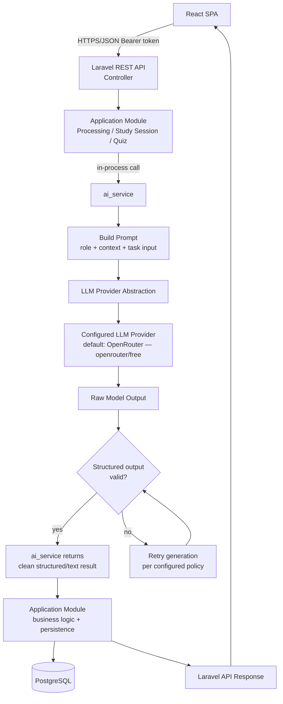
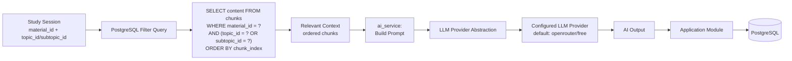
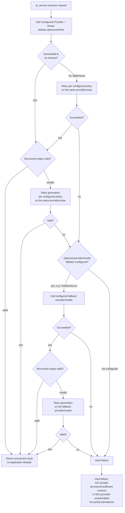

> **Implementation Language Directive**
>
> This document is written in Indonesian for documentation and planning purposes. However, all implementation based on this document must use **English** as the project's primary language.
>
> When implementing the requirements described in this document:
>
> * All user-facing UI text, labels, buttons, messages, notifications, and content must be written in **English**.
> * All source code, variable names, function names, class names, component names, and comments should use **English**.
> * All database names, table names, column names, enum values, and database-related identifiers must use **English**.
> * All API endpoints, request/response fields, validation messages, and API-related identifiers must use **English**.
> * All routes, URLs, configuration keys, and other technical identifiers must use **English**.
> * Do not directly copy Indonesian wording from this document into the application.
> * When this document contains Indonesian descriptions, interpret them as **functional and design requirements**, not as the literal language to be used in the implementation.
>
> **Important:** The language of this document does not determine the language of the application. The application must remain fully English unless another language requirement is explicitly specified.


# Studyback — AI Architecture Document (Final)

**Status:** Final, implementation-ready
**Source of truth:** Studyback System Architecture Blueprint · Studyback Database Design Document (Final) · Studyback API Design Document (Final) · Studyback Tech Stack Specification (Final — provider-agnostic AI stack)
**AI Service:** `ai_service` — in-process Laravel service (not a microservice/container)
**AI Architecture:** provider-agnostic **LLM Provider Abstraction** inside `ai_service`
**Default AI Provider:** OpenRouter — default route `openrouter/free` (free-model router, not a single model)
**Optional AI Provider:** Featherless.ai (hackathon partner, used when configured & inference credits are available)
**Development/Test AI Provider:** Mock AI Provider
**Model Strategy:** no hard-coded primary/fallback model; `gpt-oss-20b` and `Nemotron 3 Nano 30B A3B` are OPTIONAL pinned-model candidates, not a permanent architectural dependency
**Retrieval:** PostgreSQL filter-based (`material_id` + `topic_id`/`subtopic_id`), no vector database/embedding
**Scope:** 48-hour hackathon MVP

---

## 1. AI Architecture Overview

### AI's Role in Studyback

AI in Studyback is only responsible for **reasoning tasks** — it does not store state, and does not make final decisions over application data. Per Architecture Blueprint §6 and §12, AI (the "AI Orchestrator" at the blueprint level, implemented as `ai_service` at the Laravel level) performs only four things:

1. Identifying topics/subtopics from an uploaded material.
2. Explaining concepts (Teach Me / Review).
3. Generating structured quiz questions.
4. Evaluating a user's answer against the answer key.

All of the above AI outputs are **structured judgments or conversational text** returned to the calling Application Module. AI never determines whether a subtopic is "mastered," never writes to PostgreSQL, and never owns the Learning State (Architecture §6, §9; Database Design §8).

Per the Tech Stack Specification (Section AI Provider & Model Configuration), `ai_service` **is not tied to a single provider or model**. All four capabilities above are executed through an **LLM Provider Abstraction** inside `ai_service`, which forwards the request to whichever provider is currently configured — OpenRouter (default), Featherless.ai (optional), or Mock AI Provider (development/testing). The Application Module never knows which provider or model is currently active.

### Boundaries Between Layers

| Layer | May do | Must not do |
|---|---|---|
| **React (Frontend)** | Call the Laravel REST API | Call an external LLM provider directly; call `ai_service` directly; read/write PostgreSQL directly |
| **Laravel (Application Modules)** | Routing, validation, ownership checks, business logic, database transactions, calling `ai_service` | Bypass validation of AI output; persist raw AI output without validation; know which specific provider/model is currently active |
| **`ai_service` (in-process Laravel service)** | Build prompts, select provider & model through the LLM Provider Abstraction, call the configured provider, retry/fallback, validate the shape of structured output | Write to PostgreSQL; decide Learning State; be called directly from an HTTP route/frontend |
| **LLM Provider Abstraction (inside `ai_service`)** | Hide provider-specific details (base URL, auth header, request/response format) from `ai_service` core logic and from the Application Module | Expose provider-specific details outside `ai_service`; become a separate service/process |
| **Configured LLM Provider** (OpenRouter default / Featherless.ai optional / Mock dev-test) | Run inference on the prompt sent to it, per the configured model/route | Access the database; access material belonging to another user |
| **PostgreSQL (Data Layer)** | Store all application state (materials, topics, subtopics, chunks, quizzes, learning state) | Accept direct writes from AI |

This is consistent with the high-level architecture diagram in Architecture Blueprint §3: *"the AI Layer never writes to the Data Layer directly, and the AI Orchestrator never bypasses the Application Modules."* At the implementation level (API Design §2, generalized per the Tech Stack Specification into a provider-agnostic form), this diagram translates to:

```
React SPA → Laravel REST API → Application Module → ai_service → LLM Provider Abstraction → Configured LLM Provider
                                                                                                        ↓
                                                                              ai_service validates the structured output
                                                                                                        ↓
                                                                    Application Module (deterministic business logic)
                                                                                                        ↓
                                                                                                   PostgreSQL
                                                                                                        ↓
                                                                                        Laravel API → React SPA (JSON response)
```

Default runtime path for the MVP:

```
Application Module → ai_service → LLM Provider Abstraction → OpenRouter → openrouter/free
```

### Final Principles (non-negotiable)

1. `ai_service` is an in-process Laravel service — invoked through an ordinary function/service call within the same PHP process, not an HTTP call to a separate service (Architecture §5: *"Communication pattern: modules communicate through direct in-process function/service calls... only Study Session and Processing call AI Orchestration"*).
2. Laravel is the sole owner of application/database state (Database Design Principle #2).
3. AI never writes to the database directly — all writes are performed by the Application Module after receiving & validating the structured output.
4. `ai_service` is thin & stateless — it stores nothing between requests, and has no table of its own (Database Design §2: *"ai_service — no table"*).
5. Retrieval is based on PostgreSQL filtering (`material_id` + `topic_id`/`subtopic_id`), with no vector database/embedding for the MVP.
6. The frontend never calls an external LLM provider directly, and never receives raw AI output — only results that have already been validated & processed by Laravel (API Design §1).
7. `ai_service` is **provider-agnostic**: the Application Module's business logic never depends directly on OpenRouter, Featherless.ai, or a specific model — all provider-specific detail is isolated inside the LLM Provider Abstraction and configured via environment variables (Tech Stack Specification, Section AI Provider & Model Configuration).

---

## 2. AI Architecture Flow

### 2.1 General AI Request Flow



### 2.2 Retrieval + AI Flow



If the filter query returns no chunks at all for the requested `material_id` + `topic_id`/`subtopic_id`, Laravel **does not call the LLM at all** — this is an application-level failure (`422 Unprocessable Entity` for quiz generation), not something "papered over" with an AI answer based on general knowledge (Architecture §13; API Design §12). Exception: for Explanation, if the context is empty, `ai_service` is still called but is explicitly instructed to state that the material does not cover the topic (API Design §14.2) — see §6.

This flow does not change when the provider is swapped — retrieval happens entirely in PostgreSQL before `ai_service` is called, regardless of which provider/model is configured behind it.

### 2.3 Fallback Flow



**Design Decision:** Older source documents (API Design §14, §7 `POST /api/materials`) defined a retry/fallback order tied to two specific models. Per the Tech Stack Specification (Section 7.2 — Fallback Strategy), the fallback logic is now **not** defined as a single fixed primary-model → fallback-model pair, but rather three **configurable** levels:

1. **Provider fallback** — if the default provider (OpenRouter) cannot be reached/fails, `ai_service` can be configured to try the optional provider (Featherless.ai) if it is available and configured.
2. **Model fallback** — if the implementation uses a pinned model, model-level fallback can use another compatible model on the same provider (e.g. `gpt-oss-20b` ↔ `Nemotron 3 Nano 30B A3B`).
3. **Development fallback** — if no real provider is reachable (e.g. local development/automated testing), `ai_service` uses the Mock AI Provider.

For failures in **validating the shape of the structured output** (valid JSON but the wrong shape), the principle from Architecture §13 — *"retry generation; if still invalid, treat as pipeline failure"* — is retained: `ai_service` first applies structural-validation retries on the currently active provider/route (per the configured retry policy) before moving to a fallback provider/model (if configured), and finally to a hard failure once all options are exhausted. The application modules never know these details — everything is handled internally by `ai_service`.

---

## 3. `ai_service` Design

### Responsibility

`ai_service` is a **thin, stateless abstraction layer** inside Laravel that is the only component allowed to talk to an external LLM provider — through an **LLM Provider Abstraction** inside it (Architecture §5: *"AI Orchestration — The only module allowed to talk to the LLM Interface"*; Tech Stack Specification: *"This service is the sole caller to the external LLM provider — through an LLM Provider Abstraction"*). Only two modules are allowed to call `ai_service`: **Processing** (topic/subtopic identification) and **Study Session** (which subsequently covers Quiz — see §4).

### Boundary

- `ai_service` **does not** have its own database table (Database Design §2).
- `ai_service` **does not** retain state between requests — each call receives all the context it needs as parameters (retrieved chunks, task input) and returns a result with no side effects.
- `ai_service` **is never** called directly from an HTTP route/controller as a separate endpoint — it is invoked in-process from within an Application Module (Processing Module, or the Quiz/Explanation Controller under Study Session), exactly as defined in API Design §3: *"no dedicated endpoint — invoked internally by Study Session and Quiz modules."*
- `ai_service` **does not** expose provider-specific detail (base URL, API key, a given provider's request/response format) to the Application Module — all of it is isolated inside the LLM Provider Abstraction (an implementation/configuration layer, e.g. a per-provider adapter class inside `ai_service`).

### LLM Provider Abstraction

```
ai_service
    ↓
LLM Provider Interface / Abstraction
    ↓
┌──────────────────────┬──────────────────────┬────────────────────┐
│                       │                      │
OpenRouter              Featherless.ai         Mock AI Provider
(default)                (optional)             (dev/test)
│
└── openrouter/free  (default route — free-model router)
```

This abstraction remains an **in-process abstraction** inside Laravel — not a separate service, package, or container. `ai_service` selects the active provider and model based on environment configuration (see §11.3), calls that provider through a uniform interface, then normalizes the response into a consistent internal format before it is validated. The Application Module only talks to `ai_service`, never to the provider behind it.

### Internal Responsibilities

| Responsibility | Description |
|---|---|
| **Prompt construction** | Assembles three logical parts: role/instruction, retrieved context (chunks), task-specific input (see §9). |
| **Provider & model selection** | Determines the active provider (OpenRouter default, Featherless.ai optional, Mock for dev/test) and the active route/model (`openrouter/free` default, or a pinned model if configured) through the LLM Provider Abstraction, based on environment configuration (see §11.3). |
| **Provider communication** | Sends the request to the configured provider with the built model/route & prompt, through the LLM Provider Abstraction; handles timeouts. |
| **Retry/fallback** | Retries per the configured policy on the active provider/route, then optionally falls back to another provider/model if configured (see §2.3, §11). |
| **Structured-output validation** | Validates the shape of the JSON against each capability's schema (see §10) before returning the result to the Application Module — independent of the provider/model in use. |
| **Response normalization** | Normalizes the provider's response (which may differ slightly in format between providers even when both are OpenAI-compatible) into one consistent internal format for the Application Module to consume. |
| **Error handling** | Classifies failures (timeout, provider error, invalid JSON, empty response) and returns a clear failure signal to the caller (see §13) — not an unhandled exception. |

### Public Interface (conceptual — internal Laravel methods, not HTTP routes)

```
ai_service->identifyTopics(string $chunkedText): TopicIdentificationResult|AiFailure
ai_service->explain(array $contextChunks, string $intent, ?string $message): string|AiFailure
ai_service->generateQuiz(array $contextChunks, string $difficulty, int $questionCount): QuizGenerationResult|AiFailure
ai_service->evaluateAnswer(string $questionText, string $correctAnswer, string $submittedAnswer): AnswerEvaluationResult|AiFailure
```

These four methods map exactly to the four AI capabilities in §4. Their signatures **contain no provider/model parameter** — the provider and model are entirely determined by the environment configuration read by the LLM Provider Abstraction inside `ai_service`, so the Application Module still never depends on a specific provider. There are no additional methods beyond what the source documents require (Design Rule: *"Do not create a new AI feature that is not in the source documents"*).

---

## 4. AI Capability Mapping

| Capability | Trigger | Input | Retrieval | Output | Persistence |
|---|---|---|---|---|---|
| **Topic/Subtopic Identification** | `POST /api/materials` (upload PDF) | The entire chunked text from extraction (new material) | None (the material has no stored chunks yet; the input comes directly from the in-memory chunking result) | JSON: array of topics `{name, description, subtopics:[{name, description}]}` | `topics`, `subtopics`, `chunks` (with `topic_id`/`subtopic_id`), `materials.status = 'ready'` — one transaction |
| **Teach Me / Explanation** | `POST /api/study-sessions/{studySession}/explanations` | `subtopic_id`, `intent` (`explain`/`simplify`/`example`/`review`), `message` (optional) | `SELECT content FROM chunks WHERE material_id = ? AND (topic_id = ? OR subtopic_id = ?) ORDER BY chunk_index` | Free conversational text (unstructured) | None — there is no chat-log table (Database Design §3) |
| **Quiz Generation** | `POST /api/study-sessions/{studySession}/quizzes` | `topic_id`, `subtopic_id` (optional), `difficulty`, `question_count` (3–10, default 5) | Same as Explanation, scoped to the requested `topic_id`/`subtopic_id` | JSON: array of questions `{question_type, question_text, options?, correct_answer, subtopic_id, order_index}` | `quizzes`, `quiz_questions` — one transaction |
| **Answer Evaluation** | `POST /api/quizzes/{quiz}/questions/{quizQuestion}/answer` | `question_text`, `correct_answer` (internal), `submitted_answer` | No new retrieval — the context is already attached to the stored `quiz_question` | JSON: `{is_correct: boolean, feedback: string}` | `quiz_answers` (insert), `subtopics.mastery_score`/`status` (update), `quizzes` (conditional update if the quiz is complete) — one transaction |

These four capabilities are exactly the ones defined in Architecture §6 (*"Where structured output is required"*) and API Design §14 — there are no additional capabilities. Swapping the provider/model does not change the "Trigger," "Input," "Retrieval," "Output," or "Persistence" columns in the table above — only how `ai_service` runs the inference stage behind it (see §3, §11).

---

## 5. Topic/Subtopic Identification

### Flow

```
PDF (multipart upload, POST /api/materials)
  ↓ Laravel Filesystem — storage/app/private
Extraction (spatie/pdf-to-text) — deterministic library, not AI
  ↓
Cleaning (native PHP, in-memory, not persisted)
  ↓
Fixed-Length Chunking (~1,000 characters, ~200 character overlap, no heading detection)
  ↓ (in memory, not yet inserted into the database)
ai_service->identifyTopics($chunkedText)
  → Prompt: role/instruction ("identify topics and subtopics from this material") + full chunked text
  → LLM Provider Abstraction → Configured Provider (default: OpenRouter — openrouter/free);
    retry per configured policy → optional fallback provider/model (e.g. Featherless.ai) if configured
  → Shape validation: array of { name, description, subtopics: [{ name, description }] }
  → invalid after retry & fallback are exhausted → pipeline failure
  ↓
Laravel: tags each chunk with topic_id/subtopic_id based on the AI result
  ↓
PostgreSQL — ONE transaction:
   INSERT topics
   INSERT subtopics
   INSERT chunks (with topic_id/subtopic_id from tagging)
   UPDATE materials SET status = 'ready'
  ↓
Response: material JSON (status: "ready" | "failed")
```

### Division of Responsibility (Design Rule: AI only does identification, Laravel does the persisting)

| Step | Performed by |
|---|---|
| Extraction, cleaning, chunking | Laravel (Processing Module) — deterministic, not AI |
| Identifying topics/subtopics from the text | `ai_service` (AI, via the configured provider) — returns **structured data only**, does not touch the database |
| Tagging chunks to the topics/subtopics from the AI result | Laravel (Processing Module) — deterministic mapping from the AI result to each chunk |
| Inserting `topics`/`subtopics`/`chunks`, updating `materials.status` | Laravel (Processing Module), within a single `DB::transaction()` |

This is consistent with Architecture §7: *"Topic/Subtopic ID → AI processing (AI Orchestrator + LLM, structured output)"* followed by *"Storage → Data storage"* as a separate step owned by Laravel, and with Database Design §10, which confirms that all inserts happen in a single transaction after AI finishes.

### Laravel Validation

- The JSON shape must be an array of topics, each with a required `name` (string), an optional `description` (string), and `subtopics` (array, may be empty but must be an array).
- Every `subtopics[].name` is required.
- If the topics array is empty entirely → treated as invalid structured output (not "a material with no topic") → retry, then pipeline failure if still empty — consistent with Architecture §13: *"not silently 'Ready' with zero topics."*

### Database Persistence

One transaction (Database Design §15) covering: `INSERT topics` (N rows, `UNIQUE(material_id, name)`), `INSERT subtopics` (N rows per topic, `UNIQUE(topic_id, name)`), `INSERT chunks` (all chunks resulting from chunking, with `topic_id` NOT NULL and `subtopic_id` nullable — see Database Design §4 Design Decision on `chunks`), and `UPDATE materials.status = 'ready'`.

### Error/Fallback Behavior

A failure at any point (extraction fails, AI fails after retry+fallback provider/model are exhausted, structured output validation fails after retry) → the entire transaction is rolled back → `materials.status = 'failed'` is set as a **separate update** (outside the main transaction, because the `materials` row has existed since the start of the pipeline with `status = 'processing'`) with `failed_reason` populated. There is never a material with partial `topics`/`subtopics`/`chunks` (Architecture §13; Database Design §10).

---

## 6. Teach Me / Explanation

### Flow

```
Frontend: user selects a subtopic in the sidebar → POST /api/study-sessions/{studySession}/explanations
  { subtopic_id, intent: "explain" | "simplify" | "example" | "review", message?: string }
  ↓
Laravel: validates that subtopic_id belongs to the session's material; session must be 'active'
  ↓
Retrieval (filter-based, not similarity search):
  SELECT content FROM chunks
  WHERE material_id = :material_id AND (topic_id = :topic_id OR subtopic_id = :subtopic_id)
  ORDER BY chunk_index ASC
  ↓
ai_service->explain($contextChunks, $intent, $message)
  → Prompt: role/instruction (explain/simplify/give-example/review per intent) + retrieved chunks + optional follow-up message
  → LLM Provider Abstraction → Configured Provider (default: openrouter/free; optional fallback provider if configured)
  → No structured output validation — the explanation is free conversational text
  ↓
Laravel: forwards the text as-is, with no state mutation
  ↓
Response: { subtopic_id, explanation: "..." }
```

### Why There Is No Structured Output Here

Product Spec §9.1 (quoted in Architecture §6 and API Design §14.2) only requires structured output in four areas: topic extraction, quiz generation, answer evaluation, and output related to the learning state. Explanation **is not included** — so `ai_service->explain()` returns a text string, not JSON, and does not go through the shape-validation stage like the other three capabilities. This holds regardless of which provider/model is currently configured.

### No Chat-History Persistence

Database Design §3 and §9 explicitly state that there is no conversation/chat-log table — Teach Me is **purely request/response**, regenerated from retrieval every time it is called, and never stored. This document adheres to that decision strictly: `ai_service->explain()` writes nothing to the database, and the `POST /api/study-sessions/{studySession}/explanations` endpoint has no Database Effects other than retrieval (read-only).

### Insufficient Context

If retrieval finds no chunks at all for the requested `subtopic_id`/`topic_id`, Laravel still calls `ai_service`, but the prompt explicitly instructs the AI to state that the material does not cover that topic — **not** to answer from general knowledge (Architecture §13, §8: *"the prompt instruction explicitly constrains the LLM to answer only using the provided context chunks"*). The response is still `200 OK` with explanatory text stating that limitation, not an error, because this is a valid AI answer (API Design §14.2 Error Responses, note on `422`).

### Review Weak Topics

When a user clicks a subtopic with `needs_review` (⚠) status in the sidebar, the same flow is invoked with `intent = "review"` — there is no separate endpoint or capability; this is purely a task-instruction variation on the same Explanation capability (Architecture §9: Review Weak Topics *"triggers Study Session to focus AI Teacher on that subtopic, using the same retrieval scoping"*).

---

## 7. Quiz Generation

### Flow

```
Frontend: POST /api/study-sessions/{studySession}/quizzes
  { topic_id, subtopic_id?: null, difficulty?: null, question_count?: 5 }
  ↓
Laravel: validates that topic_id/subtopic_id belong to the session's material
  ↓
Retrieval (filter-based):
  SELECT content FROM chunks
  WHERE material_id = :material_id AND (topic_id = :topic_id OR subtopic_id = :subtopic_id)
  ORDER BY chunk_index ASC
  ↓
  If the result is EMPTY → Laravel returns 422 Unprocessable Entity BEFORE calling the LLM
  (insufficient context = application-level failure, not an LLM guess — Architecture §13)
  ↓
ai_service->generateQuiz($contextChunks, $difficulty, $questionCount)
  → Prompt: role/instruction ("generate {question_count} {difficulty} questions") + retrieved chunks + difficulty
  → LLM Provider Abstraction → Configured Provider (default: openrouter/free);
    retry per configured policy → optional fallback provider/model if configured
  → Structured output validation: array of questions, each item has question_type,
    question_text, options (for multiple_choice), correct_answer, subtopic reference
  → invalid after retry & fallback are exhausted → hard failure (422/503), NO partial quiz is persisted
  ↓
Laravel: re-validates at the application level (final shape) before insert
  ↓
PostgreSQL — ONE transaction:
   INSERT quizzes (status = 'in_progress')
   INSERT quiz_questions (N rows, correct_answer stored but NOT sent to the frontend)
  ↓
Response: quiz + questions (correct_answer stripped from the response)
```

### Structured Validation → Laravel Validation → Quiz Persistence

There are two validation layers with different roles:

1. **`ai_service` structural validation** — confirms the output is genuinely valid JSON with the expected fields (shape check), independent of the provider/model that produced it. If it fails → retry generation per the configured policy, then hard failure once options are exhausted.
2. **Laravel business validation** — runs after `ai_service` returns a structurally valid result: confirms that every `subtopic_id` referenced by the AI genuinely belongs to the requested `topic_id`, that `question_type` is one of the supported enum values (`multiple_choice`, `true_false`, `short_answer` — Database Design §7), and that `options` is populated for the `multiple_choice` type. Only after passing both layers does Laravel perform the insert.

### Persistence

One transaction: `INSERT quizzes` (`status = 'in_progress'`, `total_questions`) + `INSERT quiz_questions` (N rows, each with a target `subtopic_id` — because a single topic-level quiz can span multiple subtopics, Database Design §4 Design Decision on `quiz_questions`). A quiz is never persisted with only some of its questions (API Design §18).

### Review Weak Topics Re-test

Uses the **same** endpoint and capability — distinguished only by a populated `subtopic_id` (narrowing the scope) and a small `question_count` (e.g. 2, for a "mini-question"), per Database Design §4: *"Review Weak Topics ... uses the same `quizzes` structure as Quiz Me."* There is no additional capability or table for review.

---

## 8. Answer Evaluation

### Flow

```
Frontend: POST /api/quizzes/{quiz}/questions/{quizQuestion}/answer
  { submitted_answer: "B" }
  ↓
Laravel: validates the question has not already been answered (quiz_answers.quiz_question_id UNIQUE) & the quiz is not completed
  ↓
Laravel: loads quiz_question.correct_answer (internal — NEVER sent to the frontend beforehand)
  ↓
ai_service->evaluateAnswer($questionText, $correctAnswer, $submittedAnswer)
  → Prompt: role/instruction ("evaluate this answer against the correct answer, return correct/incorrect + feedback")
    + question_text + correct_answer + submitted_answer
  → LLM Provider Abstraction → Configured Provider (default: openrouter/free);
    retry per configured policy → optional fallback provider/model if configured
  → Structured verdict validation: { is_correct: boolean, feedback: string }
  → invalid/failed after retry & fallback are exhausted → 503, NO write to the database at all
  ↓
Laravel — ONE transaction (run only if the AI evaluation succeeds):
   INSERT quiz_answers (is_correct, ai_feedback, submitted_answer, answered_at)
   RECOMPUTE subtopics.mastery_score = AVG(is_correct ? 100 : 0)
             over the ENTIRE historical quiz_answers for that subtopic_id (cumulative, not just this quiz)
   DERIVE subtopics.status from a fixed threshold (<60 → needs_review, 60–79 → in_progress, ≥80 → mastered)
   IF all quiz_questions in this quiz have been answered:
     UPDATE quizzes.correct_count, quizzes.score, quizzes.status = 'completed', quizzes.completed_at
  ↓
Response: { is_correct, ai_feedback, quiz_status, subtopic: { mastery_score, status }, quiz_result? }
```

### AI Verdict as Input, Not Final Authority

AI returns `is_correct` and `feedback` as a **verdict per answer** — this is *input* to Laravel's deterministic scoring process, not the final authority over the Learning State (Architecture §5: *"Quiz ... scores answers deterministically (using AI evaluation output as input, not as final authority on state)"*). It is Laravel that recomputes `mastery_score` from the **entire history** of `quiz_answers` (not just the running session average), so mastery always stays consistent with the data actually stored. This principle holds regardless of the provider/model that produced the verdict.

### Learning State Remains Deterministic and Owned by Laravel

- `mastery_score` and `status` are columns on `subtopics`, computed with a fixed formula (not any kind of ML/knowledge-tracing): the average of `is_correct` across all `quiz_answers` ever recorded for that subtopic, then mapped to a fixed threshold.
- The LLM **never** writes `mastery_score`/`status` directly — only the Learning State logic in Laravel computes and persists these values (Database Design §8: *"AI never owns the Learning State ... the computation of mastery_score/status is done entirely by Laravel"*).
- If the AI evaluation fails (after retry & fallback provider/model are exhausted), **there is no write at all** to `quiz_answers` or `subtopics` — the prior state remains intact. This upholds the guiding principle of Architecture §13: *"never let an AI failure silently corrupt Learning State."*

### Persistence

One transaction (Database Design §15): `INSERT quiz_answers` (1 row) + `UPDATE subtopics` (mastery/status, 1 row) + `UPDATE quizzes` (conditional, only if the quiz has just been completed). There is no partial update — if the AI evaluation fails before commit, the entire transaction (including the mastery update) is never run.

---

## 9. Prompt Architecture

Every AI capability has a conceptual prompt template with the same structure, following Architecture §6: *"Role/instruction → Retrieved context → Task-specific input."* This structure is **provider/model-agnostic** — the same template is sent to whichever provider is currently configured (OpenRouter, Featherless.ai, or Mock) through the LLM Provider Abstraction. Below is the structure per capability (not the full production prompt, only the skeleton).

### 9.1 Topic/Subtopic Identification

```
[System Instruction]
You are an assistant that identifies the topic and subtopic structure from a piece of learning material.
Return ONLY valid JSON per the given schema, with no additional text.

[Task Instruction]
Identify the main topics and the subtopics under each topic from the following material text.

[Retrieved Context]
(none — new material; the input is the entire chunked text)

[User/Input Data]
{{full_chunked_text}}

[Output Requirements]
JSON array: [{ "name": string, "description": string, "subtopics": [{ "name": string, "description": string }] }]
```

### 9.2 Teach Me / Explanation

```
[System Instruction]
You are an AI Teacher who explains concepts ONLY based on the given material context.
If the context does not cover the question, say the material does not discuss this topic — do not
answer from general knowledge outside the context.

[Task Instruction]
Mode: {{intent}}  // explain | simplify | example | review

[Retrieved Context]
{{context_chunks}}  // result of filtering by material_id + topic_id/subtopic_id, ordered by chunk_index

[User/Input Data]
{{message}}  // optional follow-up question from the user

[Output Requirements]
Free conversational text (unstructured), in the language of the material's context.
```

### 9.3 Quiz Generation

```
[System Instruction]
You are an AI that composes quiz questions ONLY from the given material context.
Return ONLY valid JSON per the given schema.

[Task Instruction]
Create {{question_count}} questions at {{difficulty}} difficulty, each targeting
one of the relevant subtopics from the context.

[Retrieved Context]
{{context_chunks}}

[User/Input Data]
difficulty = {{difficulty}}, question_count = {{question_count}}

[Output Requirements]
JSON array of questions: [{ "question_type": "multiple_choice"|"true_false"|"short_answer",
  "question_text": string, "options": string[]?, "correct_answer": string, "subtopic_id": integer }]
```

### 9.4 Answer Evaluation

```
[System Instruction]
You are a quiz answer evaluator. Return ONLY valid JSON per the schema.

[Task Instruction]
Compare the user's answer with the answer key, determine correct/incorrect, and give brief feedback.

[Retrieved Context]
(no new retrieval — the context is already attached to question_text & correct_answer)

[User/Input Data]
question_text = {{question_text}}
correct_answer = {{correct_answer}}
submitted_answer = {{submitted_answer}}

[Output Requirements]
JSON: { "is_correct": boolean, "feedback": string }
```

---

## 10. Structured Output Schemas

### 10.1 Topic/Subtopic Identification

```json
[
  {
    "name": "Inheritance",
    "description": "How classes derive behavior from other classes.",
    "subtopics": [
      { "name": "Polymorphism", "description": "Same interface, different implementations." },
      { "name": "Method Overriding", "description": "Redefining a parent method in a child class." }
    ]
  }
]
```
**Laravel Validation:** the array must not be empty; every element must have `name` (string, non-empty); `subtopics` must be an array (may be empty per topic, but at least one topic must have at least one subtopic so the material is not "Ready" with zero subtopics — Architecture §13).

### 10.2 Quiz Generation

```json
[
  {
    "question_type": "multiple_choice",
    "question_text": "Which statement best explains polymorphism?",
    "options": ["Option A", "Option B", "Option C", "Option D"],
    "correct_answer": "Option B",
    "subtopic_id": 1042
  },
  {
    "question_type": "true_false",
    "question_text": "Encapsulation prevents inheritance.",
    "options": null,
    "correct_answer": "False",
    "subtopic_id": 1043
  }
]
```
**Laravel Validation:** `question_type` ∈ {`multiple_choice`, `true_false`, `short_answer`} (Database Design §7); `options` must be a non-empty array (≥2 elements) if `question_type = multiple_choice`, and must be `null`/ignored for other types; `correct_answer` must be a non-empty string; `subtopic_id` must reference a subtopic that genuinely belongs under the requested `topic_id`; the number of array elements must equal the requested `question_count`.

### 10.3 Answer Evaluation

```json
{
  "is_correct": true,
  "feedback": "Correct — polymorphism lets a single interface represent different underlying forms."
}
```
**Laravel Validation:** `is_correct` must be a boolean (not the string `"true"`/`"false"`); `feedback` must be a string (may be short, but must not be empty/null — it is persisted to `quiz_answers.ai_feedback`).

### 10.4 Explanation (unstructured — reference only)

```
"Polymorphism lets objects of different classes be treated through a common interface..."
```
There is no JSON schema for this capability — only validation that the response is not an empty string (an empty response is treated as a failure, see §13).

### Note on Provider-Agnosticism

The schema contracts in §10.1–10.3 apply **independently of the provider/model** in use (Tech Stack Specification, Section 7.4: *"Structured-output validation works independently of the provider/model in use — the schema contract stays the same regardless of the provider/model behind it"*). If a given provider/model cannot reliably meet that structured-output contract, `ai_service` may retry or switch to another configured provider/model, without changing the schema or the Laravel validation above.

---

## 11. Provider & Model Strategy

Per the Tech Stack Specification, Studyback does **not** lock `ai_service` to a single provider or a single model. The provider and model are configured via environment variables, and the Application Module never depends directly on either of them.

### 11.1 Default Provider — OpenRouter (`openrouter/free`)

OpenRouter is the **default provider** for all four AI capabilities in the MVP, with the default route `openrouter/free`:

- OpenRouter provides an OpenAI-compatible API, so the integration on the `ai_service` side stays simple through the same HTTP client.
- `openrouter/free` is a **router**, not an individual model — it dynamically picks one of the free models available on OpenRouter at request time, taking into account the capabilities the request needs (e.g. structured output).
- Because the pool of free models behind it can change over time, the specific model ultimately selected by `openrouter/free` is treated as a **runtime/implementation detail**, not a permanent application architecture decision.

### 11.2 Optional Provider — Featherless.ai

Featherless.ai remains supported as an **optional provider**, mainly because:

- It is a hackathon partner for this event.
- Participants may potentially obtain inference credits if successfully claimed.
- It offers an OpenAI-compatible endpoint, so it can be integrated through the same LLM Provider Abstraction without changing the application's business logic.

Featherless.ai is **not** a required provider. If it is not configured, or credits are not successfully claimed, the application can still run entirely on OpenRouter (or the Mock AI Provider for development).

### 11.3 Development/Test Provider — Mock AI Provider

The Mock AI Provider is used for local development and automated testing without calling a real AI API — e.g. when there is no connection to a real provider, or when a demo/test needs deterministic, fast output with no rate limits or inference cost.

### 11.4 Optional Pinned Model Strategy

Specific models such as `gpt-oss-20b` and `Nemotron 3 Nano 30B A3B` are **not** primary/fallback models required to be hard-coded into the architecture. Both are **optional model candidates** that can be explicitly selected (pinned) when deterministic model selection is needed (e.g. for consistent results during a demo) and the model is available on the configured provider/plan. These models are **not routers** — unlike `openrouter/free`, which is a router that dynamically picks a model.

If a task-specific pinned model is used, this is an **optional optimization**, not an architectural baseline:

| AI Capability | Default Route | Optional Pinned Model |
|---|---|---|
| Topic/Subtopic Identification | `openrouter/free` | `gpt-oss-20b` if available |
| Teach Me / Explanation | `openrouter/free` | `Nemotron 3 Nano 30B A3B` or `gpt-oss-20b` if available |
| Quiz Generation | `openrouter/free` | `gpt-oss-20b` if available |
| Answer Evaluation | `openrouter/free` | `gpt-oss-20b` if available |

The MVP baseline remains **`openrouter/free`** for all capabilities above; a pinned model is not guaranteed to remain free forever, and does not change the Tech Stack baseline.

### 11.5 Fallback Strategy

Because provider and model availability can change, fallback logic is **not** defined as a single fixed primary-model → fallback-model pair (see also §2.3). Instead, fallback is split into three **configurable** levels, not hard-coded into Laravel's business logic:

1. **Provider fallback** — if the default provider (OpenRouter) cannot be reached or fails, `ai_service` can be configured to try the optional provider (Featherless.ai) if it is available and configured.
2. **Model fallback** — if the implementation uses a pinned model, model-level fallback can use another compatible model on the same provider (e.g. `gpt-oss-20b` ↔ `Nemotron 3 Nano 30B A3B`), per configuration.
3. **Development fallback** — if no real provider is reachable (e.g. during local development/automated testing), `ai_service` uses the Mock AI Provider.

This order applies identically to all four capabilities that use an LLM (topic identification, explanation, quiz generation, answer evaluation) — there is no per-capability difference in fallback strategy.

### When Fallback Is Triggered

- Network/response timeout from the configured provider.
- Provider error (5xx, connection error) from the configured provider.
- **Not** triggered by invalid structured output alone — an invalid shape is first handled with a generation retry on the currently active provider/model (see the §2.3 Design Decision), and only then moves to the fallback provider/model (if configured), following the diagram in §2.3.

### Both Options Fail (Configured Provider and Optional Fallback Both Fail)

When the configured default provider (after retry per policy) **and** the optional fallback provider/model (if configured) both fail to be reached (provider unreachable/timeout), or both produce invalid structured output even after being given a generation retry per policy:

| Capability | Behavior |
|---|---|
| Topic/Subtopic Identification | The pipeline fails entirely: the transaction is rolled back, `materials.status = 'failed'`, `failed_reason` is populated. Response is `422 Unprocessable Entity` (invalid structure) or `503 Service Unavailable` (provider unreachable). The material remains visible in My Materials for re-upload. |
| Explanation | `503 Service Unavailable`. There is no partial state to roll back because this capability does not write to the database. |
| Quiz Generation | `503 Service Unavailable` (or `422` if the failure originates from empty retrieval before the LLM is called at all). No quiz/quiz_questions are persisted. |
| Answer Evaluation | `503 Service Unavailable`. **No write** to `quiz_answers`/`subtopics`/`quizzes` — the prior Learning State remains intact. |

There is no attempt beyond the configured provider/model — this avoids over-engineering beyond the final decision already made in the Tech Stack Specification.

### 11.6 Environment Configuration

The provider and model are configured via environment variables, not hard-coded into the business logic:

```env
AI_PROVIDER=openrouter
AI_MODEL=openrouter/free

OPENROUTER_API_KEY=your_openrouter_api_key

# Optional — only needed if Featherless.ai is used as a fallback/optional provider
FEATHERLESS_API_KEY=your_featherless_api_key
```

Provider-specific detail (base URL, auth header, request/response format) is isolated inside the LLM Provider Abstraction's implementation/configuration layer (e.g. a per-provider adapter class inside `ai_service`), so swapping or adding a provider **requires no change to the application modules** (Materials, Topics, Quiz, Learning State, etc.) — only a configuration change.

---

## 12. Context & Retrieval Strategy

### Chunk Selection

Chunking is done **deterministically by Laravel** (not AI) when a material is processed: fixed-length ~1,000 characters with ~200 characters of overlap, with no heading detection (Database Design §10). Each chunk is stored with a `chunk_index` (0-based order within the material) and, once topic identification succeeds, is tagged with `topic_id` (required) and `subtopic_id` (optional, nullable — see Database Design §4 Design Decision on `chunks`).

### Material/Topic/Subtopic Boundary

Every AI interaction in the Workspace (both Explanation and Quiz Generation) always occurs within the scope of **one material** and, where applicable, **one topic/subtopic** — reflecting the Workspace's single-material session model (Architecture §8). The same retrieval query is used for both capabilities:

```sql
SELECT content FROM chunks
WHERE material_id = :material_id
  AND (topic_id = :topic_id OR subtopic_id = :subtopic_id)
ORDER BY chunk_index ASC;
```

This query is backed by the `idx_chunks_material_topic` and `idx_chunks_material_subtopic` indexes (Database Design §6) — no additional index exists beyond what is already defined.

### Context Construction

`ai_service` assembles the filter result (a list of `content` strings, already ordered by `chunk_index`) into a single "Retrieved Context" block within the prompt (see §9). There is no additional ranking/reranking — chunk order follows the original order within the material. This step happens entirely **before** the prompt is passed to the LLM Provider Abstraction, so it does not depend on which provider/model is currently active.

### Context Size Considerations

Because chunking is already fixed-length (~1,000 characters/chunk) and retrieval is scoped to the topic/subtopic (not the entire material), the number of chunks that go into a single prompt is naturally limited to the portion of the material relevant to the topic currently being studied — not the whole document. Exception: for **Topic/Subtopic Identification**, the entire chunked text of the material is sent at once (because there are no topics/subtopics yet to filter by), per Architecture §7, which names this stage as the sole AI step in the processing pipeline.

### Preventing Irrelevant Context

- The prompt instruction explicitly restricts the AI to answering **only** based on the given context chunks (§9.2), not general knowledge outside the material (Architecture §8: *"the prompt instruction explicitly constrains the LLM to answer only using the provided context chunks"*).
- Retrieval is always scoped to the `material_id` owned by the currently logged-in user — chunks from another user's material never enter a single prompt (see §14, LLM data boundary).
- If retrieval is empty for Quiz Generation, Laravel fails **before** calling the LLM at all (§7) — preventing the AI from "making up" questions outside the context.

The system still uses PostgreSQL filtering — there is no vector database, embedding, or similarity search in this MVP, per the final decision. Swapping the AI provider/model does **not** introduce any new retrieval requirement.

---

## 13. AI Error Handling & Reliability

| Condition | Behavior |
|---|---|
| **Timeout** (configured provider does not respond within the time limit) | Treated the same as a provider failure: retry per the configured policy on the active provider/route, then optionally fall back to another provider/model if configured (§11). If all options time out → `503 Service Unavailable`. |
| **Provider failure** (network error, 5xx from the configured provider) | Same as timeout — retry → optional fallback → `503` if all options fail. |
| **Invalid structured output** (syntactically valid JSON but the shape/fields do not match the §10 schema) | Retry generation per the configured policy on the currently active provider/model. If still invalid → treated as a failure of that stage, proceeding to the optional fallback provider/model (if configured and not yet tried) or a hard failure. |
| **Empty response** (the provider returns an empty/null string) | Treated as invalid structured output (for structured capabilities) or an immediate failure (for Explanation, since empty text is not a valid answer) → retry → optional fallback if needed. |
| **Malformed JSON** (not valid JSON at all — parse error) | Treated as invalid structured output → retry → optional fallback if needed. |
| **Default provider/route failure** (after retry per the configured policy on `openrouter/free`) | Proceeds to the optional fallback provider/model (e.g. Featherless.ai) if configured; an invalid structure on the fallback is also given a generation retry per policy. |
| **Fallback failure** (the optional fallback provider/model also fails/is invalid after retry, or no fallback is configured) | Hard failure — see the per-capability table in §11.5 ("Both Options Fail"). No further attempts beyond what is configured. |

### Core Principle: No Silent Corruption

An AI failure **never** causes:
- A material to be `ready` with a partial set of topics/subtopics/chunks — all inserts sit within a single transaction that is fully rolled back on failure (§5).
- A quiz to be stored with only some of its questions — `quizzes` + `quiz_questions` are inserted in a single transaction (§7).
- `subtopics.mastery_score`/`status` to change based on a failed evaluation — if the AI evaluation fails, **there is no write at all**, and the prior state remains intact (§8).

This is an explicit guiding principle from Architecture §13: *"never let an AI failure silently corrupt Learning State. When in doubt, the system fails visibly and leaves prior state untouched."* A failure is always returned to the frontend as a clear error state (`422` or `503`, see API Design §16), never hidden or papered over with placeholder data. This principle applies identically regardless of which provider or model is configured.

---

## 14. Security & AI Boundaries

### User Ownership

Every material (and all data derived from it — `topics`, `subtopics`, `chunks`, `study_sessions`, `quizzes`, `quiz_questions`, `quiz_answers`) can only be traced through a foreign key chain that terminates at `materials.user_id`. `MaterialPolicy` validates `materials.user_id === auth()->id()` on **every** request that touches a material or its derived data, before that data ever reaches retrieval or an AI prompt (Database Design §17; API Design §5, §17).

### Context Isolation

Retrieval is always filtered by the `material_id` of a material that has already passed the ownership check above — so the chunks entering a single AI prompt **only ever come from one material belonging to one currently logged-in user** (§12).

### Preventing Cross-User Data Retrieval

Nested resources (`topics`, `subtopics`, `study_sessions`, `quizzes`, etc.) are always loaded **through** the owning material's relationship (`$material->topics()->findOrFail($id)`), never through a global lookup by ID (API Design §5). As a result, User A attempting to access a `studySession`/`quiz`/`quizQuestion` belonging to User B receives a `404 Not Found` — not a `403`, so as not to confirm the resource's existence (API Design §16) — and this never even triggers a call to `ai_service` with another user's data.

### Validation Against AI Output

Every AI output (topic list, quiz questions, evaluation verdict) passes through two validation layers before being persisted or returned to the frontend: structural validation in `ai_service` (§3) and business validation in the Application Module (§5–§8). No AI output is ever persisted directly without validation — regardless of the provider/model that produced it.

### Laravel as Final Authority

Laravel — not `ai_service`, not the LLM, not any specific provider — is the sole party that decides what gets persisted to PostgreSQL and how the Learning State is computed. `ai_service` only returns data to the Application Module; it never determines the application's final outcome (Architecture §12: *"the backend is the only component allowed to decide what gets persisted"*).

### The Frontend Never Calls an External LLM Provider Directly

The React SPA only talks to the Laravel REST API. No endpoint, credential, or provider URL (OpenRouter, Featherless.ai, or Mock) is ever exposed to the frontend. All four AI capabilities can only be triggered through authenticated, ownership-checked Laravel endpoints (`POST /api/materials`, `POST /api/study-sessions/{studySession}/explanations`, `POST /api/study-sessions/{studySession}/quizzes`, `POST /api/quizzes/{quiz}/questions/{quizQuestion}/answer`).

### Additional: Raw AI Output Is Never Returned to the Frontend

- `correct_answer` on quiz questions is never sent to the frontend before grading (it is stripped from the `POST /api/study-sessions/{studySession}/quizzes` response).
- The quiz generation and topic identification responses are always **already-validated and persisted** results (containing an `id` from the database), never raw JSON from any provider.

### API Key & Credential Isolation

All provider API keys (`OPENROUTER_API_KEY`, `FEATHERLESS_API_KEY`) are stored as server-side environment variables, never hard-coded, and never exposed to the frontend or an API response. The LLM Provider Abstraction is the only part of `ai_service` that reads these credentials (§11.6).

---

## 15. AI → Application Mapping

| AI Capability | Laravel Module | `ai_service` Method/Responsibility | DB Effect |
|---|---|---|---|
| Topic/Subtopic Identification | **Processing Module** (invoked from `POST /api/materials`) | `identifyTopics($chunkedText)` — prompt construction, invoke the configured LLM provider through `ai_service` / LLM Provider Abstraction, validate the `{name, description, subtopics[]}` shape | `INSERT topics`, `INSERT subtopics`, `INSERT chunks` (with tagging), `UPDATE materials.status` — 1 transaction |
| Teach Me / Explanation | **Study Session Module** (invoked from `POST /api/study-sessions/{studySession}/explanations`) | `explain($contextChunks, $intent, $message)` — prompt construction, invoke the configured LLM provider through `ai_service` / LLM Provider Abstraction, no shape validation (free text) | None (retrieval only, read-only) |
| Quiz Generation | **Quiz Module** (invoked from `POST /api/study-sessions/{studySession}/quizzes`) | `generateQuiz($contextChunks, $difficulty, $questionCount)` — prompt construction, invoke the configured LLM provider through `ai_service` / LLM Provider Abstraction, validate the questions array shape | `INSERT quizzes`, `INSERT quiz_questions` — 1 transaction |
| Answer Evaluation | **Quiz Module** (invoked from `POST /api/quizzes/{quiz}/questions/{quizQuestion}/answer`), result forwarded to the **Learning State Module** | `evaluateAnswer($questionText, $correctAnswer, $submittedAnswer)` — prompt construction, invoke the configured LLM provider through `ai_service` / LLM Provider Abstraction, validate the `{is_correct, feedback}` shape | `INSERT quiz_answers`, `UPDATE subtopics.mastery_score/status`, `UPDATE quizzes` (conditional) — 1 transaction |

No other module (Materials, Auth, Topics-read-path) ever calls `ai_service` — exactly per Architecture §5: *"only Study Session and Processing call AI Orchestration."* (Quiz falls under the Study Session umbrella at the API routing level, but is still mapped modularly as the Quiz Module per the Architecture §5 module table.)

---

## 16. Final AI Architecture Summary

### Summary

Studyback uses AI narrowly and in a controlled way: four reasoning capabilities (identify topics, explain, generate quiz, evaluate answer), all invoked through a single in-process Laravel service (`ai_service`) that never writes to the database and is never exposed as a separate endpoint. `ai_service` is **provider-agnostic**: every AI call follows the same pattern — retrieval (except for topic identification) → three-part prompt construction → LLM Provider Abstraction → configured provider (default: OpenRouter `openrouter/free`; optional: Featherless.ai; dev/test: Mock AI Provider) with retry per the configured policy and an optional fallback provider/model → structured output validation (except for Explanation) → the Application Module processes the result deterministically → PostgreSQL. Specific models such as `gpt-oss-20b` and `Nemotron 3 Nano 30B A3B` are available as optional pinned-model candidates, not a permanent architectural dependency. The Learning State (`subtopics.mastery_score`/`status`) is always computed and owned by Laravel, never by the LLM or any specific provider. An AI failure at any point never produces corrupted state — the system always fails explicitly (`422`/`503`) and leaves prior data intact.

This architecture is consistent end-to-end with the System Architecture Blueprint (modular monolith, in-process AI Orchestrator, filter-based RAG with no vector DB), the Database Design Document (no `ai_service` table, Learning State as `subtopics` columns, transaction boundaries in DDD §15), the API Design Document (four AI-involved endpoints, `422`/`503` error handling), and the latest Tech Stack Specification (`ai_service` as a provider-agnostic AI abstraction; OpenRouter `openrouter/free` as the default provider/route; Featherless.ai as an optional provider; Mock AI Provider for development/testing; provider/model configured via environment variables) — no contradictions were found regarding ai_service, provider/model strategy, retrieval, chunking, Learning State, database ownership, AI capabilities, or API flow.

### Implementation Checklist

- [ ] `ai_service` is implemented as an in-process Laravel service class (`AiOrchestrator.php` or equivalent), with four public methods: `identifyTopics()`, `explain()`, `generateQuiz()`, `evaluateAnswer()` — the method signatures contain no provider/model parameter.
- [ ] The LLM Provider Abstraction is implemented inside `ai_service` (e.g. a per-provider adapter class), with a minimal implementation for OpenRouter (default), Featherless.ai (optional), and the Mock AI Provider (dev/test).
- [ ] Provider/model configuration is read from environment variables (`AI_PROVIDER`, `AI_MODEL`, `OPENROUTER_API_KEY`, `FEATHERLESS_API_KEY` optional) — see §11.6 — not hard-coded in the business logic.
- [ ] The default route `openrouter/free` is used as the baseline for all four capabilities, per the Tech Stack Specification.
- [ ] Retry per the configured policy is implemented on the active provider/route before the optional fallback, for all four capabilities, following the flow in §2.3.
- [ ] A separate structured-output validator per capability (topic identification, quiz generation, answer evaluation) validates the schema in §10 before data is returned to the Application Module, independent of provider/model.
- [ ] Explanation does **not** go through the structured-output validator — only a non-empty check.
- [ ] The Processing Module calls `ai_service->identifyTopics()` inside `POST /api/materials`, then performs chunk tagging & persistence in a single `DB::transaction()`.
- [ ] The Study Session Module calls `ai_service->explain()` inside `POST /api/study-sessions/{studySession}/explanations`, with no persistence.
- [ ] The Quiz Module calls `ai_service->generateQuiz()` inside `POST /api/study-sessions/{studySession}/quizzes`, with an empty-retrieval pre-check before calling the AI, then persists the quiz + questions in a single transaction.
- [ ] The Quiz Module calls `ai_service->evaluateAnswer()` inside `POST /api/quizzes/{quiz}/questions/{quizQuestion}/answer`, then the Learning State Module recomputes `mastery_score`/`status` and Laravel persists everything in a single transaction.
- [ ] The retrieval query filter (`material_id` + `topic_id`/`subtopic_id`, `ORDER BY chunk_index`) is implemented as an internal function, using the `idx_chunks_material_topic`/`idx_chunks_material_subtopic` index — not exposed as a route.
- [ ] The ownership check (`MaterialPolicy`) runs before any retrieval/AI call on all four AI-involved endpoints.
- [ ] `correct_answer` is stripped from every quiz response before it is sent to the frontend.
- [ ] Error handling returns `422` (validation/insufficient-context/invalid-structure after retry & fallback are exhausted) or `503` (all configured providers/models unreachable), with no partial write to the database, per §13.
- [ ] No table, queue, cache, vector store, or additional endpoint is created specifically for AI beyond what is already specified in this document and the source documents.